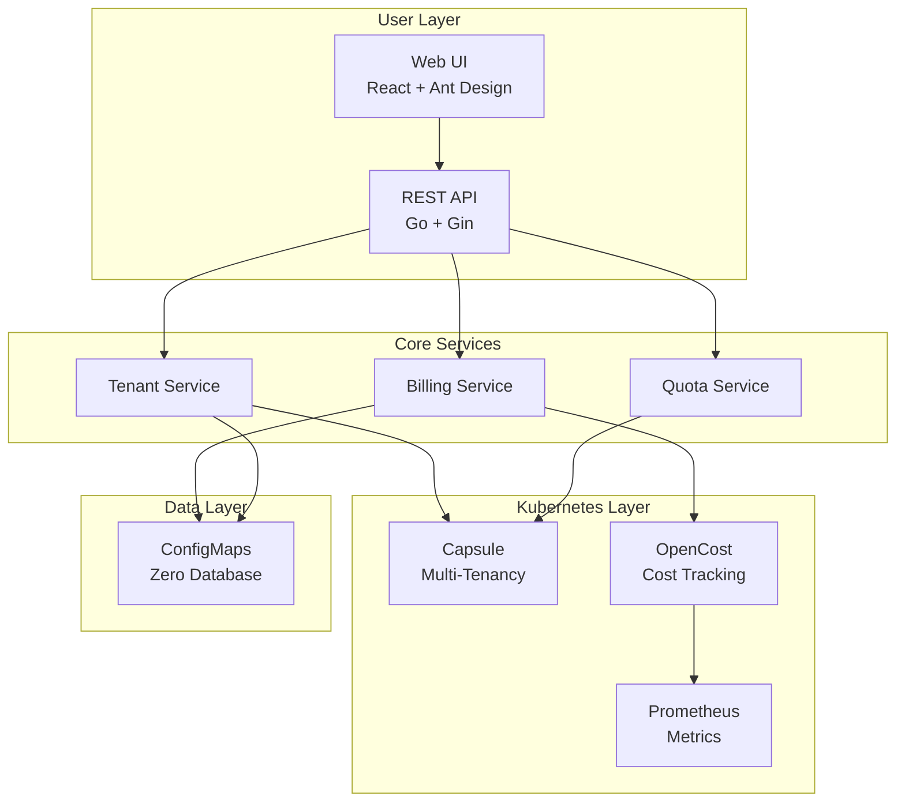
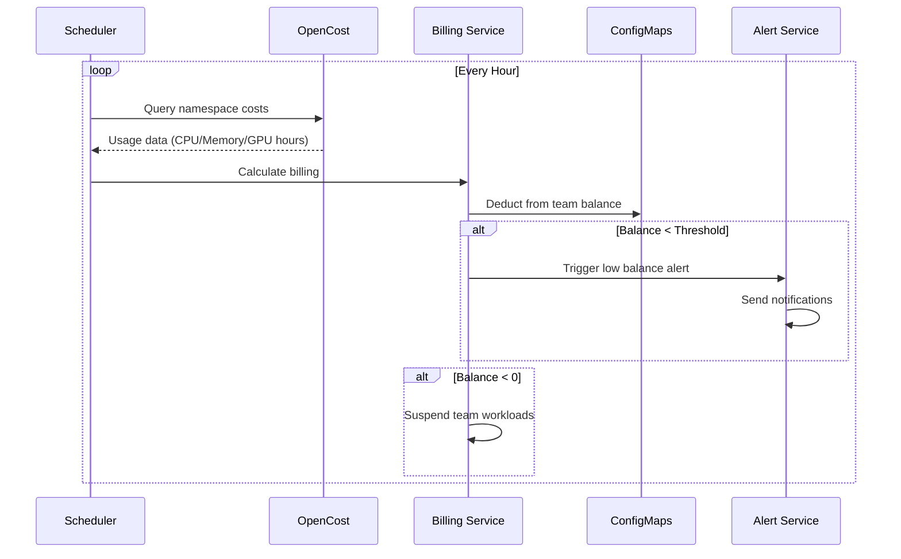
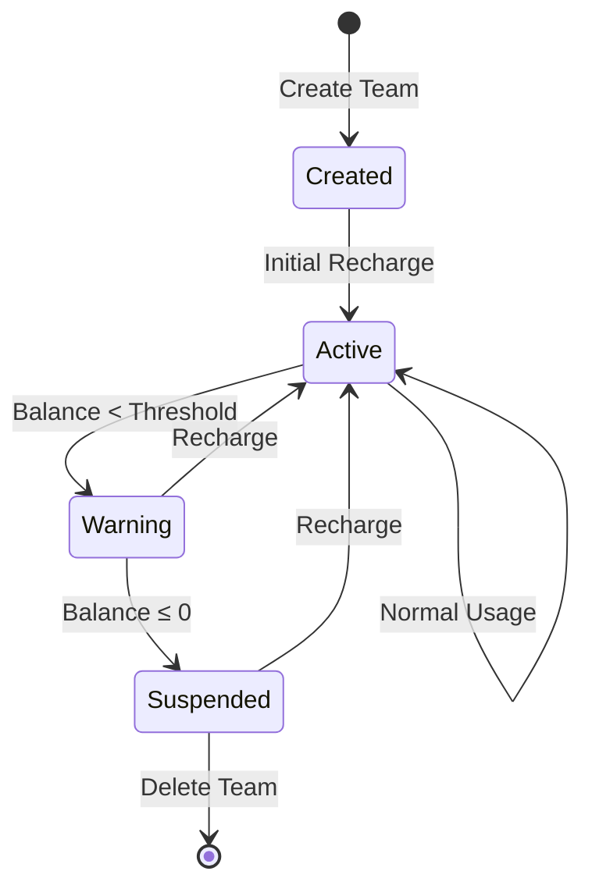

<p align="center">
  
</p>

<h1 align="center">Bison</h1>

<p align="center">
  <strong>Enterprise GPU Resource Billing & Multi-Tenant Management Platform</strong>
</p>

<p align="center">
  <a href="./docs/README_CN.md">中文文档</a> •
  <a href="./docs/architecture.md">Architecture</a> •
  <a href="#quick-start">Quick Start</a> •
  <a href="#features">Features</a>
</p>

<p align="center">
  
  
  
  
</p>

---

## Why Bison?

Managing GPU resources across multiple teams is challenging. Traditional approaches require complex quota systems, manual billing, and scattered tooling. **Bison** provides a unified platform that:

| Challenge | Bison Solution |
|-----------|----------------|
| 🔐 **Multi-tenant isolation** | Capsule-based namespace isolation with OIDC integration |
| 💰 **Cost tracking** | Real-time billing powered by OpenCost + Prometheus |
| ⚖️ **Resource quotas** | Dynamic quotas supporting any Kubernetes resource type |
| 💳 **Balance management** | Team wallets with auto-recharge and low-balance alerts |
| 📊 **Usage analytics** | Comprehensive reports with CSV export |
| 🔧 **Zero database** | All data stored in ConfigMaps - no external dependencies |

## Features

### Core Capabilities

```
✅ Multi-Tenant Management     Capsule-powered team isolation with OIDC
✅ Real-Time Billing           Usage-based billing with configurable pricing
✅ Dynamic Resource Quotas     CPU, Memory, GPU, or any K8s resource
✅ Team Balance & Wallet       Prepaid balance with auto-deduction
✅ Auto-Recharge               Scheduled balance top-ups (weekly/monthly)
✅ Balance Alerts              Multi-channel notifications (Webhook, DingTalk, WeChat)
✅ Usage Reports               Team/project analytics with export
✅ Audit Logging               Complete operation history
```

### Architecture Highlights



## Quick Start

### Prerequisites

- Kubernetes 1.26+
- Helm 3.0+
- kubectl configured

### 1. Install Dependencies

```bash
# Install Capsule (multi-tenancy)
helm repo add projectcapsule https://projectcapsule.github.io/charts
helm install capsule projectcapsule/capsule -n capsule-system --create-namespace

# Install Prometheus + OpenCost
helm repo add prometheus-community https://prometheus-community.github.io/helm-charts
helm install prometheus prometheus-community/kube-prometheus-stack -n monitoring --create-namespace

helm repo add opencost https://opencost.github.io/opencost-helm-chart
helm install opencost opencost/opencost -n opencost --create-namespace \
  --set opencost.prometheus.internal.serviceName=prometheus-kube-prometheus-prometheus \
  --set opencost.prometheus.internal.namespaceName=monitoring
```

### 2. Deploy Bison

```bash
# Clone and deploy
git clone https://github.com/your-org/bison.git
cd bison

helm install bison ./deploy/charts/bison \
  --namespace bison-system \
  --create-namespace \
  --set auth.enabled=true
```

### 3. Access the Platform

```bash
# Get admin password
kubectl get secret bison-auth -n bison-system -o jsonpath='{.data.password}' | base64 -d

# Port forward
kubectl port-forward svc/bison-api 8080:8080 -n bison-system

# Access API
curl http://localhost:8080/api/v1/health
```

## How It Works

### Billing Flow



### Team Lifecycle



## Configuration

### Key Settings

| Parameter | Description | Default |
|-----------|-------------|---------|
| `auth.enabled` | Enable authentication | `false` |
| `auth.admin.username` | Admin username | `admin` |
| `apiServer.replicaCount` | API server replicas | `2` |
| `dependencies.opencost.apiUrl` | OpenCost API endpoint | `http://opencost.opencost:9003` |

### Billing Configuration

Configure pricing through the Web UI or API:

```json
{
  "enabled": true,
  "currency": "USD",
  "pricing": {
    "cpu": 0.05,
    "memory": 0.01,
    "nvidia.com/gpu": 2.50
  },
  "billingInterval": "hourly"
}
```

## Development

```bash
# Install dependencies
make install-deps

# Run locally
make dev          # API + Web UI (requires tmux)
make dev-api      # API server only
make dev-web      # Web UI only

# Build
make build        # Docker images
make build-binary # Binary files

# Test
make test
make lint
```

## Project Structure

```
bison/
├── api-server/           # Go backend (Gin framework)
│   ├── cmd/              # Entry point
│   ├── internal/
│   │   ├── handler/      # HTTP handlers
│   │   ├── service/      # Business logic
│   │   ├── k8s/          # Kubernetes client
│   │   └── scheduler/    # Background tasks
│   └── Dockerfile
├── web-ui/               # React frontend
│   ├── src/
│   │   ├── pages/        # Page components
│   │   ├── services/     # API clients
│   │   └── contexts/     # React contexts
│   └── Dockerfile
├── deploy/
│   └── charts/bison/     # Helm chart
├── docs/                 # Documentation
└── Makefile
```

## Roadmap

- [ ] Kubernetes Events integration
- [ ] Grafana dashboard templates
- [ ] Cost forecasting
- [ ] Budget alerts
- [ ] API rate limiting
- [ ] RBAC fine-grained permissions

## License

MIT License - see [LICENSE](LICENSE) for details.

---

<p align="center">
  <strong>Bison</strong> - Simplify GPU Resource Management
</p>
