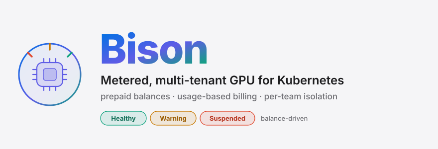
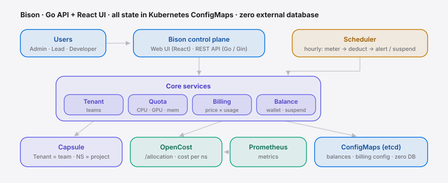

<div align="right"><sub><b>English</b>&nbsp;&nbsp;⇄&nbsp;&nbsp;<a href="./README.zh-CN.md">简体中文</a></sub></div>

<picture>
  <source media="(prefers-color-scheme: dark)" srcset="./assets/hero-dark.svg">
  <source media="(prefers-color-scheme: light)" srcset="./assets/hero-light.svg">
  
</picture>

<p><sub>Bison turns a shared Kubernetes GPU cluster into a metered, multi-tenant platform: every team gets an isolated quota and a <strong>prepaid balance</strong>, usage is priced and deducted hourly, and a team that runs dry is auto-suspended — all without an external database.</sub></p>

<p align="center">
  <a href="./LICENSE"></a>
  <a href="https://github.com/SuperMarioYL/Bison/releases"></a>
  <a href="https://github.com/SuperMarioYL/Bison/actions/workflows/build-test.yml"></a>
  
  
  
</p>

> Shared GPU clusters fail the same way everywhere: quotas are hand-edited per namespace, chargeback lives in a spreadsheet, and the bill arrives a month after the budget was already blown. Bison closes the loop in the cluster — **Capsule** isolates teams, **OpenCost** prices what they actually consumed, and an hourly scheduler deducts from each team's wallet and suspends the ones that hit zero.

##  Why Bison

Bison folds four normally-separate tools into one control plane:

- **Kubernetes-native multi-tenancy** — teams are [Capsule](https://capsule.clastix.io) Tenants, projects are namespaces; quotas and node isolation are enforced by an admission webhook, not by convention.
- **Real-time cost tracking** — [OpenCost](https://www.opencost.io) + Prometheus attribute spend per pod / namespace / team, so chargeback is measured, not estimated.
- **Prepaid wallets with auto-deduction** — each team holds a balance; the hourly scheduler meters usage, applies your pricing, deducts, alerts on low balance, and auto-suspends at zero.
- **Zero external dependencies** — all state (balances, billing config) lives in Kubernetes ConfigMaps, etcd-backed. No Postgres, no Redis, nothing to back up separately.

|  | Without Bison | With Bison |
|---|---|---|
| **Quotas** | hand-edited `ResourceQuota` per namespace | per-team quota, webhook-enforced |
| **Billing** | spreadsheet, reconciled monthly | priced & deducted hourly in-cluster |
| **Isolation** | teams compete on shared nodes | shared *or* dedicated node pools per team |
| **Budget control** | overruns discovered after the fact | low-balance alerts + auto-suspend |
| **Stack** | quota tool + cost tool + billing system | one chart, one API, one dashboard |

##  Features

| Capability | What it does |
|---|---|
| **Multi-tenant management** | Capsule-powered team isolation, optional OIDC login |
| **Usage-based billing** | configurable per-resource pricing (CPU / memory / GPU / any K8s resource) |
| **Dynamic resource quotas** | CPU, memory, GPU, or arbitrary extended resources per team |
| **Team balance & wallet** | prepaid balance with hourly auto-deduction |
| **Auto-recharge** | scheduled top-ups (weekly / monthly) with amount validation |
| **Balance alerts** | multi-channel notifications — Webhook, DingTalk, WeCom |
| **Auto-suspend / resume** | idempotent suspend at zero balance, resume on recharge |
| **Usage reports** | per-team / per-project analytics with CSV export |
| **Audit logging** | full operation history |

##  Architecture

<picture>
  <source media="(prefers-color-scheme: dark)" srcset="./assets/atlas-dark.svg">
  <source media="(prefers-color-scheme: light)" srcset="./assets/atlas-light.svg">
  
</picture>

- **Control plane** — a React + Ant Design UI and a Go (Gin) REST API under `/api/v1`. Services are injected into handlers; the four core services are Tenant, Quota, Billing, and Balance.
- **Multi-tenancy** — Bison creates Capsule **Tenants** (a team) that own **namespaces** (projects). In *exclusive* mode Capsule injects a `nodeSelector` so a team's pods only land on its dedicated node pool; in *shared* mode pods run on a common pool under the same quota.
- **Cost & metering** — the billing scheduler queries OpenCost's `/allocation` endpoint hourly for per-namespace CPU/memory/GPU hours, prices them, and deducts from the team's balance. OpenCost reads metrics from Prometheus.
- **Storage** — balances and billing config are ConfigMaps (`bison-team-balances`, `bison-billing-config`), persisted in etcd. There is no external database to provision, scale, or back up.

##  Install

**Prerequisites:** Kubernetes ≥ 1.22, Helm ≥ 3.8 (for OCI charts), `kubectl` configured.

**1 · Install the dependencies** (Capsule, Prometheus, OpenCost):

```bash
# Multi-tenancy
helm repo add projectcapsule https://projectcapsule.github.io/charts
helm install capsule projectcapsule/capsule -n capsule-system --create-namespace

# Metrics
helm repo add prometheus-community https://prometheus-community.github.io/helm-charts
helm install prometheus prometheus-community/kube-prometheus-stack -n monitoring --create-namespace

# Cost tracking
helm repo add opencost https://opencost.github.io/opencost-helm-chart
helm install opencost opencost/opencost -n opencost --create-namespace \
  --set opencost.prometheus.internal.serviceName=prometheus-kube-prometheus-prometheus \
  --set opencost.prometheus.internal.namespaceName=monitoring
```

**2 · Deploy Bison** — the chart ships as an OCI artifact on GHCR:

```bash
helm install bison oci://ghcr.io/supermarioyl/charts/bison \
  --version 0.0.31 \
  --namespace bison-system --create-namespace \
  --set auth.enabled=true
```

<details>
<summary>Other install methods</summary>

```bash
# From a GitHub Release tarball
wget https://github.com/SuperMarioYL/Bison/releases/download/v0.0.31/bison-0.0.31.tgz
helm install bison bison-0.0.31.tgz -n bison-system --create-namespace

# From source
git clone https://github.com/SuperMarioYL/Bison.git && cd Bison
helm install bison ./deploy/charts/bison -n bison-system --create-namespace --set auth.enabled=true
```

Container images: `ghcr.io/supermarioyl/bison/api-server` and `ghcr.io/supermarioyl/bison/web-ui` (`linux/amd64` + `linux/arm64`).
</details>

##  Quickstart

```bash
# 1. Read the auto-generated admin password
kubectl get secret bison-auth -n bison-system -o jsonpath='{.data.password}' | base64 -d

# 2. Port-forward the API (and the UI on :80)
kubectl port-forward svc/bison-api 8080:8080 -n bison-system

# 3. Confirm it's live
curl http://localhost:8080/healthz
```

Then open the Web UI, create your first team with a quota and an initial balance, hand its kubeconfig to the team lead, and watch usage meter against the wallet on the dashboard.

##  Usage

**Core model.** A **team** is a Capsule Tenant with a quota, a balance, and a billing policy. A **project** is a namespace owned by that team. Developers deploy ordinary Kubernetes workloads into the project namespace — Capsule enforces the quota and (in exclusive mode) the node placement at admission time.

**Quota enforcement is transparent to developers.** A user submits a normal pod; Capsule rewrites it to honour the team's isolation:

```yaml
# Developer applies this into namespace ml-training (owned by team-ml)
apiVersion: v1
kind: Pod
metadata: { name: trainer, namespace: ml-training }
spec:
  containers:
  - name: trainer
    image: pytorch:latest
    resources: { requests: { nvidia.com/gpu: 2 } }

# Capsule admission webhook injects the team's node pool (exclusive mode):
#   spec.nodeSelector: { bison.io/pool: team-ml }
# and rejects the pod outright if the team's GPU quota is exhausted.
```

**Billing config** is set per resource through the UI or API — pricing is `price × usage`, metered hourly:

```json
{
  "enabled": true,
  "currency": "USD",
  "pricing": { "cpu": 0.05, "memory": 0.01, "nvidia.com/gpu": 2.50 },
  "billingInterval": "hourly"
}
```

Each hour the scheduler meters every namespace, deducts the cost from the owning team's balance, fires a low-balance alert past your threshold, and suspends the team's workloads once the balance reaches zero — resuming automatically on the next recharge.

##  Screenshots

| Dashboard | Teams & budgets | Billing config |
|---|---|---|
|  |  |  |

Real-time cluster overview with 7-day cost trends · per-team balance with colour-coded status (healthy / warning / suspended) · per-resource pricing and alert thresholds.

##  Configuration

Set via `--set` or a values file. Full reference: [`deploy/charts/bison/values.yaml`](deploy/charts/bison/values.yaml).

| Parameter | Description | Default |
|---|---|---|
| `auth.enabled` | enable login authentication | `false` |
| `auth.admin.username` | admin username | `admin` |
| `apiServer.replicaCount` | API server replicas | `2` |
| `webUI.replicaCount` | Web UI replicas | `2` |
| `dependencies.opencost.apiUrl` | OpenCost API endpoint (port **9003**, not the UI port) | `http://opencost.opencost.svc.cluster.local:9003` |
| `dependencies.prometheus.url` | Prometheus server URL | `http://prometheus-kube-prometheus-prometheus.monitoring:9090` |
| `ingress.enabled` / `ingress.host` | expose via Ingress | `true` / `bison.example.com` |
| `networkPolicy.enabled` | restrict cross-team pod traffic | `false` |
| `apiServer.autoscaling` / `podDisruptionBudget` | HPA + PDB for the API server | disabled |

##  Development

```bash
make install-deps   # Go modules + npm
make dev            # API + Web UI (needs tmux) — or dev-api / dev-web
make test           # all tests          (test-api / test-web)
make lint           # go vet + eslint
make build          # multi-arch Docker images
make helm-lint      # validate the chart
```

```
api-server/   Go backend — cmd/ (entry + routes), internal/{handler,service,k8s,scheduler,middleware}
web-ui/       React + TS + Vite — src/{pages,components,services,contexts,hooks}
deploy/       Helm chart (deploy/charts/bison)
docs/         Architecture & guides — see https://bison.lei6393.com
```

##  Roadmap

- [x] Multi-tenant teams, prepaid wallets, hourly usage-based billing
- [x] Auto-recharge, multi-channel balance alerts, idempotent auto-suspend
- [x] Leader election, CORS & auth startup checks, autoscaling / PDB / NetworkPolicy knobs
- [ ] Kubernetes Events integration
- [ ] Grafana dashboard templates
- [ ] Cost forecasting & budget projections
- [ ] Fine-grained RBAC permissions
- [ ] API rate limiting

---

<p align="center"><sub><a href="./LICENSE">MIT</a> © 2025 supermario_yl · <a href="https://bison.lei6393.com">docs</a></sub></p>
