<p align="center">
  
</p>

<h1 align="center">Bison</h1>

<p align="center">
  <strong>Enterprise GPU Resource Billing & Multi-Tenant Management Platform</strong>
</p>

<p align="center">
  <a href="./docs/README_CN.md">中文文档</a> •
  <a href="./docs/architecture.md">Architecture</a> •
  <a href="#quick-start">Quick Start</a> •
  <a href="#features">Features</a>
</p>

<p align="center">
  
  
  
  
</p>

---

## The GPU Management Challenge

Managing shared GPU clusters across multiple teams creates critical operational and financial challenges:

**For Platform Administrators:**
- How do you fairly allocate expensive GPU resources across competing teams?
- How do you prevent resource hogging while ensuring everyone gets their fair share?
- How do you track who's using what and implement accurate chargeback?
- How do you maintain strict multi-tenant isolation without complex manual configuration?

**For Finance & Budget Teams:**
- How do you implement automated chargeback for GPU usage without manual accounting?
- How do you prevent budget overruns before they happen?
- How do you generate accurate cost reports for internal billing?

**For Development Teams:**
- How do you get predictable, isolated access to GPU resources?
- How do you know when you're approaching your budget limits?
- How do you avoid impacting other teams' workloads?

**Traditional Approach:**
- Manual quota configuration per namespace
- Excel-based billing calculations
- No real-time cost visibility
- Complex multi-tool setup (quota management + cost tracking + billing system)
- Frequent resource conflicts and budget surprises

### Bison's Integrated Solution

```mermaid
graph TB
    subgraph WITHOUT["Without Bison"]
        P1[❌ Manual Quota Management<br/>Per-namespace configuration]
        P2[❌ Spreadsheet Billing<br/>Manual calculations & reports]
        P3[❌ No Resource Isolation<br/>Teams compete for resources]
        P4[❌ Budget Overruns<br/>No proactive alerts]
        P5[❌ Complex Tooling<br/>Multiple systems to manage]
    end

    subgraph WITH["With Bison"]
        S1[✅ Automated Team Quotas<br/>Capsule-powered isolation]
        S2[✅ Real-Time Billing<br/>OpenCost integration]
        S3[✅ True Multi-Tenancy<br/>Shared/Exclusive modes]
        S4[✅ Proactive Alerts<br/>Balance monitoring & auto-suspend]
        S5[✅ Unified Platform<br/>Single pane of glass]
    end

    P1 -.Transform.-> S1
    P2 -.Transform.-> S2
    P3 -.Transform.-> S3
    P4 -.Transform.-> S4
    P5 -.Transform.-> S5

    style WITHOUT fill:#ffebee
    style WITH fill:#e8f5e9
    style S1 fill:#4caf50,color:#fff
    style S2 fill:#4caf50,color:#fff
    style S3 fill:#4caf50,color:#fff
    style S4 fill:#4caf50,color:#fff
    style S5 fill:#4caf50,color:#fff
```



**Bison combines:**
- 🔐 **Kubernetes-native multi-tenancy** (Capsule) - True team isolation with shared or exclusive node pools
- 💰 **Real-time cost tracking** (OpenCost + Prometheus) - Per-pod, per-namespace, per-team cost visibility
- 💳 **Automated billing & budgets** - Prepaid balances, auto-deduction, low-balance alerts, and auto-suspension
- 📊 **Unified dashboard** - Single interface for admins, team leaders, and finance teams
- 🔧 **Zero external dependencies** - All data stored in Kubernetes ConfigMaps (etcd-backed)

**Result:** Deploy once, get complete GPU resource management with automated billing in under 30 minutes.

---

## See Bison in Action

### 🎯 Real-Time Resource Dashboard

<p align="center">
  
</p>

**What you see:**
- **Cluster Overview** - Total teams, projects, resource pools, and quotas at a glance
- **Resource Utilization** - Visual breakdown showing which teams are consuming resources
- **7-Day Cost Trends** - Historical cost data to identify spending patterns
- **Top 5 Cost Rankings** - Quickly identify heavy GPU consumers
- **Team Budget Status** - Real-time balance monitoring with color-coded alerts

**Who benefits:**
- **Platform Administrators** get instant visibility into cluster health and usage patterns
- **Finance Teams** can track costs in real-time without waiting for monthly reports
- **Team Leaders** can compare their usage against other teams

---

### 💼 Team Management & Budget Monitoring

<p align="center">
  
</p>

**What you see:**
- **Team List** with real-time status indicators:
  - 🟢 Green balance = Healthy budget
  - 🟡 Yellow balance = Approaching threshold
  - 🔴 Red balance = Low balance or suspended
- **Resource Allocation** - CPU/Memory/GPU quotas per team (e.g., "cpu 0/10" means 0 used out of 10 allocated)
- **Project Count** - Number of namespaces/projects under each team
- **Quick Actions** - Edit quotas, recharge balance, or delete team with one click

**Who benefits:**
- **Team Leaders** monitor their budget status and resource usage at a glance
- **Administrators** manage multiple teams from a single unified view
- **Finance Teams** see which teams need recharging

---

### 💰 Flexible Billing Configuration

<p align="center">
  
</p>

**What you see:**
- **Per-Resource Pricing** - Set custom prices for CPU (per core-hour), Memory (per GB-hour), GPU (per GPU-hour)
- **Currency Selection** - Support for CNY, USD, EUR, and other currencies
- **Enable/Disable Toggle** - Turn billing on/off for specific resources with one click
- **Billing Rules** - Define how resources are metered (hourly, daily, etc.)
- **Alert Thresholds** - Configure when to send low-balance warnings

**Who benefits:**
- **Finance Teams** align cloud costs with internal chargeback policies
- **Administrators** adjust pricing based on actual hardware costs
- **Budget Managers** set appropriate warning thresholds to prevent overruns

---

## Features

### Core Capabilities

```
✅ Multi-Tenant Management     Capsule-powered team isolation with OIDC
✅ Real-Time Billing           Usage-based billing with configurable pricing
✅ Dynamic Resource Quotas     CPU, Memory, GPU, or any K8s resource
✅ Team Balance & Wallet       Prepaid balance with auto-deduction
✅ Auto-Recharge               Scheduled balance top-ups (weekly/monthly)
✅ Balance Alerts              Multi-channel notifications (Webhook, DingTalk, WeChat)
✅ Usage Reports               Team/project analytics with export
✅ Audit Logging               Complete operation history
```

### Architecture Highlights


## Quick Start

### Prerequisites

- Kubernetes 1.22+
- Helm 3.0+
- kubectl configured

### 1. Install Dependencies

```bash
# Install Capsule (multi-tenancy)
helm repo add projectcapsule https://projectcapsule.github.io/charts
helm install capsule projectcapsule/capsule -n capsule-system --create-namespace

# Install Prometheus + OpenCost
helm repo add prometheus-community https://prometheus-community.github.io/helm-charts
helm install prometheus prometheus-community/kube-prometheus-stack -n monitoring --create-namespace

helm repo add opencost https://opencost.github.io/opencost-helm-chart
helm install opencost opencost/opencost -n opencost --create-namespace \
  --set opencost.prometheus.internal.serviceName=prometheus-kube-prometheus-prometheus \
  --set opencost.prometheus.internal.namespaceName=monitoring
```

### 2. Deploy Bison

#### Option A: Using Helm Repository (Recommended)

```bash
# Add Bison Helm repository
helm repo add bison https://supermarioyl.github.io/Bison/
helm repo update

# Install Bison
helm install bison bison/bison \
  --namespace bison-system \
  --create-namespace \
  --set auth.enabled=true \
  --version 3.0.0
```

#### Option B: From GitHub Release

```bash
# Download Helm chart from GitHub Release
wget https://github.com/SuperMarioYL/Bison/releases/download/v3.0.0/bison-3.0.0.tgz

# Install from downloaded chart
helm install bison bison-3.0.0.tgz \
  --namespace bison-system \
  --create-namespace \
  --set auth.enabled=true
```

#### Option C: From Source

```bash
# Clone and deploy from source
git clone https://github.com/SuperMarioYL/Bison.git
cd Bison

helm install bison ./deploy/charts/bison \
  --namespace bison-system \
  --create-namespace \
  --set auth.enabled=true
```

### 3. Access the Platform

```bash
# Get admin password
kubectl get secret bison-auth -n bison-system -o jsonpath='{.data.password}' | base64 -d

# Port forward
kubectl port-forward svc/bison-api 8080:8080 -n bison-system

# Access API
curl http://localhost:8080/api/v1/health
```

---

## User Journeys

Bison serves different user roles with tailored workflows. Here's how each persona uses the platform:

### 👨‍💼 Platform Administrator: Setting Up Multi-Tenant GPU Cluster

**Scenario:** Sarah is a platform engineer setting up a shared GPU cluster for 5 ML teams.


**Key Actions:**
1. Create team with appropriate resource mode (shared vs exclusive)
2. Set quotas based on team size and workload requirements
3. Initialize balance and configure alert thresholds
4. Provide team leader with kubeconfig for namespace access
5. Monitor cluster-wide metrics and respond to alerts

---

### 👥 Team Leader: Managing Team Resources & Budget

**Scenario:** Mike leads the Computer Vision team and needs to manage budgets across multiple projects.


**Key Actions:**
1. Monitor team balance and consumption rate daily
2. Create projects and allocate quotas to sub-teams
3. Request recharges before balance runs out
4. View detailed cost breakdowns by project
5. (Optional) Set up auto-recharge for predictable budgets

---

### 👨‍💻 Developer: Deploying GPU Workload

**Scenario:** Alex is a data scientist deploying a GPU training job.


**Key Actions:**
1. Receive kubeconfig from team leader
2. Write Kubernetes manifest (Job/Pod) with GPU requests
3. Deploy workload - Capsule automatically enforces quotas
4. Monitor job progress and cost accumulation
5. Clean up resources after job completes to stop billing

**Resource Isolation in Action:**
- User's pods are automatically scheduled according to team's resource mode
- In **Exclusive Mode**: Capsule injects `nodeSelector: {bison.io/pool: team-ml}` - pods only run on team's dedicated nodes
- In **Shared Mode**: Pods can run on any node in the shared pool
- Quota enforcement prevents over-allocation regardless of mode

---

## How It Works

### System Architecture & Dependencies

Bison integrates seamlessly with the Kubernetes ecosystem, leveraging proven open-source components:

```mermaid
graph TB
    subgraph BISON[Bison Platform]
        style "Bison Platform" fill:#e3f2fd
        BISON_UI[Bison Web UI<br/>React + Ant Design]
        BISON_API[Bison API Server<br/>Go + Gin]
        BISON_SCHED[Billing Scheduler<br/>Hourly Jobs]
    end

    subgraph K8S_CORE[Kubernetes Core]
        style "Kubernetes Core" fill:#fff3e0
        K8S_API[Kubernetes API Server]
        ETCD[etcd<br/>ConfigMaps Storage]
    end

    subgraph TENANT[Multi-Tenancy Layer]
        style "Multi-Tenancy Layer" fill:#f3e5f5
        CAPSULE[Capsule Controller]
        TENANT_CRD[Tenant CRDs]
    end

    subgraph COST[Cost Tracking Stack]
        style "Cost Tracking Stack" fill:#e8f5e9
        OPENCOST[OpenCost]
        PROM[Prometheus]
        NODE_EXP[Node Exporter]
        KUBE_STATE[kube-state-metrics]
    end

    subgraph ALERT[Alerting (Optional)]
        style "Alerting (Optional)" fill:#fce4ec
        WEBHOOK[Webhook]
        DINGTALK[DingTalk]
        WECHAT[WeChat Work]
    end

    BISON_UI -->|HTTPS| BISON_API
    BISON_API -->|Create/Update Tenants| CAPSULE
    BISON_API -->|Read/Write ConfigMaps| K8S_API
    BISON_API -->|Query Costs| OPENCOST

    BISON_SCHED -->|Hourly Billing| OPENCOST
    BISON_SCHED -->|Update Balances| K8S_API
    BISON_SCHED -->|Send Alerts| WEBHOOK
    BISON_SCHED -.->|Optional| DINGTALK
    BISON_SCHED -.->|Optional| WECHAT

    CAPSULE -->|Watch/Reconcile| TENANT_CRD
    CAPSULE -->|Create Namespaces| K8S_API

    K8S_API -->|Persist Data| ETCD

    OPENCOST -->|Query Metrics| PROM
    PROM -->|Scrape| NODE_EXP
    PROM -->|Scrape| KUBE_STATE

    style BISON_API fill:#4caf50,color:#fff
    style BISON_UI fill:#2196f3,color:#fff
    style CAPSULE fill:#ff9800,color:#fff
    style OPENCOST fill:#9c27b0,color:#fff
    style PROM fill:#e65100,color:#fff
```

**Key Integration Points:**
- **Kubernetes API** - All Bison data stored in ConfigMaps (zero external database)
- **Capsule** - Provides multi-tenant isolation; team = Tenant, project = Namespace
- **OpenCost** - Tracks per-pod, per-namespace resource costs
- **Prometheus** - Provides metrics for OpenCost cost calculation
- **Alert Channels** - Flexible notification via Webhook, DingTalk, or WeChat

---

### Resource Isolation Explained

Bison uses **Capsule** to enforce strict resource isolation between teams. Here's how it works:

```mermaid
graph TB
    subgraph K8S_CLUSTER[Kubernetes Cluster]
        subgraph TEAM_A[Team A (Exclusive Mode)]
            style "Team A (Exclusive Mode)" fill:#e3f2fd
            T1[Capsule Tenant: team-ml]
            T1_NS1[Namespace: ml-training<br/>ResourceQuota: 10 GPU]
            T1_NS2[Namespace: ml-inference<br/>ResourceQuota: 5 GPU]
            T1_POD1[Pod: trainer-1<br/>GPU: 2]
            T1_POD2[Pod: serve-1<br/>GPU: 1]

            T1 --> T1_NS1
            T1 --> T1_NS2
            T1_NS1 --> T1_POD1
            T1_NS2 --> T1_POD2
        end

        subgraph TEAM_B[Team B (Shared Mode)]
            style "Team B (Shared Mode)" fill:#fce4ec
            T2[Capsule Tenant: team-cv]
            T2_NS1[Namespace: cv-research<br/>ResourceQuota: 5 GPU]
            T2_POD1[Pod: detector-1<br/>GPU: 2]

            T2 --> T2_NS1
            T2_NS1 --> T2_POD1
        end

        subgraph NODES[Node Pools]
            style "Node Pools" fill:#f3e5f5
            N1[Node 1<br/>label: bison.io/pool=team-ml<br/>GPUs: 4]
            N2[Node 2<br/>label: bison.io/pool=team-ml<br/>GPUs: 4]
            N3[Node 3<br/>label: bison.io/pool=shared<br/>GPUs: 8]
            N4[Node 4<br/>label: bison.io/pool=shared<br/>GPUs: 8]
        end
    end

    T1_POD1 -.Scheduled ONLY on.-> N1
    T1_POD2 -.Scheduled ONLY on.-> N2
    T2_POD1 -.Scheduled on.-> N3
    T2_POD1 -.Scheduled on.-> N4

    style T1 fill:#2196f3,color:#fff
    style T2 fill:#e91e63,color:#fff
    style N1 fill:#4caf50,color:#fff
    style N2 fill:#4caf50,color:#fff
    style N3 fill:#ff9800,color:#fff
    style N4 fill:#ff9800,color:#fff
```

**Isolation Mechanisms:**

| Isolation Type | Implementation | Benefit |
|----------------|----------------|---------|
| **Namespace** | Capsule Tenant owns namespaces | Teams can only create/access their own namespaces |
| **Compute** | ResourceQuota per Tenant | Teams cannot exceed allocated CPU/Memory/GPU |
| **Node (Exclusive)** | NodeSelector injection | Team's pods ONLY run on dedicated nodes |
| **Node (Shared)** | Shared pool with quotas | Cost-effective for smaller teams |
| **Network (Optional)** | NetworkPolicies | Prevent cross-team pod communication |
| **Billing** | Separate balance per team | One team's spending doesn't affect others |

**How Capsule Enforces Isolation:**
1. **Admission Webhook** - Intercepts all pod creation requests
2. **Quota Validation** - Checks if team has available quota (CPU/GPU/Memory)
3. **NodeSelector Injection** - Automatically adds node labels for exclusive teams
4. **Rejection** - Blocks requests that exceed quota or violate policies

**Example:**
```yaml
# Developer creates this simple pod
apiVersion: v1
kind: Pod
metadata:
  name: my-job
  namespace: ml-training  # Owned by team-ml
spec:
  containers:
  - name: trainer
    image: pytorch:latest
    resources:
      requests:
        nvidia.com/gpu: 2

# Capsule automatically transforms it to:
# (adds nodeSelector for exclusive mode)
apiVersion: v1
kind: Pod
metadata:
  name: my-job
  namespace: ml-training
spec:
  nodeSelector:
    bison.io/pool: team-ml  # Injected by Capsule!
  containers:
  - name: trainer
    image: pytorch:latest
    resources:
      requests:
        nvidia.com/gpu: 2
```

---

### Billing Flow


### Team Lifecycle


## Configuration

### Key Settings

| Parameter | Description | Default |
|-----------|-------------|---------|
| `auth.enabled` | Enable authentication | `false` |
| `auth.admin.username` | Admin username | `admin` |
| `apiServer.replicaCount` | API server replicas | `2` |
| `dependencies.opencost.apiUrl` | OpenCost API endpoint | `http://opencost.opencost:9003` |

### Billing Configuration

Configure pricing through the Web UI or API:

```json
{
  "enabled": true,
  "currency": "USD",
  "pricing": {
    "cpu": 0.05,
    "memory": 0.01,
    "nvidia.com/gpu": 2.50
  },
  "billingInterval": "hourly"
}
```

## Installation Details

### Docker Images

Bison images are available on GitHub Container Registry:

```bash
# Pull images
docker pull ghcr.io/supermarioyl/bison/api-server:3.0.0
docker pull ghcr.io/supermarioyl/bison/web-ui:3.0.0

# Or use latest
docker pull ghcr.io/supermarioyl/bison/api-server:latest
docker pull ghcr.io/supermarioyl/bison/web-ui:latest
```

**Available Tags:**
- `3.0.0`, `3.0`, `3` - Semantic version tags
- `latest` - Latest stable release

**Supported Platforms:**
- `linux/amd64`
- `linux/arm64`

### Helm Repository

```bash
# Add repository
helm repo add bison https://supermarioyl.github.io/Bison/

# Search available versions
helm search repo bison

# View chart information
helm show chart bison/bison
helm show values bison/bison

# Install specific version
helm install my-bison bison/bison --version 3.0.0

# Upgrade to latest
helm upgrade my-bison bison/bison
```

## Development

```bash
# Install dependencies
make install-deps

# Run locally
make dev          # API + Web UI (requires tmux)
make dev-api      # API server only
make dev-web      # Web UI only

# Build
make build        # Docker images
make build-binary # Binary files

# Test
make test
make lint
```

### Release Process

Bison uses automated GitHub Actions for releases:

1. **Create a Git tag** to trigger release:
   ```bash
   git tag v3.1.0
   git push origin v3.1.0
   ```

2. **GitHub Actions automatically**:
   - Builds multi-platform Docker images
   - Pushes images to GitHub Container Registry
   - Packages Helm chart
   - Creates GitHub Release
   - Updates Helm repository on GitHub Pages

3. **Verify release**:
   - Check [GitHub Releases](https://github.com/SuperMarioYL/Bison/releases)
   - Pull new images: `docker pull ghcr.io/supermarioyl/bison/api-server:3.1.0`
   - Update Helm repo: `helm repo update && helm search repo bison`

## Project Structure

```
bison/
├── api-server/           # Go backend (Gin framework)
│   ├── cmd/              # Entry point
│   ├── internal/
│   │   ├── handler/      # HTTP handlers
│   │   ├── service/      # Business logic
│   │   ├── k8s/          # Kubernetes client
│   │   └── scheduler/    # Background tasks
│   └── Dockerfile
├── web-ui/               # React frontend
│   ├── src/
│   │   ├── pages/        # Page components
│   │   ├── services/     # API clients
│   │   └── contexts/     # React contexts
│   └── Dockerfile
├── deploy/
│   └── charts/bison/     # Helm chart
├── docs/                 # Documentation
└── Makefile
```

## Roadmap

- [ ] Kubernetes Events integration
- [ ] Grafana dashboard templates
- [ ] Cost forecasting
- [ ] Budget alerts
- [ ] API rate limiting
- [ ] RBAC fine-grained permissions

## License

MIT License - see [LICENSE](LICENSE) for details.

---

<p align="center">
  <strong>Bison</strong> - Simplify GPU Resource Management
</p>
