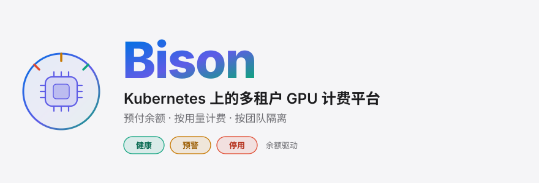
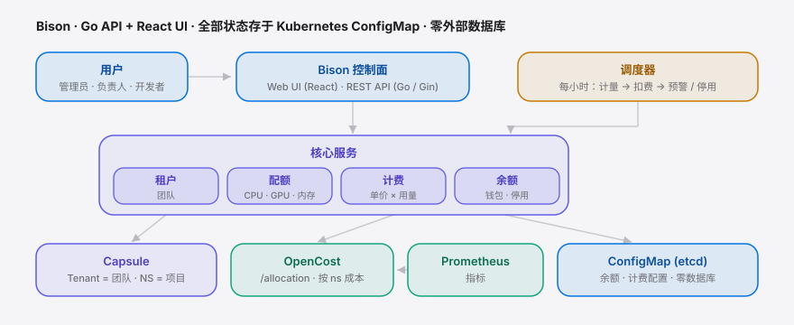
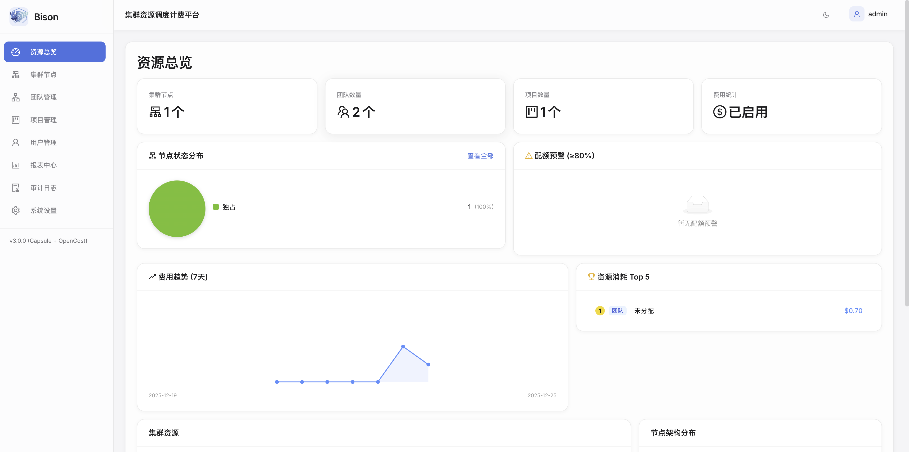
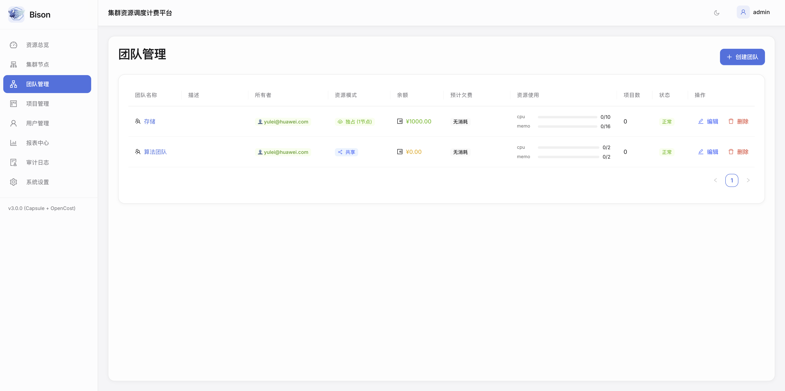
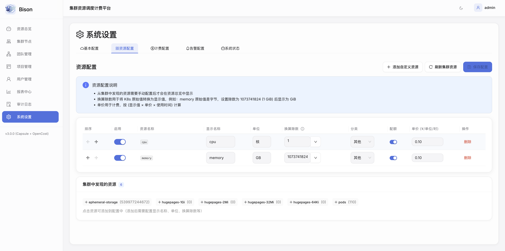

<div align="right"><sub><a href="./README.md">English</a>&nbsp;&nbsp;⇄&nbsp;&nbsp;<b>简体中文</b></sub></div>

<picture>
  <source media="(prefers-color-scheme: dark)" srcset="./assets/hero-cn-dark.svg">
  <source media="(prefers-color-scheme: light)" srcset="./assets/hero-cn-light.svg">
  
</picture>

<p><sub>Bison 把共享的 Kubernetes GPU 集群变成一个可计量的多租户平台：每个团队拥有独立配额和一份<strong>预付余额</strong>，用量按小时计价扣费，余额耗尽的团队自动停用——并且全程无需任何外部数据库。</sub></p>

<p align="center">
  <a href="./LICENSE"></a>
  <a href="https://github.com/SuperMarioYL/Bison/releases"></a>
  <a href="https://github.com/SuperMarioYL/Bison/actions/workflows/build-test.yml"></a>
  
  
  
</p>

> 共享 GPU 集群的痛点到处都一样：配额靠人工逐 namespace 改，成本分摊记在电子表格里，账单在预算早已超支一个月后才姗姗来迟。Bison 在集群内闭环这件事——**Capsule** 隔离团队、**OpenCost** 按实际消耗计价，再由一个每小时运行的调度器从各团队的钱包里扣费、把归零的团队停用。

##  为什么用 Bison

Bison 把通常分散的四类工具合进一个控制面：

- **Kubernetes 原生多租户** —— 团队即 [Capsule](https://capsule.clastix.io) Tenant，项目即 namespace；配额与节点隔离由准入 Webhook 强制执行，而非靠约定。
- **实时成本追踪** —— [OpenCost](https://www.opencost.io) + Prometheus 把消耗按 pod / namespace / 团队归集，分摊是「算出来的」而非「估出来的」。
- **预付钱包 + 自动扣费** —— 每个团队持有余额；每小时调度器计量用量、套用你的定价、扣费、低余额预警，并在归零时自动停用。
- **零外部依赖** —— 所有状态（余额、计费配置）都存于 Kubernetes ConfigMap，由 etcd 持久化。没有 Postgres、没有 Redis，没有需要单独备份的东西。

|  | 没有 Bison | 用上 Bison |
|---|---|---|
| **配额** | 逐 namespace 手改 `ResourceQuota` | 按团队配额，Webhook 强制 |
| **计费** | 电子表格，月度对账 | 集群内按小时计价扣费 |
| **隔离** | 团队在共享节点上争抢 | 每团队可选共享 *或* 独占节点池 |
| **预算管控** | 超支事后才发现 | 低余额预警 + 自动停用 |
| **技术栈** | 配额工具 + 成本工具 + 计费系统 | 一个 chart、一个 API、一个面板 |

##  功能特性

| 能力 | 说明 |
|---|---|
| **多租户管理** | 基于 Capsule 的团队隔离，可选 OIDC 登录 |
| **按量计费** | 可配置的按资源定价（CPU / 内存 / GPU / 任意 K8s 资源） |
| **动态资源配额** | 每团队的 CPU、内存、GPU 或任意扩展资源 |
| **团队余额与钱包** | 预付余额 + 每小时自动扣费 |
| **自动充值** | 定时充值（每周 / 每月），含金额校验 |
| **余额预警** | 多渠道通知 —— Webhook、钉钉、企业微信 |
| **自动停用 / 恢复** | 余额归零幂等停用，充值后恢复 |
| **用量报表** | 按团队 / 按项目分析，支持 CSV 导出 |
| **审计日志** | 完整操作历史 |

##  架构

<picture>
  <source media="(prefers-color-scheme: dark)" srcset="./assets/atlas-cn-dark.svg">
  <source media="(prefers-color-scheme: light)" srcset="./assets/atlas-cn-light.svg">
  
</picture>

- **控制面** —— React + Ant Design 前端，Go（Gin）REST API，基础路径 `/api/v1`。服务被注入到处理器中；四个核心服务为租户、配额、计费、余额。
- **多租户** —— Bison 创建 Capsule **Tenant**（团队），Tenant 拥有 **namespace**（项目）。*独占* 模式下 Capsule 注入 `nodeSelector`，让团队的 pod 只落在其专属节点池；*共享* 模式下 pod 在公共池中按同一配额运行。
- **成本与计量** —— 计费调度器每小时查询 OpenCost 的 `/allocation` 端点，获取每个 namespace 的 CPU/内存/GPU 用时，计价后从团队余额扣除。OpenCost 的指标来自 Prometheus。
- **存储** —— 余额与计费配置以 ConfigMap 形式存在（`bison-team-balances`、`bison-billing-config`），由 etcd 持久化。没有需要部署、扩容或备份的外部数据库。

##  安装

**前置条件：** Kubernetes ≥ 1.22、Helm ≥ 3.8（OCI chart 需要）、已配置好 `kubectl`。

**1 · 安装依赖**（Capsule、Prometheus、OpenCost）：

```bash
# 多租户
helm repo add projectcapsule https://projectcapsule.github.io/charts
helm install capsule projectcapsule/capsule -n capsule-system --create-namespace

# 指标
helm repo add prometheus-community https://prometheus-community.github.io/helm-charts
helm install prometheus prometheus-community/kube-prometheus-stack -n monitoring --create-namespace

# 成本追踪
helm repo add opencost https://opencost.github.io/opencost-helm-chart
helm install opencost opencost/opencost -n opencost --create-namespace \
  --set opencost.prometheus.internal.serviceName=prometheus-kube-prometheus-prometheus \
  --set opencost.prometheus.internal.namespaceName=monitoring
```

**2 · 部署 Bison** —— chart 以 OCI 制品形式发布在 GHCR：

```bash
helm install bison oci://ghcr.io/supermarioyl/charts/bison \
  --version 0.0.31 \
  --namespace bison-system --create-namespace \
  --set auth.enabled=true
```

<details>
<summary>其他安装方式</summary>

```bash
# 从 GitHub Release 包安装
wget https://github.com/SuperMarioYL/Bison/releases/download/v0.0.31/bison-0.0.31.tgz
helm install bison bison-0.0.31.tgz -n bison-system --create-namespace

# 从源码安装
git clone https://github.com/SuperMarioYL/Bison.git && cd Bison
helm install bison ./deploy/charts/bison -n bison-system --create-namespace --set auth.enabled=true
```

容器镜像：`ghcr.io/supermarioyl/bison/api-server` 与 `ghcr.io/supermarioyl/bison/web-ui`（`linux/amd64` + `linux/arm64`）。
</details>

##  快速开始

```bash
# 1. 读取自动生成的管理员密码
kubectl get secret bison-auth -n bison-system -o jsonpath='{.data.password}' | base64 -d

# 2. 端口转发 API（UI 在 :80）
kubectl port-forward svc/bison-api 8080:8080 -n bison-system

# 3. 确认已就绪
curl http://localhost:8080/healthz
```

随后打开 Web UI，创建第一个团队（设置配额和初始余额），把它的 kubeconfig 交给团队负责人，就能在面板上看到用量按钱包计量。

##  用法

**核心模型。** **团队**是一个带配额、余额和计费策略的 Capsule Tenant；**项目**是该团队拥有的 namespace。开发者把普通的 Kubernetes 工作负载部署进项目 namespace —— Capsule 在准入阶段强制配额，并在独占模式下强制节点落点。

**配额强制对开发者透明。** 用户提交一个普通 pod，Capsule 会改写它以满足团队隔离：

```yaml
# 开发者把它 apply 到 namespace ml-training（归 team-ml 所有）
apiVersion: v1
kind: Pod
metadata: { name: trainer, namespace: ml-training }
spec:
  containers:
  - name: trainer
    image: pytorch:latest
    resources: { requests: { nvidia.com/gpu: 2 } }

# Capsule 准入 Webhook 注入团队节点池（独占模式）：
#   spec.nodeSelector: { bison.io/pool: team-ml }
# 若团队 GPU 配额已耗尽，则直接拒绝该 pod。
```

**计费配置**通过 UI 或 API 按资源设置 —— 计价为 `单价 × 用量`，按小时计量：

```json
{
  "enabled": true,
  "currency": "CNY",
  "pricing": { "cpu": 0.05, "memory": 0.01, "nvidia.com/gpu": 2.50 },
  "billingInterval": "hourly"
}
```

每小时调度器计量每个 namespace，从所属团队余额扣费，超过阈值时触发低余额预警，余额归零后停用该团队的工作负载 —— 下次充值时自动恢复。

##  界面截图

| 仪表盘 | 团队与预算 | 计费配置 |
|---|---|---|
|  |  |  |

实时集群概览与 7 天成本趋势 · 按团队余额、状态用颜色区分（健康 / 预警 / 停用）· 按资源定价与预警阈值。

##  配置

通过 `--set` 或 values 文件设置。完整参考：[`deploy/charts/bison/values.yaml`](deploy/charts/bison/values.yaml)。

| 参数 | 说明 | 默认值 |
|---|---|---|
| `auth.enabled` | 启用登录认证 | `false` |
| `auth.admin.username` | 管理员用户名 | `admin` |
| `apiServer.replicaCount` | API 服务副本数 | `2` |
| `webUI.replicaCount` | Web UI 副本数 | `2` |
| `dependencies.opencost.apiUrl` | OpenCost API 地址（端口 **9003**，非 UI 端口） | `http://opencost.opencost.svc.cluster.local:9003` |
| `dependencies.prometheus.url` | Prometheus 服务地址 | `http://prometheus-kube-prometheus-prometheus.monitoring:9090` |
| `ingress.enabled` / `ingress.host` | 通过 Ingress 暴露 | `true` / `bison.example.com` |
| `networkPolicy.enabled` | 限制跨团队 pod 流量 | `false` |
| `apiServer.autoscaling` / `podDisruptionBudget` | API 服务的 HPA + PDB | 默认关闭 |

##  开发

```bash
make install-deps   # Go modules + npm
make dev            # API + Web UI（需要 tmux）—— 或 dev-api / dev-web
make test           # 全部测试            （test-api / test-web）
make lint           # go vet + eslint
make build          # 多架构 Docker 镜像
make helm-lint      # 校验 chart
```

```
api-server/   Go 后端 —— cmd/（入口 + 路由），internal/{handler,service,k8s,scheduler,middleware}
web-ui/       React + TS + Vite —— src/{pages,components,services,contexts,hooks}
deploy/       Helm chart（deploy/charts/bison）
docs/         架构与指南 —— 见 https://bison.lei6393.com
```

##  路线图

- [x] 多租户团队、预付钱包、每小时按量计费
- [x] 自动充值、多渠道余额预警、幂等自动停用
- [x] Leader 选举、CORS 与认证启动检查、autoscaling / PDB / NetworkPolicy 配置项
- [ ] Kubernetes Events 集成
- [ ] Grafana 仪表盘模板
- [ ] 成本预测与预算推演
- [ ] 细粒度 RBAC 权限
- [ ] API 限流

---

<p align="center"><sub><a href="./LICENSE">MIT</a> © 2025 supermario_yl · <a href="https://bison.lei6393.com">文档</a></sub></p>
