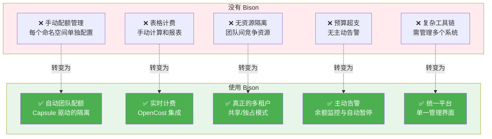
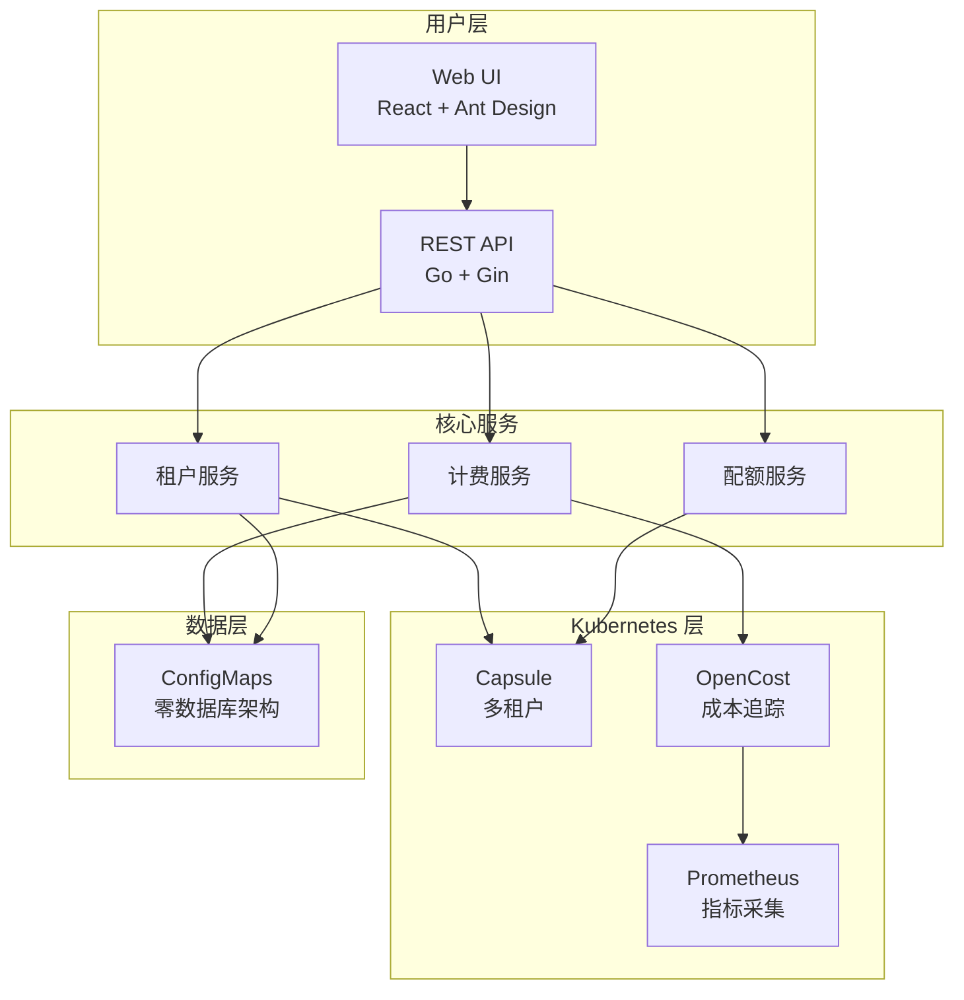
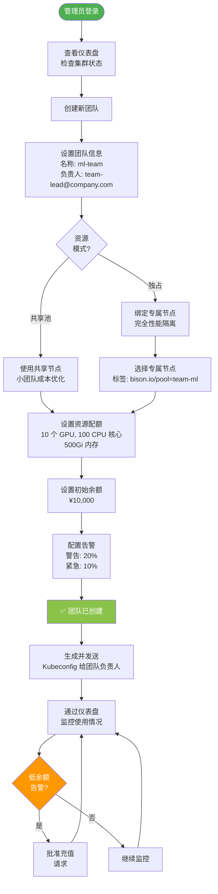
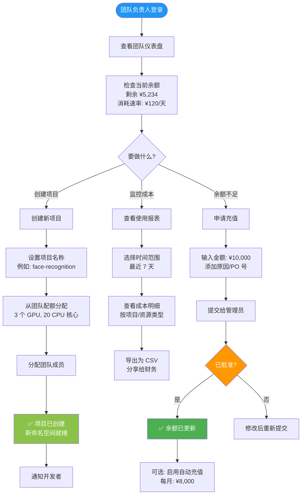
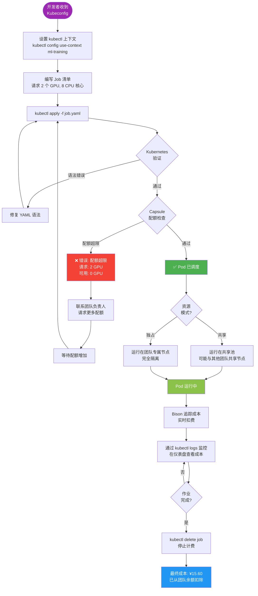
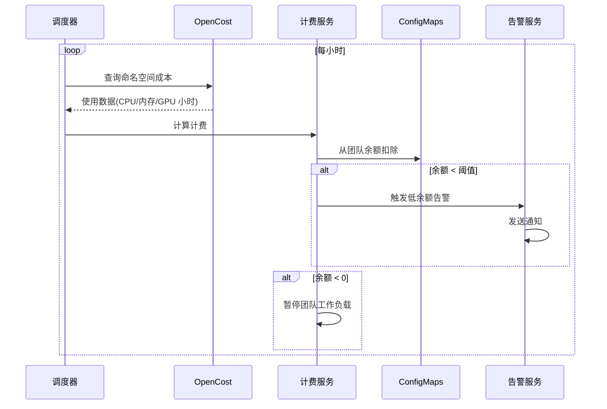
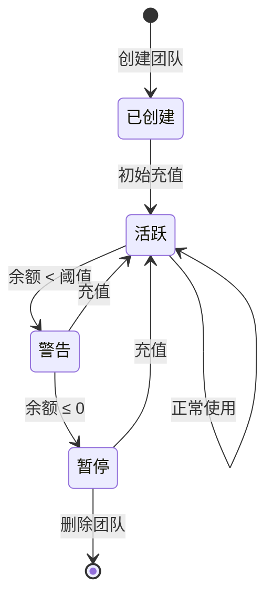

<p align="center">
  
</p>

<h1 align="center">Bison</h1>

<p align="center">
  <strong>企业级 GPU 资源计费与多租户管理平台</strong>
</p>

<p align="center">
  <a href="../README.md">English</a> •
  <a href="./architecture_cn.md">技术架构</a> •
  <a href="#快速开始">快速开始</a> •
  <a href="#功能特性">功能特性</a>
</p>

<p align="center">
  
  
  
  
</p>

---

## GPU 管理挑战

在多团队环境中管理共享 GPU 集群会带来严峻的运营和财务挑战:

**对于平台管理员:**
- 如何在竞争的团队间公平分配昂贵的 GPU 资源?
- 如何防止资源独占,同时确保每个人都能获得应有的份额?
- 如何追踪谁在使用什么资源,并实现准确的成本分摊?
- 如何在无需复杂手动配置的情况下维护严格的多租户隔离?

**对于财务与预算团队:**
- 如何实现 GPU 使用的自动计费,而无需手动核算?
- 如何在预算超支发生前就预防它?
- 如何生成准确的成本报表用于内部计费?

**对于开发团队:**
- 如何获得可预测的、隔离的 GPU 资源访问?
- 如何知道自己何时接近预算限制?
- 如何避免影响其他团队的工作负载?

**传统方案:**
- 每个命名空间手动配置配额
- 基于 Excel 的计费计算
- 缺乏实时成本可见性
- 复杂的多工具组合(配额管理 + 成本追踪 + 计费系统)
- 频繁的资源冲突和预算意外

### Bison 的集成解决方案



**Bison 集成了:**
- 🔐 **Kubernetes 原生多租户** (Capsule) - 通过共享或独占节点池实现真正的团队隔离
- 💰 **实时成本追踪** (OpenCost + Prometheus) - 每个 Pod、命名空间、团队的成本可见性
- 💳 **自动计费与预算** - 预付费余额、自动扣费、低余额告警和自动暂停
- 📊 **统一仪表盘** - 为管理员、团队负责人和财务团队提供单一界面
- 🔧 **零外部依赖** - 所有数据存储在 Kubernetes ConfigMaps 中(etcd 支持)

**结果:** 一次部署,在 30 分钟内获得带自动计费的完整 GPU 资源管理。

---

## Bison 实战演示

### 🎯 实时资源仪表盘

<p align="center">
  
</p>

**界面说明:**
- **集群总览** - 一目了然查看团队总数、项目数、资源池和配额
- **资源利用率** - 可视化展示各团队的资源消耗情况
- **7 天成本趋势** - 历史成本数据,识别支出模式
- **成本 Top 5 排名** - 快速识别 GPU 重度使用者
- **团队预算状态** - 实时余额监控,带颜色编码告警

**受益对象:**
- **平台管理员** 即时了解集群健康状况和使用模式
- **财务团队** 无需等待月度报表即可实时追踪成本
- **团队负责人** 可将自己的使用情况与其他团队对比

---

### 💼 团队管理与预算监控

<p align="center">
  
</p>

**界面说明:**
- **团队列表** 带实时状态指示:
  - 🟢 绿色余额 = 预算健康
  - 🟡 黄色余额 = 接近阈值
  - 🔴 红色余额 = 低余额或已暂停
- **资源分配** - 每个团队的 CPU/内存/GPU 配额(例如 "cpu 0/10" 表示已分配 10 个,使用了 0 个)
- **项目数量** - 每个团队下的命名空间/项目数量
- **快捷操作** - 一键编辑配额、充值余额或删除团队

**受益对象:**
- **团队负责人** 一目了然地监控预算状态和资源使用
- **管理员** 从单一视图管理多个团队
- **财务团队** 查看哪些团队需要充值

---

### 💰 灵活的计费配置

<p align="center">
  
</p>

**界面说明:**
- **按资源定价** - 为 CPU(每核心小时)、内存(每 GB 小时)、GPU(每 GPU 小时)设置自定义价格
- **货币选择** - 支持 CNY、USD、EUR 等多种货币
- **启用/禁用开关** - 一键开启或关闭特定资源的计费
- **计费规则** - 定义资源计量方式(按小时、按天等)
- **告警阈值** - 配置何时发送低余额警告

**受益对象:**
- **财务团队** 将云成本与内部分摊政策对齐
- **管理员** 根据实际硬件成本调整定价
- **预算管理者** 设置适当的警告阈值以防止超支

---

## 功能特性

### 核心能力

```
✅ 多租户管理        基于 Capsule 的团队隔离,支持 OIDC
✅ 实时计费          按使用量计费,支持可配置定价
✅ 动态资源配额      CPU、内存、GPU 或任意 K8s 资源
✅ 团队余额钱包      预付费余额,自动扣费
✅ 定时自动充值      支持每周/每月定时充值
✅ 余额告警通知      多渠道通知(Webhook、钉钉、企业微信)
✅ 使用报表          团队/项目分析,支持导出
✅ 审计日志          完整的操作历史记录
```

### 架构亮点



## 快速开始

### 前置条件

- Kubernetes 1.22+
- Helm 3.0+
- kubectl 已配置

### 1. 安装依赖组件

```bash
# 安装 Capsule(多租户)
helm repo add projectcapsule https://projectcapsule.github.io/charts
helm install capsule projectcapsule/capsule -n capsule-system --create-namespace

# 安装 Prometheus + OpenCost
helm repo add prometheus-community https://prometheus-community.github.io/helm-charts
helm install prometheus prometheus-community/kube-prometheus-stack -n monitoring --create-namespace

helm repo add opencost https://opencost.github.io/opencost-helm-chart
helm install opencost opencost/opencost -n opencost --create-namespace \
  --set opencost.prometheus.internal.serviceName=prometheus-kube-prometheus-prometheus \
  --set opencost.prometheus.internal.namespaceName=monitoring
```

### 2. 部署 Bison

```bash
# 克隆并部署
git clone https://github.com/your-org/bison.git
cd bison

helm install bison ./deploy/charts/bison \
  --namespace bison-system \
  --create-namespace \
  --set auth.enabled=true
```

### 3. 访问平台

```bash
# 获取管理员密码
kubectl get secret bison-auth -n bison-system -o jsonpath='{.data.password}' | base64 -d

# 端口转发
kubectl port-forward svc/bison-api 8080:8080 -n bison-system

# 访问 API
curl http://localhost:8080/api/v1/health
```

---

## 用户旅程

Bison 为不同的用户角色提供量身定制的工作流程。以下是各角色如何使用平台:

### 👨‍💼 平台管理员: 搭建多租户 GPU 集群

**场景:** Sarah 是一名平台工程师,为 5 个机器学习团队搭建共享 GPU 集群。



**关键操作:**
1. 创建团队并选择适当的资源模式(共享 vs 独占)
2. 根据团队规模和工作负载需求设置配额
3. 初始化余额并配置告警阈值
4. 向团队负责人提供 kubeconfig 以访问命名空间
5. 监控集群级指标并响应告警

---

### 👥 团队负责人: 管理团队资源与预算

**场景:** Mike 领导计算机视觉团队,需要管理多个项目的预算。



**关键操作:**
1. 每日监控团队余额和消耗速率
2. 创建项目并为子团队分配配额
3. 在余额耗尽前申请充值
4. 按项目查看详细成本明细
5. (可选)为可预测预算设置自动充值

---

### 👨‍💻 开发者: 部署 GPU 工作负载

**场景:** Alex 是一名数据科学家,正在部署 GPU 训练作业。



**关键操作:**
1. 从团队负责人接收 kubeconfig
2. 编写 Kubernetes 清单(Job/Pod)并请求 GPU
3. 部署工作负载 - Capsule 自动强制执行配额
4. 监控作业进度和成本累积
5. 作业完成后清理资源以停止计费

**资源隔离实战:**
- 用户的 Pod 会根据团队的资源模式自动调度
- 在**独占模式**中: Capsule 注入 `nodeSelector: {bison.io/pool: team-ml}` - Pod 只运行在团队专属节点上
- 在**共享模式**中: Pod 可以运行在共享池中的任何节点上
- 无论哪种模式,配额强制都会防止过度分配

---

## 工作原理

### 系统架构与依赖关系

Bison 与 Kubernetes 生态系统无缝集成,利用经过验证的开源组件:

```mermaid
graph TB
    subgraph BISON[Bison 平台]
        style "Bison 平台" fill:#e3f2fd
        BISON_UI[Bison Web UI<br/>React + Ant Design]
        BISON_API[Bison API 服务器<br/>Go + Gin]
        BISON_SCHED[计费调度器<br/>每小时任务]
    end

    subgraph K8S_CORE[Kubernetes 核心]
        style "Kubernetes 核心" fill:#fff3e0
        K8S_API[Kubernetes API 服务器]
        ETCD[etcd<br/>ConfigMaps 存储]
    end

    subgraph TENANT[多租户层]
        style "多租户层" fill:#f3e5f5
        CAPSULE[Capsule 控制器]
        TENANT_CRD[Tenant CRDs]
    end

    subgraph COST[成本追踪栈]
        style "成本追踪栈" fill:#e8f5e9
        OPENCOST[OpenCost]
        PROM[Prometheus]
        NODE_EXP[Node Exporter]
        KUBE_STATE[kube-state-metrics]
    end

    subgraph ALERT[告警(可选)]
        style "告警(可选)" fill:#fce4ec
        WEBHOOK[Webhook]
        DINGTALK[钉钉]
        WECHAT[企业微信]
    end

    BISON_UI -->|HTTPS| BISON_API
    BISON_API -->|创建/更新 Tenants| CAPSULE
    BISON_API -->|读写 ConfigMaps| K8S_API
    BISON_API -->|查询成本| OPENCOST

    BISON_SCHED -->|每小时计费| OPENCOST
    BISON_SCHED -->|更新余额| K8S_API
    BISON_SCHED -->|发送告警| WEBHOOK
    BISON_SCHED -.->|可选| DINGTALK
    BISON_SCHED -.->|可选| WECHAT

    CAPSULE -->|监听/协调| TENANT_CRD
    CAPSULE -->|创建 Namespaces| K8S_API

    K8S_API -->|持久化数据| ETCD

    OPENCOST -->|查询指标| PROM
    PROM -->|抓取| NODE_EXP
    PROM -->|抓取| KUBE_STATE

    style BISON_API fill:#4caf50,color:#fff
    style BISON_UI fill:#2196f3,color:#fff
    style CAPSULE fill:#ff9800,color:#fff
    style OPENCOST fill:#9c27b0,color:#fff
    style PROM fill:#e65100,color:#fff
```

**关键集成点:**
- **Kubernetes API** - 所有 Bison 数据存储在 ConfigMaps 中(零外部数据库)
- **Capsule** - 提供多租户隔离; 团队 = Tenant, 项目 = Namespace
- **OpenCost** - 追踪每个 Pod、每个命名空间的资源成本
- **Prometheus** - 为 OpenCost 成本计算提供指标
- **告警渠道** - 通过 Webhook、钉钉或企业微信灵活通知

---

### 资源隔离详解

Bison 使用 **Capsule** 在团队间强制执行严格的资源隔离。工作原理如下:

```mermaid
graph TB
    subgraph K8S_CLUSTER[Kubernetes 集群]
        subgraph TEAM_A[团队 A (独占模式)]
            style "团队 A (独占模式)" fill:#e3f2fd
            T1[Capsule Tenant: team-ml]
            T1_NS1[Namespace: ml-training<br/>ResourceQuota: 10 GPU]
            T1_NS2[Namespace: ml-inference<br/>ResourceQuota: 5 GPU]
            T1_POD1[Pod: trainer-1<br/>GPU: 2]
            T1_POD2[Pod: serve-1<br/>GPU: 1]

            T1 --> T1_NS1
            T1 --> T1_NS2
            T1_NS1 --> T1_POD1
            T1_NS2 --> T1_POD2
        end

        subgraph TEAM_B[团队 B (共享模式)]
            style "团队 B (共享模式)" fill:#fce4ec
            T2[Capsule Tenant: team-cv]
            T2_NS1[Namespace: cv-research<br/>ResourceQuota: 5 GPU]
            T2_POD1[Pod: detector-1<br/>GPU: 2]

            T2 --> T2_NS1
            T2_NS1 --> T2_POD1
        end

        subgraph NODES[节点池]
            style "节点池" fill:#f3e5f5
            N1[Node 1<br/>标签: bison.io/pool=team-ml<br/>GPUs: 4]
            N2[Node 2<br/>标签: bison.io/pool=team-ml<br/>GPUs: 4]
            N3[Node 3<br/>标签: bison.io/pool=shared<br/>GPUs: 8]
            N4[Node 4<br/>标签: bison.io/pool=shared<br/>GPUs: 8]
        end
    end

    T1_POD1 -.仅调度到.-> N1
    T1_POD2 -.仅调度到.-> N2
    T2_POD1 -.调度到.-> N3
    T2_POD1 -.调度到.-> N4

    style T1 fill:#2196f3,color:#fff
    style T2 fill:#e91e63,color:#fff
    style N1 fill:#4caf50,color:#fff
    style N2 fill:#4caf50,color:#fff
    style N3 fill:#ff9800,color:#fff
    style N4 fill:#ff9800,color:#fff
```

**隔离机制:**

| 隔离类型 | 实现方式 | 优势 |
|---------|---------|------|
| **命名空间** | Capsule Tenant 拥有命名空间 | 团队只能创建/访问自己的命名空间 |
| **计算** | 每个 Tenant 的 ResourceQuota | 团队无法超过分配的 CPU/内存/GPU |
| **节点(独占)** | NodeSelector 注入 | 团队的 Pod 仅运行在专属节点上 |
| **节点(共享)** | 带配额的共享池 | 小团队的成本优化方案 |
| **网络(可选)** | NetworkPolicies | 防止跨团队 Pod 通信 |
| **计费** | 每个团队独立余额 | 一个团队的支出不影响其他团队 |

**Capsule 如何强制隔离:**
1. **准入 Webhook** - 拦截所有 Pod 创建请求
2. **配额验证** - 检查团队是否有可用配额(CPU/GPU/内存)
3. **NodeSelector 注入** - 为独占团队自动添加节点标签
4. **拒绝** - 阻止超过配额或违反策略的请求

**示例:**
```yaml
# 开发者创建这个简单的 Pod
apiVersion: v1
kind: Pod
metadata:
  name: my-job
  namespace: ml-training  # 属于 team-ml
spec:
  containers:
  - name: trainer
    image: pytorch:latest
    resources:
      requests:
        nvidia.com/gpu: 2

# Capsule 自动将其转换为:
# (为独占模式添加 nodeSelector)
apiVersion: v1
kind: Pod
metadata:
  name: my-job
  namespace: ml-training
spec:
  nodeSelector:
    bison.io/pool: team-ml  # 由 Capsule 注入!
  containers:
  - name: trainer
    image: pytorch:latest
    resources:
      requests:
        nvidia.com/gpu: 2
```

---

### 计费流程



### 团队生命周期



## 配置说明

### 主要参数

| 参数 | 说明 | 默认值 |
|------|------|--------|
| `auth.enabled` | 启用认证 | `false` |
| `auth.admin.username` | 管理员用户名 | `admin` |
| `apiServer.replicaCount` | API 服务器副本数 | `2` |
| `dependencies.opencost.apiUrl` | OpenCost API 地址 | `http://opencost.opencost:9003` |

### 计费配置

通过 Web UI 或 API 配置定价:

```json
{
  "enabled": true,
  "currency": "CNY",
  "pricing": {
    "cpu": 0.35,
    "memory": 0.07,
    "nvidia.com/gpu": 18.00
  },
  "billingInterval": "hourly"
}
```

## 本地开发

```bash
# 安装依赖
make install-deps

# 本地运行
make dev          # API + Web UI(需要 tmux)
make dev-api      # 仅 API 服务器
make dev-web      # 仅 Web UI

# 构建
make build        # Docker 镜像
make build-binary # 二进制文件

# 测试
make test
make lint
```

## 目录结构

```
bison/
├── api-server/           # Go 后端(Gin 框架)
│   ├── cmd/              # 入口点
│   ├── internal/
│   │   ├── handler/      # HTTP 处理器
│   │   ├── service/      # 业务逻辑
│   │   ├── k8s/          # Kubernetes 客户端
│   │   └── scheduler/    # 后台任务
│   └── Dockerfile
├── web-ui/               # React 前端
│   ├── src/
│   │   ├── pages/        # 页面组件
│   │   ├── services/     # API 客户端
│   │   └── contexts/     # React 上下文
│   └── Dockerfile
├── deploy/
│   └── charts/bison/     # Helm Chart
├── docs/                 # 文档
└── Makefile
```

## 开发路线

- [ ] Kubernetes Events 集成
- [ ] Grafana 仪表盘模板
- [ ] 成本预测
- [ ] 预算告警
- [ ] API 限流
- [ ] 细粒度 RBAC 权限

## 许可证

MIT License - 详见 [LICENSE](../LICENSE)

---

<p align="center">
  <strong>Bison</strong> - 让 GPU 资源管理更简单
</p>
