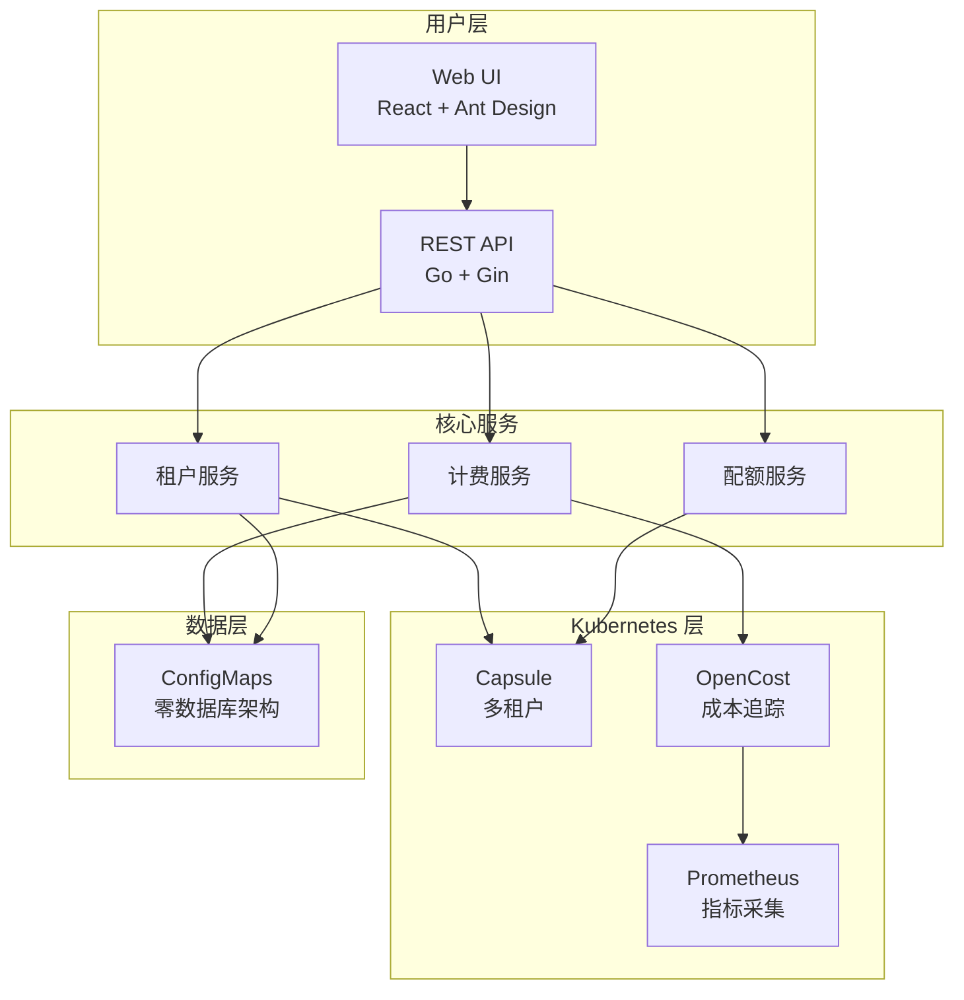
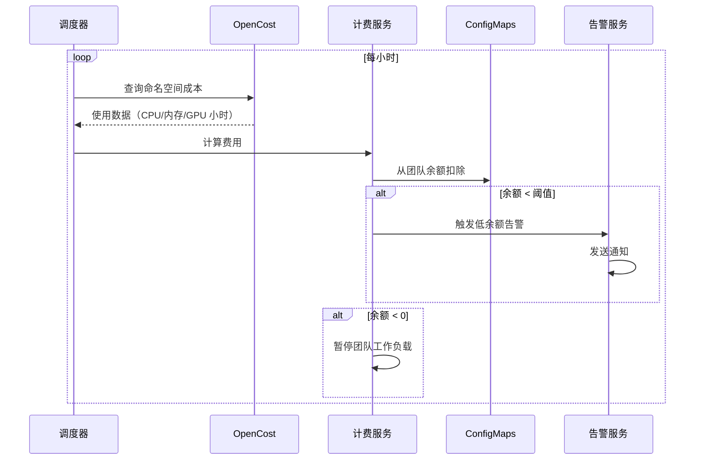

<p align="center">
  
</p>

<h1 align="center">Bison</h1>

<p align="center">
  <strong>企业级 GPU 资源计费与多租户管理平台</strong>
</p>

<p align="center">
  <a href="../README.md">English</a> •
  <a href="./architecture_cn.md">技术架构</a> •
  <a href="#快速开始">快速开始</a> •
  <a href="#功能特性">功能特性</a>
</p>

<p align="center">
  
  
  
  
</p>

---

## 为什么选择 Bison？

在多团队环境中管理 GPU 资源是一项挑战。传统方案需要复杂的配额系统、手动计费和分散的工具。**Bison** 提供统一的平台解决方案：

| 痛点 | Bison 方案 |
|------|-----------|
| 🔐 **多租户隔离** | 基于 Capsule 的命名空间隔离，支持 OIDC 集成 |
| 💰 **成本追踪** | OpenCost + Prometheus 驱动的实时计费 |
| ⚖️ **资源配额** | 动态配额，支持任意 Kubernetes 资源类型 |
| 💳 **余额管理** | 团队钱包，支持自动充值和低余额告警 |
| 📊 **使用分析** | 全面的报表，支持 CSV 导出 |
| 🔧 **零数据库** | 所有数据存储在 ConfigMaps 中，无外部依赖 |

## 功能特性

### 核心能力

```
✅ 多租户管理        基于 Capsule 的团队隔离，支持 OIDC 认证
✅ 实时计费          按使用量计费，支持自定义定价
✅ 动态资源配额      支持 CPU、内存、GPU 或任意 K8s 资源
✅ 团队余额钱包      预付费余额，自动扣费
✅ 定时自动充值      支持每周/每月定时充值
✅ 余额告警通知      多渠道通知（Webhook、钉钉、企业微信）
✅ 使用报表          团队/项目分析，支持导出
✅ 审计日志          完整的操作历史记录
```

### 架构亮点



## 快速开始

### 前置条件

- Kubernetes 1.26+
- Helm 3.0+
- kubectl 已配置

### 1. 安装依赖组件

```bash
# 安装 Capsule（多租户）
helm repo add projectcapsule https://projectcapsule.github.io/charts
helm install capsule projectcapsule/capsule -n capsule-system --create-namespace

# 安装 Prometheus + OpenCost
helm repo add prometheus-community https://prometheus-community.github.io/helm-charts
helm install prometheus prometheus-community/kube-prometheus-stack -n monitoring --create-namespace

helm repo add opencost https://opencost.github.io/opencost-helm-chart
helm install opencost opencost/opencost -n opencost --create-namespace \
  --set opencost.prometheus.internal.serviceName=prometheus-kube-prometheus-prometheus \
  --set opencost.prometheus.internal.namespaceName=monitoring
```

### 2. 部署 Bison

```bash
# 克隆并部署
git clone https://github.com/your-org/bison.git
cd bison

helm install bison ./deploy/charts/bison \
  --namespace bison-system \
  --create-namespace \
  --set auth.enabled=true
```

### 3. 访问平台

```bash
# 获取管理员密码
kubectl get secret bison-auth -n bison-system -o jsonpath='{.data.password}' | base64 -d

# 端口转发
kubectl port-forward svc/bison-api 8080:8080 -n bison-system

# 访问 API
curl http://localhost:8080/api/v1/health
```

## 工作原理

### 计费流程



### 团队生命周期


## 界面预览

<p align="center">
  
  <br/>
  <em>仪表盘 - 资源总览与成本趋势</em>
</p>

<p align="center">
  
  <br/>
  <em>团队管理 - 配额与余额配置</em>
</p>

<p align="center">
  
  <br/>
  <em>计费配置 - 资源定价设置</em>
</p>

## 配置说明

### 主要参数

| 参数 | 说明 | 默认值 |
|------|------|--------|
| `auth.enabled` | 启用认证 | `false` |
| `auth.admin.username` | 管理员用户名 | `admin` |
| `apiServer.replicaCount` | API 服务器副本数 | `2` |
| `dependencies.opencost.apiUrl` | OpenCost API 地址 | `http://opencost.opencost:9003` |

### 计费配置

通过 Web UI 或 API 配置定价：

```json
{
  "enabled": true,
  "currency": "CNY",
  "pricing": {
    "cpu": 0.35,
    "memory": 0.07,
    "nvidia.com/gpu": 18.00
  },
  "billingInterval": "hourly"
}
```

## 本地开发

```bash
# 安装依赖
make install-deps

# 本地运行
make dev          # API + Web UI（需要 tmux）
make dev-api      # 仅 API 服务器
make dev-web      # 仅 Web UI

# 构建
make build        # Docker 镜像
make build-binary # 二进制文件

# 测试
make test
make lint
```

## 目录结构

```
bison/
├── api-server/           # Go 后端（Gin 框架）
│   ├── cmd/              # 入口点
│   ├── internal/
│   │   ├── handler/      # HTTP 处理器
│   │   ├── service/      # 业务逻辑
│   │   ├── k8s/          # Kubernetes 客户端
│   │   └── scheduler/    # 后台任务
│   └── Dockerfile
├── web-ui/               # React 前端
│   ├── src/
│   │   ├── pages/        # 页面组件
│   │   ├── services/     # API 客户端
│   │   └── contexts/     # React 上下文
│   └── Dockerfile
├── deploy/
│   └── charts/bison/     # Helm Chart
├── docs/                 # 文档
└── Makefile
```

## 开发路线

- [ ] Kubernetes Events 集成
- [ ] Grafana 仪表盘模板
- [ ] 成本预测
- [ ] 预算告警
- [ ] API 限流
- [ ] 细粒度 RBAC 权限

## 许可证

MIT License - 详见 [LICENSE](../LICENSE)

---

<p align="center">
  <strong>Bison</strong> - 让 GPU 资源管理更简单
</p>
