# Bison Technical Architecture

<p align="center">
  <a href="./architecture_cn.md">中文版</a>
</p>

This document provides a comprehensive technical overview of Bison's architecture, designed with **high cohesion and low coupling** principles for maintainability and scalability.

---

## Table of Contents

- [System Overview](#system-overview)
- [User Roles & Responsibilities](#user-roles--responsibilities)
- [Architecture Layers](#architecture-layers)
- [Core Components](#core-components)
- [Data Flow](#data-flow)
- [Usage Scenarios](#usage-scenarios)
- [Integration Points](#integration-points)
- [Resource Isolation Architecture](#resource-isolation-architecture)
- [Deployment Architecture](#deployment-architecture)
- [Security Model](#security-model)

---

## System Overview

### High-Level Architecture

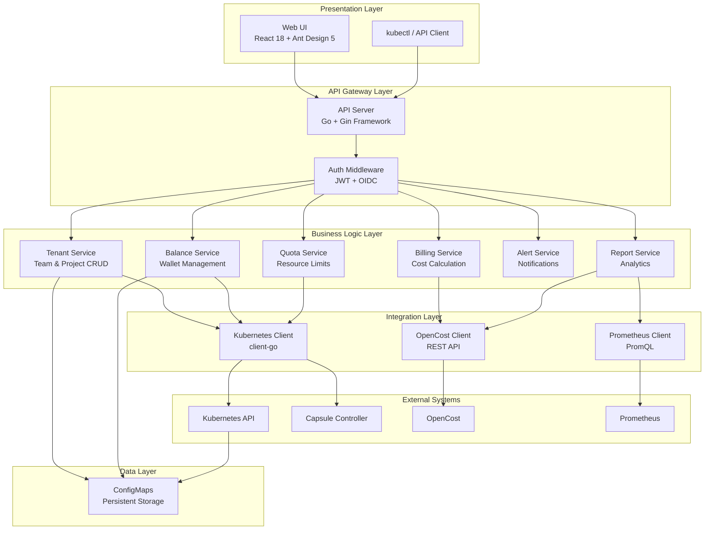
```mermaid
graph TB
    subgraph PRESENT[Presentation Layer]
        WEB[Web UI<br/>React 18 + Ant Design 5]
        CLI[kubectl / API Client]
    end

    subgraph GATEWAY[API Gateway Layer]
        GW[API Server<br/>Go + Gin Framework]
        AUTH[Auth Middleware<br/>JWT + OIDC]
    end

    subgraph BUSINESS[Business Logic Layer]
        TS[Tenant Service<br/>Team & Project CRUD]
        BS[Billing Service<br/>Cost Calculation]
        BLS[Balance Service<br/>Wallet Management]
        QS[Quota Service<br/>Resource Limits]
        AS[Alert Service<br/>Notifications]
        RS[Report Service<br/>Analytics]
    end

    subgraph INTEGRATION[Integration Layer]
        K8S[Kubernetes Client<br/>client-go]
        OCC[OpenCost Client<br/>REST API]
        PC[Prometheus Client<br/>PromQL]
    end

    subgraph EXTERNAL[External Systems]
        KAPI[Kubernetes API]
        CAP[Capsule Controller]
        OC[OpenCost]
        PROM[Prometheus]
    end

    subgraph DATA[Data Layer]
        CM[ConfigMaps<br/>Persistent Storage]
    end

    WEB --> GW
    CLI --> GW
    GW --> AUTH
    AUTH --> TS & BS & BLS & QS & AS & RS

    TS --> K8S
    BS --> OCC
    BLS --> K8S
    QS --> K8S
    RS --> OCC & PC

    K8S --> KAPI
    K8S --> CAP
    OCC --> OC
    PC --> PROM

    TS & BLS --> CM
    KAPI --> CM
```

### Design Principles

| Principle | Implementation |
|-----------|----------------|
| **High Cohesion** | Each service handles a single domain (billing, quota, alerts) |
| **Low Coupling** | Services communicate via well-defined interfaces |
| **Stateless API** | All state persisted in Kubernetes ConfigMaps |
| **Cloud Native** | Leverages Kubernetes primitives for HA and scaling |
| **Zero Database** | ConfigMaps eliminate external database dependencies |

---

## User Roles & Responsibilities

Bison serves four distinct user personas, each with specific responsibilities and access patterns:

### Role 1: Platform Administrator

**Responsibilities:**
- Deploy and configure Bison platform
- Create and manage teams (Capsule Tenants)
- Set global billing configuration
- Monitor cluster-wide metrics
- Respond to alerts and recharge requests

**Typical Workflows:**
1. Create new team with resource mode (shared/exclusive)
2. Configure billing rules (CPU/Memory/GPU pricing)
3. Approve recharge requests
4. Generate monthly reports
5. Respond to low-balance alerts

**Key Metrics Dashboard:**
- Cluster total utilization
- Per-team resource consumption
- Cost trends
- Number of suspended teams
- Active alerts count

**Technical Permissions:**
```yaml
# ClusterRole: bison-admin
rules:
- apiGroups: ["capsule.clastix.io"]
  resources: ["tenants"]
  verbs: ["create", "update", "delete", "get", "list"]
- apiGroups: [""]
  resources: ["configmaps", "namespaces"]
  verbs: ["create", "update", "delete", "get", "list"]
- apiGroups: [""]
  resources: ["nodes"]
  verbs: ["get", "list", "patch"]  # For node pool binding
```

---

### Role 2: Team Leader

**Responsibilities:**
- Create and manage projects (namespaces) within team
- Allocate quotas to projects
- Monitor team balance and consumption rate
- Request recharges
- Configure auto-recharge schedules

**Typical Workflows:**
1. Create project and assign resource quotas
2. Monitor budget and burn rate daily
3. Submit recharge requests before balance depletion
4. View usage reports broken down by project
5. Set up monthly auto-recharge

**Key Metrics Dashboard:**
- Team balance and burn rate
- Per-project costs
- Team quota utilization
- Projected balance depletion date

**Technical Permissions:**
```yaml
# Role: team-leader (scoped to team's namespaces)
rules:
- apiGroups: [""]
  resources: ["namespaces"]
  verbs: ["create", "get", "list"]
  # Restricted to team's tenant via Capsule
- apiGroups: [""]
  resources: ["resourcequotas"]
  verbs: ["create", "update", "get", "list"]
```

---

### Role 3: Project Developer

**Responsibilities:**
- Create Kubernetes workloads (Pods, Jobs, Deployments)
- Request appropriate resources (CPU, GPU)
- Monitor workload status and logs
- Clean up completed jobs to stop billing

**Typical Workflows:**
1. Receive kubeconfig from team leader
2. Write Job/Pod manifests with GPU requests
3. Deploy workloads - quota enforcement is automatic
4. Monitor job progress and cost accumulation
5. Delete completed resources

**Key Metrics Dashboard:**
- Job status and logs
- Resource usage
- Job cost (visible in Bison Dashboard)
- Project quota remaining

**Resource Isolation Experience:**
- **Exclusive Mode**: Pods automatically run on team's dedicated nodes
- **Shared Mode**: Pods run on shared pool, cost-effective
- **Quota Enforcement**: Capsule blocks requests exceeding team quota

**Technical Permissions:**
```yaml
# Role: developer (scoped to specific project namespace)
rules:
- apiGroups: ["", "apps", "batch"]
  resources: ["pods", "deployments", "jobs"]
  verbs: ["create", "get", "list", "delete"]
- apiGroups: [""]
  resources: ["pods/log"]
  verbs: ["get"]
```

---

### Role 4: Kubernetes Workload User

**Focus: Understanding Resource Isolation**

This role represents users who deploy workloads via `kubectl` and need to understand how Bison enforces multi-tenancy.

**Isolation Guarantees:**

| Isolation Type | Mechanism | Benefit |
|----------------|-----------|---------|
| **Compute** | ResourceQuota per Tenant | Cannot exceed team's allocated CPU/Memory/GPU |
| **Node (Exclusive)** | NodeSelector injection | Workloads ONLY run on team's dedicated nodes |
| **Node (Shared)** | Shared pool with quotas | Cost-effective for smaller teams |
| **Namespace** | Capsule Tenant ownership | Can only create/access team's namespaces |
| **Network (Optional)** | NetworkPolicies | Prevent cross-team pod communication |
| **Billing** | Independent team balance | One team's spending doesn't affect others |

**Example: How Capsule Enforces Isolation**

```yaml
# Developer creates this simple pod
apiVersion: v1
kind: Pod
metadata:
  name: training-job
  namespace: ml-training  # Owned by team-ml
spec:
  containers:
  - name: pytorch
    image: pytorch:latest
    resources:
      requests:
        nvidia.com/gpu: 2

# Capsule webhook automatically transforms it to:
apiVersion: v1
kind: Pod
metadata:
  name: training-job
  namespace: ml-training
spec:
  nodeSelector:
    bison.io/pool: team-ml  # Injected by Capsule for exclusive mode!
  containers:
  - name: pytorch
    image: pytorch:latest
    resources:
      requests:
        nvidia.com/gpu: 2
```

**Isolation Execution Flow:**
1. User submits pod creation request
2. Capsule admission webhook intercepts request
3. Validates team has sufficient quota
4. Injects `nodeSelector` if team is in exclusive mode
5. Applies `ResourceQuota` enforcement
6. Rejects request if quota exceeded

---

## Architecture Layers

### Layer Diagram

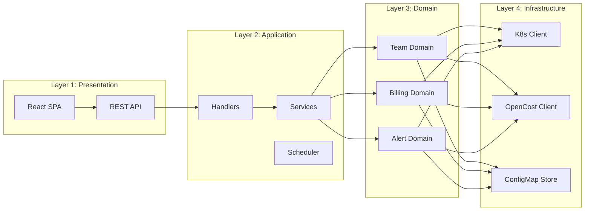
```mermaid
graph LR
    subgraph LAYER1[Layer 1: Presentation]
        direction TB
        A1[React SPA]
        A2[REST API]
    end

    subgraph LAYER2[Layer 2: Application]
        direction TB
        B1[Handlers]
        B2[Services]
        B3[Scheduler]
    end

    subgraph LAYER3[Layer 3: Domain]
        direction TB
        C1[Team Domain]
        C2[Billing Domain]
        C3[Alert Domain]
    end

    subgraph LAYER4[Layer 4: Infrastructure]
        direction TB
        D1[K8s Client]
        D2[OpenCost Client]
        D3[ConfigMap Store]
    end

    A1 --> A2
    A2 --> B1
    B1 --> B2
    B2 --> C1 & C2 & C3
    C1 & C2 & C3 --> D1 & D2 & D3
```

### Layer Responsibilities

#### Presentation Layer
- **Web UI**: React SPA with Ant Design Pro components
- **REST API**: RESTful endpoints following OpenAPI 3.0

#### Application Layer
- **Handlers**: HTTP request/response handling, validation
- **Services**: Business logic orchestration
- **Scheduler**: Background jobs (billing, alerts, auto-recharge)

#### Domain Layer
- **Team Domain**: Capsule Tenant lifecycle
- **Billing Domain**: Cost calculation, balance management
- **Alert Domain**: Threshold monitoring, notifications

#### Infrastructure Layer
- **Kubernetes Client**: CRUD for Tenants, Namespaces, ConfigMaps
- **OpenCost Client**: Query cost allocation API
- **ConfigMap Store**: Data persistence abstraction

---

## Core Components

### Backend Services

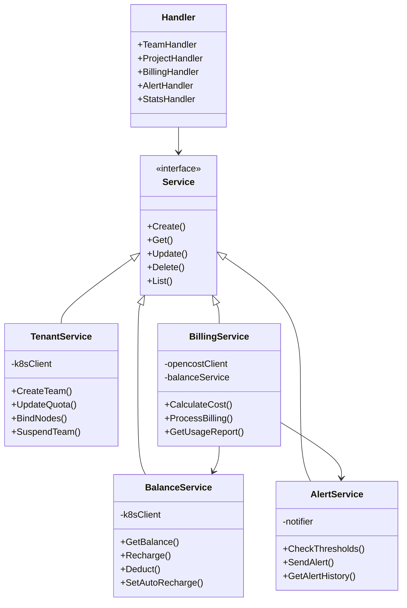
```mermaid
classDiagram
    class Handler {
        +TeamHandler
        +ProjectHandler
        +BillingHandler
        +AlertHandler
        +StatsHandler
    }

    class Service {
        <<interface>>
        +Create()
        +Get()
        +Update()
        +Delete()
        +List()
    }

    class TenantService {
        -k8sClient
        +CreateTeam()
        +UpdateQuota()
        +BindNodes()
        +SuspendTeam()
    }

    class BillingService {
        -opencostClient
        -balanceService
        +CalculateCost()
        +ProcessBilling()
        +GetUsageReport()
    }

    class BalanceService {
        -k8sClient
        +GetBalance()
        +Recharge()
        +Deduct()
        +SetAutoRecharge()
    }

    class AlertService {
        -notifier
        +CheckThresholds()
        +SendAlert()
        +GetAlertHistory()
    }

    Handler --> Service
    Service <|-- TenantService
    Service <|-- BillingService
    Service <|-- BalanceService
    Service <|-- AlertService

    BillingService --> BalanceService
    BillingService --> AlertService
```

### Service Dependencies

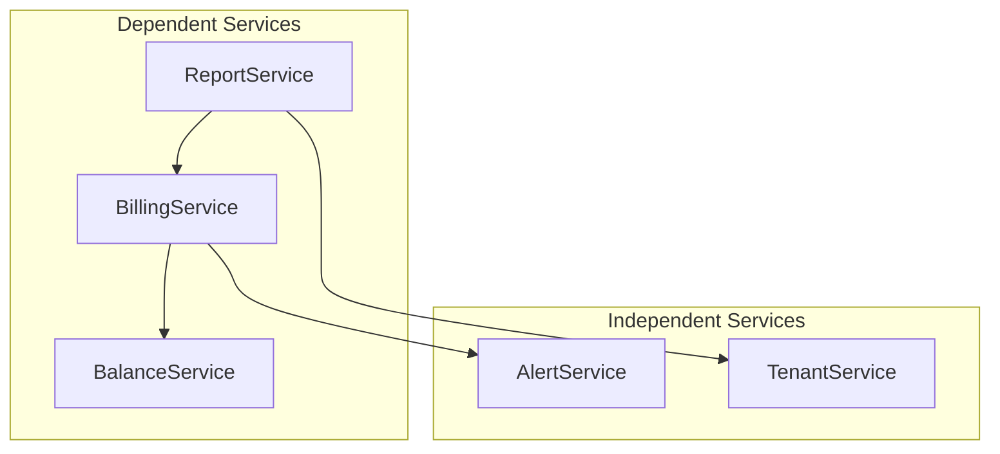
```mermaid
graph TD
    subgraph INDEPENDENT[Independent Services]
        TS[TenantService]
        AS[AlertService]
    end

    subgraph DEPENDENT[Dependent Services]
        BLS[BalanceService]
        BS[BillingService]
        RS[ReportService]
    end

    BS --> BLS
    BS --> AS
    RS --> BS
    RS --> TS
```

### Frontend Architecture

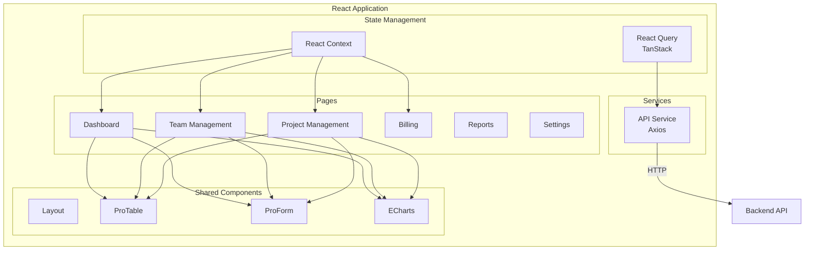
```mermaid
graph TB
    subgraph REACT[React Application]
        subgraph STATE[State Management]
            CTX[React Context]
            RQ[React Query<br/>TanStack]
        end

        subgraph PAGES[Pages]
            DASH[Dashboard]
            TEAM[Team Management]
            PROJ[Project Management]
            BILL[Billing]
            REPORT[Reports]
            SETTINGS[Settings]
        end

        subgraph SHARED_COMP[Shared Components]
            LAYOUT[Layout]
            TABLE[ProTable]
            FORM[ProForm]
            CHART[ECharts]
        end

        subgraph SERVICES[Services]
            API[API Service<br/>Axios]
        end
    end

    CTX --> DASH & TEAM & PROJ & BILL
    RQ --> API
    DASH & TEAM & PROJ --> TABLE & FORM & CHART
    API --> |HTTP| BE[Backend API]
```

---

## Data Flow

### Billing Cycle

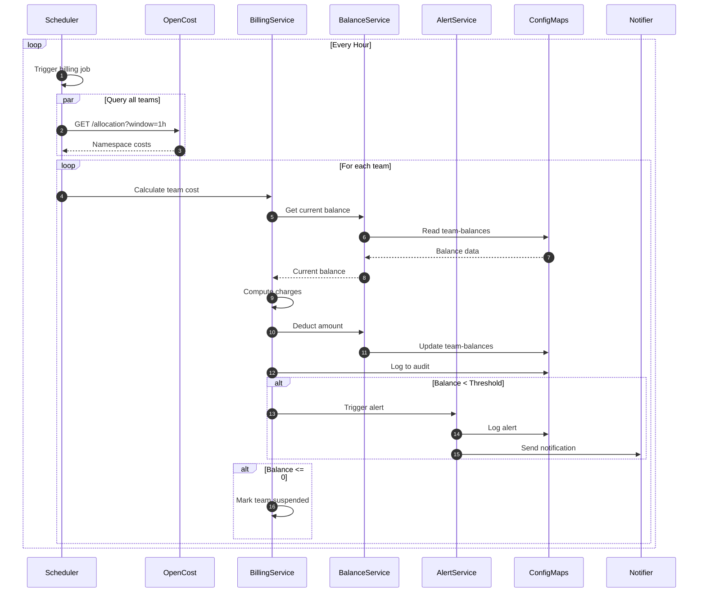
```mermaid
sequenceDiagram
    autonumber
    participant SCHED as Scheduler
    participant OC as OpenCost
    participant BILL as BillingService
    participant BAL as BalanceService
    participant ALERT as AlertService
    participant CM as ConfigMaps
    participant NOTIFY as Notifier

    loop Every Hour
        SCHED->>SCHED: Trigger billing job

        par Query all teams
            SCHED->>OC: GET /allocation?window=1h
            OC-->>SCHED: Namespace costs
        end

        loop For each team
            SCHED->>BILL: Calculate team cost
            BILL->>BAL: Get current balance
            BAL->>CM: Read team-balances
            CM-->>BAL: Balance data
            BAL-->>BILL: Current balance

            BILL->>BILL: Compute charges
            BILL->>BAL: Deduct amount
            BAL->>CM: Update team-balances
            BILL->>CM: Log to audit

            alt Balance < Threshold
                BILL->>ALERT: Trigger alert
                ALERT->>CM: Log alert
                ALERT->>NOTIFY: Send notification
            end

            alt Balance <= 0
                BILL->>BILL: Mark team suspended
            end
        end
    end
```

### Team Creation Flow

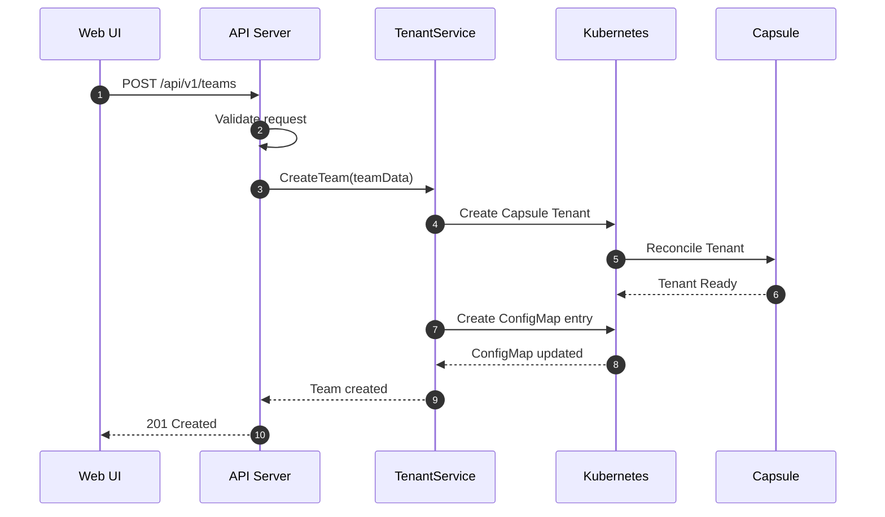
```mermaid
sequenceDiagram
    autonumber
    participant UI as Web UI
    participant API as API Server
    participant TS as TenantService
    participant K8S as Kubernetes
    participant CAP as Capsule

    UI->>API: POST /api/v1/teams
    API->>API: Validate request
    API->>TS: CreateTeam(teamData)

    TS->>K8S: Create Capsule Tenant
    K8S->>CAP: Reconcile Tenant
    CAP-->>K8S: Tenant Ready

    TS->>K8S: Create ConfigMap entry
    K8S-->>TS: ConfigMap updated

    TS-->>API: Team created
    API-->>UI: 201 Created
```

### Project Namespace Lifecycle

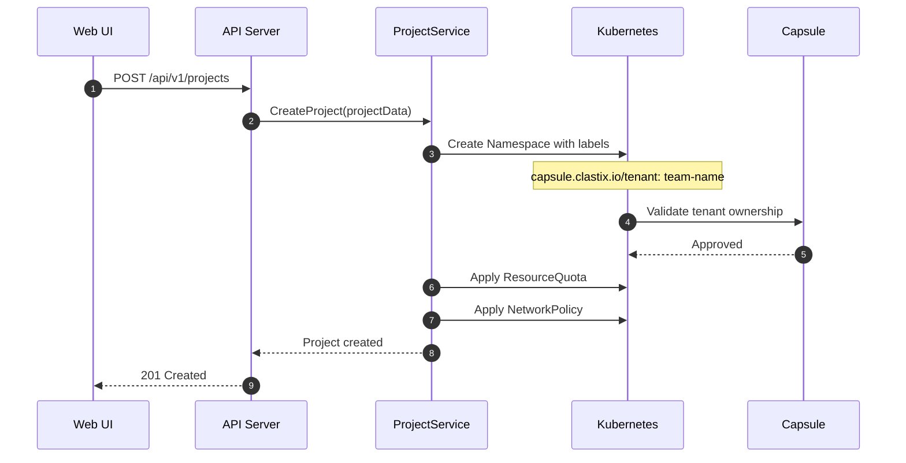
```mermaid
sequenceDiagram
    autonumber
    participant UI as Web UI
    participant API as API Server
    participant PS as ProjectService
    participant K8S as Kubernetes
    participant CAP as Capsule

    UI->>API: POST /api/v1/projects
    API->>PS: CreateProject(projectData)

    PS->>K8S: Create Namespace with labels
    Note over K8S: capsule.clastix.io/tenant: team-name

    K8S->>CAP: Validate tenant ownership
    CAP-->>K8S: Approved

    PS->>K8S: Apply ResourceQuota
    PS->>K8S: Apply NetworkPolicy

    PS-->>API: Project created
    API-->>UI: 201 Created
```

---

## Usage Scenarios

This section demonstrates typical end-to-end scenarios showing how different components interact.

### Scenario 1: New Team Onboarding

**Context:** Platform administrator onboards a new ML team with exclusive GPU nodes.

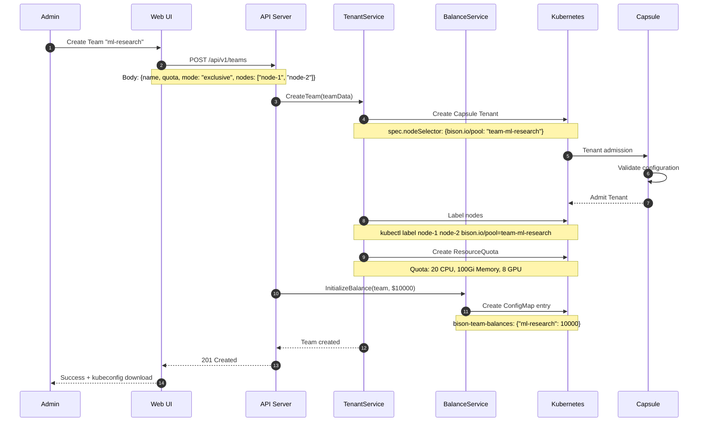
```mermaid
sequenceDiagram
    autonumber
    participant ADMIN as Admin
    participant UI as Web UI
    participant API as API Server
    participant TS as TenantService
    participant BS as BalanceService
    participant K8S as Kubernetes
    participant CAP as Capsule

    ADMIN->>UI: Create Team "ml-research"
    UI->>API: POST /api/v1/teams
    Note over UI,API: Body: {name, quota, mode: "exclusive", nodes: ["node-1", "node-2"]}

    API->>TS: CreateTeam(teamData)

    TS->>K8S: Create Capsule Tenant
    Note over TS,K8S: spec.nodeSelector: {bison.io/pool: "team-ml-research"}

    K8S->>CAP: Tenant admission
    CAP->>CAP: Validate configuration
    CAP-->>K8S: Admit Tenant

    TS->>K8S: Label nodes
    Note over TS,K8S: kubectl label node-1 node-2 bison.io/pool=team-ml-research

    TS->>K8S: Create ResourceQuota
    Note over TS,K8S: Quota: 20 CPU, 100Gi Memory, 8 GPU

    API->>BS: InitializeBalance(team, $10000)
    BS->>K8S: Create ConfigMap entry
    Note over BS,K8S: bison-team-balances: {"ml-research": 10000}

    TS-->>API: Team created
    API-->>UI: 201 Created
    UI-->>ADMIN: Success + kubeconfig download
```

**Key Takeaways:**
- Capsule Tenant is the authoritative source for team isolation
- NodeSelector injection happens automatically for exclusive mode
- Balance initialization is independent of K8s resources
- Admin receives kubeconfig for team's namespaces

---

### Scenario 2: Developer Deploys GPU Job (Quota Exceeded)

**Context:** Developer attempts to deploy a job that exceeds team quota.

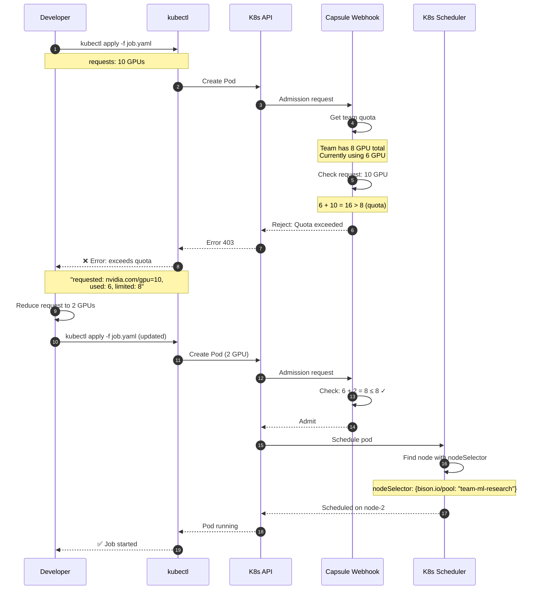
```mermaid
sequenceDiagram
    autonumber
    participant DEV as Developer
    participant KUBECTL as kubectl
    participant K8S as K8s API
    participant CAP as Capsule Webhook
    participant SCHED as K8s Scheduler

    DEV->>KUBECTL: kubectl apply -f job.yaml
    Note over DEV,KUBECTL: requests: 10 GPUs

    KUBECTL->>K8S: Create Pod
    K8S->>CAP: Admission request

    CAP->>CAP: Get team quota
    Note over CAP: Team has 8 GPU total<br/>Currently using 6 GPU

    CAP->>CAP: Check request: 10 GPU
    Note over CAP: 6 + 10 = 16 > 8 (quota)

    CAP-->>K8S: Reject: Quota exceeded
    K8S-->>KUBECTL: Error 403

    KUBECTL-->>DEV: ❌ Error: exceeds quota
    Note over DEV,KUBECTL: "requested: nvidia.com/gpu=10,<br/>used: 6, limited: 8"

    DEV->>DEV: Reduce request to 2 GPUs
    DEV->>KUBECTL: kubectl apply -f job.yaml (updated)

    KUBECTL->>K8S: Create Pod (2 GPU)
    K8S->>CAP: Admission request
    CAP->>CAP: Check: 6 + 2 = 8 ≤ 8 ✓
    CAP-->>K8S: Admit

    K8S->>SCHED: Schedule pod
    SCHED->>SCHED: Find node with nodeSelector
    Note over SCHED: nodeSelector: {bison.io/pool: "team-ml-research"}

    SCHED-->>K8S: Scheduled on node-2
    K8S-->>KUBECTL: Pod running
    KUBECTL-->>DEV: ✅ Job started
```

**Key Takeaways:**
- Capsule enforces quotas at admission time (before scheduling)
- Clear error messages guide users to fix resource requests
- NodeSelector ensures pods run on team's dedicated nodes
- Quota tracking is cumulative across all team namespaces

---

### Scenario 3: Hourly Billing with Low Balance Alert

**Context:** Automated billing job runs and detects low team balance.

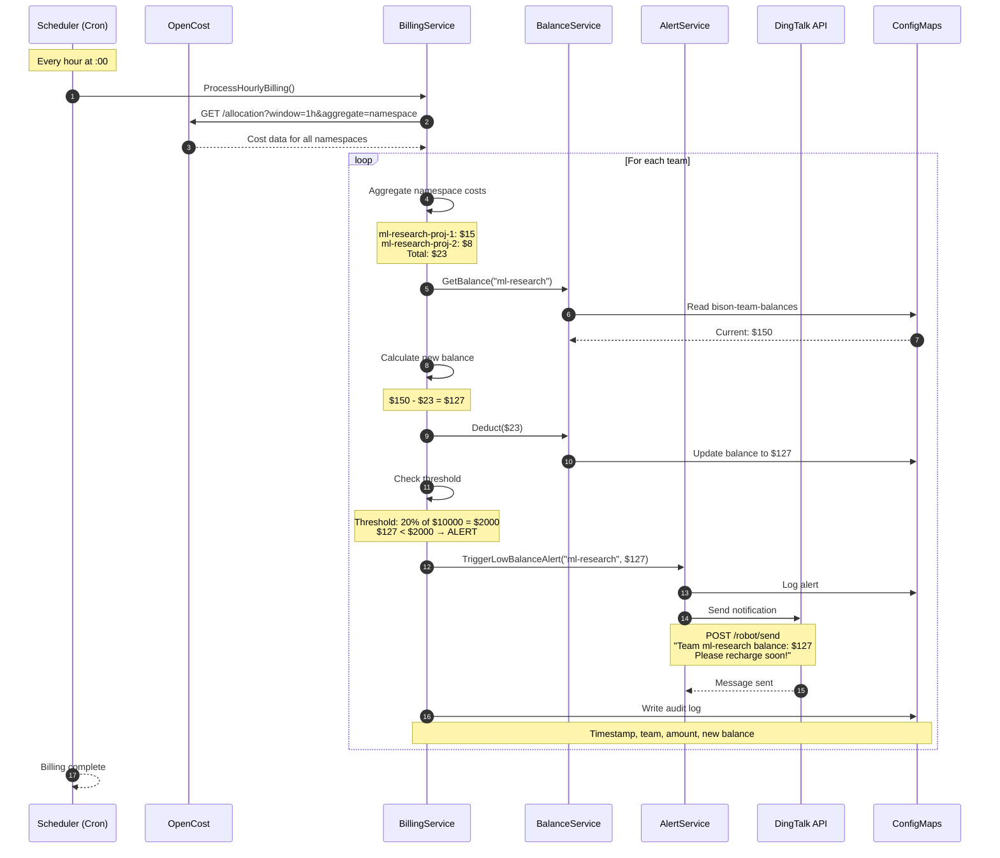
```mermaid
sequenceDiagram
    autonumber
    participant CRON as Scheduler (Cron)
    participant OC as OpenCost
    participant BILL as BillingService
    participant BAL as BalanceService
    participant ALERT as AlertService
    participant DT as DingTalk API
    participant CM as ConfigMaps

    Note over CRON: Every hour at :00
    CRON->>BILL: ProcessHourlyBilling()

    BILL->>OC: GET /allocation?window=1h&aggregate=namespace
    OC-->>BILL: Cost data for all namespaces

    loop For each team
        BILL->>BILL: Aggregate namespace costs
        Note over BILL: ml-research-proj-1: $15<br/>ml-research-proj-2: $8<br/>Total: $23

        BILL->>BAL: GetBalance("ml-research")
        BAL->>CM: Read bison-team-balances
        CM-->>BAL: Current: $150

        BILL->>BILL: Calculate new balance
        Note over BILL: $150 - $23 = $127

        BILL->>BAL: Deduct($23)
        BAL->>CM: Update balance to $127

        BILL->>BILL: Check threshold
        Note over BILL: Threshold: 20% of $10000 = $2000<br/>$127 < $2000 → ALERT

        BILL->>ALERT: TriggerLowBalanceAlert("ml-research", $127)

        ALERT->>CM: Log alert
        ALERT->>DT: Send notification
        Note over ALERT,DT: POST /robot/send<br/>"Team ml-research balance: $127<br/>Please recharge soon!"

        DT-->>ALERT: Message sent

        BILL->>CM: Write audit log
        Note over BILL,CM: Timestamp, team, amount, new balance
    end

    CRON-->>CRON: Billing complete
```

**Key Takeaways:**
- Billing runs hourly, aggregating costs from OpenCost
- Balance deduction and alert checking happen atomically
- Multiple notification channels supported (DingTalk, WeChat, Webhook)
- Audit logs provide complete billing history

---

### Scenario 4: Auto-Recharge on Schedule

**Context:** Team has configured monthly auto-recharge, and the scheduled job executes.

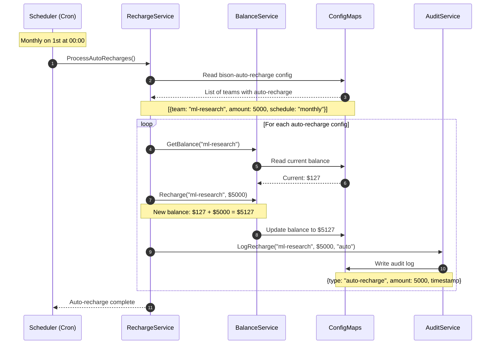
```mermaid
sequenceDiagram
    autonumber
    participant CRON as Scheduler (Cron)
    participant RECHARGE as RechargeService
    participant BAL as BalanceService
    participant CM as ConfigMaps
    participant AUDIT as AuditService

    Note over CRON: Monthly on 1st at 00:00
    CRON->>RECHARGE: ProcessAutoRecharges()

    RECHARGE->>CM: Read bison-auto-recharge config
    CM-->>RECHARGE: List of teams with auto-recharge
    Note over CM,RECHARGE: [{team: "ml-research", amount: 5000, schedule: "monthly"}]

    loop For each auto-recharge config
        RECHARGE->>BAL: GetBalance("ml-research")
        BAL->>CM: Read current balance
        CM-->>BAL: Current: $127

        RECHARGE->>BAL: Recharge("ml-research", $5000)
        Note over RECHARGE,BAL: New balance: $127 + $5000 = $5127

        BAL->>CM: Update balance to $5127

        RECHARGE->>AUDIT: LogRecharge("ml-research", $5000, "auto")
        AUDIT->>CM: Write audit log
        Note over AUDIT,CM: {type: "auto-recharge", amount: 5000, timestamp}
    end

    RECHARGE-->>CRON: Auto-recharge complete
```

**Key Takeaways:**
- Auto-recharge schedules stored in ConfigMaps
- Fully automated - no human intervention needed
- Audit trail maintained for compliance
- Prevents unexpected service disruptions

---

## Integration Points

### Capsule Integration

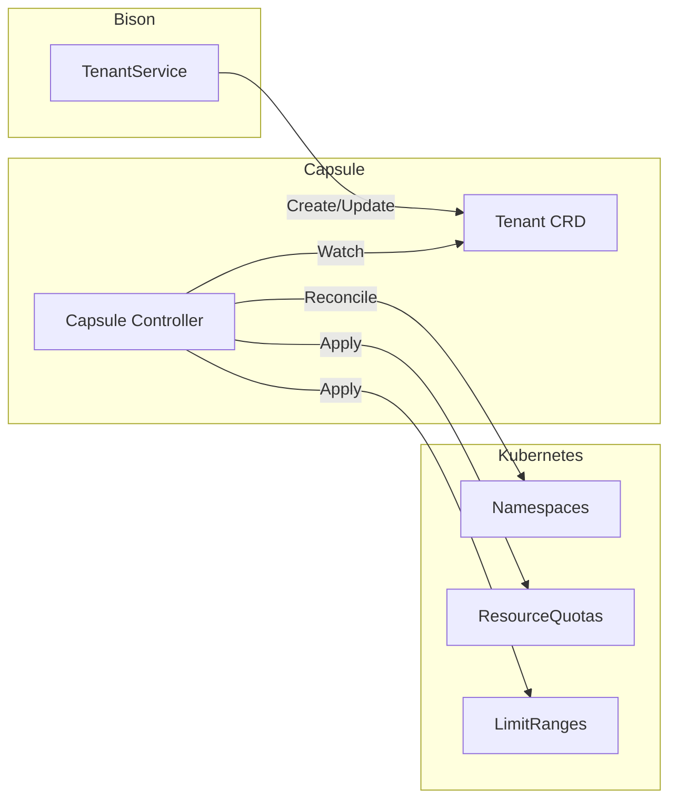
```mermaid
graph LR
    subgraph BISON[Bison]
        TS[TenantService]
    end

    subgraph CAPSULE[Capsule]
        CTRL[Capsule Controller]
        TEN[Tenant CRD]
    end

    subgraph K8S[Kubernetes]
        NS[Namespaces]
        RQ[ResourceQuotas]
        LR[LimitRanges]
    end

    TS -->|Create/Update| TEN
    CTRL -->|Watch| TEN
    CTRL -->|Reconcile| NS
    CTRL -->|Apply| RQ & LR
```

**Tenant CRD Mapping:**

| Bison Concept | Capsule Resource |
|---------------|-----------------|
| Team | Tenant |
| Project | Namespace (within Tenant) |
| Team Owners | Tenant Owners (OIDC groups) |
| Resource Quota | Tenant ResourceQuota |
| Node Binding | Tenant NodeSelector |

### OpenCost Integration

```mermaid
graph LR
    subgraph BISON2[Bison]
        CS[CostService]
        RS[ReportService]
    end

    subgraph OPENCOST[OpenCost]
        API[Allocation API<br/>:9003/allocation]
        UI[OpenCost UI<br/>:9090]
    end

    subgraph PROM[Prometheus]
        PROM[Prometheus Server]
        METRICS[Container Metrics]
    end

    CS -->|GET /allocation| API
    RS -->|GET /allocation| API
    API -->|Query| PROM
    PROM -->|Scrape| METRICS
```

**OpenCost API Usage:**

```bash
# Query hourly costs by namespace
GET /allocation?window=1h&aggregate=namespace

# Response structure
{
  "namespace-name": {
    "cpuCost": 0.05,
    "memoryCost": 0.02,
    "gpuCost": 2.50,
    "totalCost": 2.57
  }
}
```

---

## Resource Isolation Architecture

Bison achieves true multi-tenancy through **Capsule**, which enforces strict isolation between teams at multiple levels.

### Isolation Hierarchy

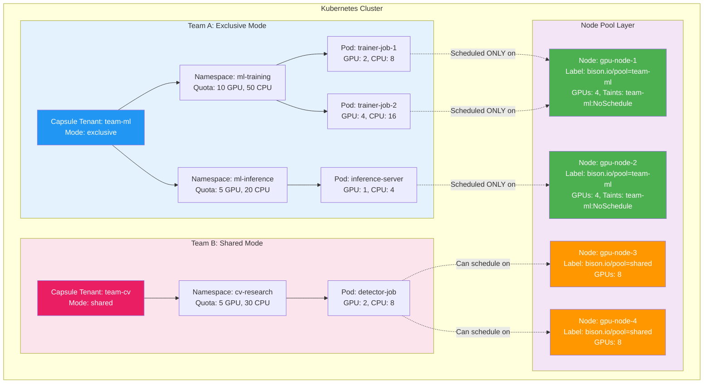
```mermaid
graph TB
    subgraph K8S_CLUSTER[Kubernetes Cluster]
        subgraph TEAM_A[Team A: Exclusive Mode]
            style TEAM_A fill:#e3f2fd
            T1[Capsule Tenant: team-ml<br/>Mode: exclusive]
            T1_NS1[Namespace: ml-training<br/>Quota: 10 GPU, 50 CPU]
            T1_NS2[Namespace: ml-inference<br/>Quota: 5 GPU, 20 CPU]

            T1_POD1[Pod: trainer-job-1<br/>GPU: 2, CPU: 8]
            T1_POD2[Pod: trainer-job-2<br/>GPU: 4, CPU: 16]
            T1_POD3[Pod: inference-server<br/>GPU: 1, CPU: 4]

            T1 --> T1_NS1
            T1 --> T1_NS2
            T1_NS1 --> T1_POD1
            T1_NS1 --> T1_POD2
            T1_NS2 --> T1_POD3
        end

        subgraph TEAM_B[Team B: Shared Mode]
            style TEAM_B fill:#fce4ec
            T2[Capsule Tenant: team-cv<br/>Mode: shared]
            T2_NS1[Namespace: cv-research<br/>Quota: 5 GPU, 30 CPU]
            T2_POD1[Pod: detector-job<br/>GPU: 2, CPU: 8]

            T2 --> T2_NS1
            T2_NS1 --> T2_POD1
        end

        subgraph NODES[Node Pool Layer]
            style NODES fill:#f3e5f5
            N1[Node: gpu-node-1<br/>Label: bison.io/pool=team-ml<br/>GPUs: 4, Taints: team-ml:NoSchedule]
            N2[Node: gpu-node-2<br/>Label: bison.io/pool=team-ml<br/>GPUs: 4, Taints: team-ml:NoSchedule]
            N3[Node: gpu-node-3<br/>Label: bison.io/pool=shared<br/>GPUs: 8]
            N4[Node: gpu-node-4<br/>Label: bison.io/pool=shared<br/>GPUs: 8]
        end
    end

    T1_POD1 -.Scheduled ONLY on.-> N1
    T1_POD2 -.Scheduled ONLY on.-> N1
    T1_POD3 -.Scheduled ONLY on.-> N2

    T2_POD1 -.Can schedule on.-> N3
    T2_POD1 -.Can schedule on.-> N4

    style T1 fill:#2196f3,color:#fff
    style T2 fill:#e91e63,color:#fff
    style N1 fill:#4caf50,color:#fff
    style N2 fill:#4caf50,color:#fff
    style N3 fill:#ff9800,color:#fff
    style N4 fill:#ff9800,color:#fff
```

---

### Isolation Mechanisms

| Isolation Layer | Technology | Enforcement Point | Benefit |
|----------------|------------|-------------------|---------|
| **Namespace** | Capsule Tenant ownership | K8s RBAC | Teams can only create/access their own namespaces |
| **Compute Quota** | ResourceQuota per Tenant | Capsule admission webhook | Teams cannot exceed allocated CPU/Memory/GPU |
| **Node (Exclusive)** | NodeSelector + Taints | Capsule mutating webhook | Team pods ONLY run on dedicated nodes |
| **Node (Shared)** | Shared pool with quotas | K8s scheduler | Cost-effective for smaller teams |
| **Network (Optional)** | NetworkPolicies | K8s network plugin | Prevent cross-team pod communication |
| **Billing** | Separate balance ConfigMap | Bison billing service | One team's spending doesn't affect others |

---

### Capsule Isolation Execution Flow

This sequence diagram shows how Capsule intercepts and enforces isolation for exclusive mode teams:

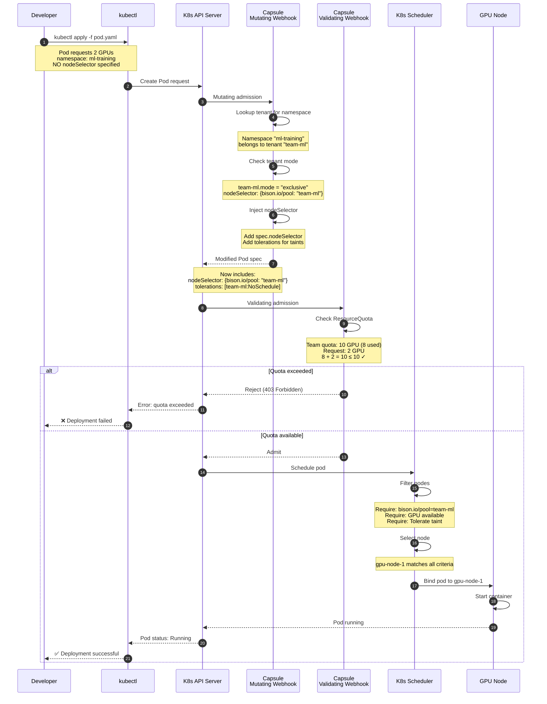
```mermaid
sequenceDiagram
    autonumber
    participant DEV as Developer
    participant KUBECTL as kubectl
    participant K8S as K8s API Server
    participant CAP_MUTATE as Capsule<br/>Mutating Webhook
    participant CAP_VALIDATE as Capsule<br/>Validating Webhook
    participant SCHED as K8s Scheduler
    participant NODE as GPU Node

    DEV->>KUBECTL: kubectl apply -f pod.yaml
    Note over DEV,KUBECTL: Pod requests 2 GPUs<br/>namespace: ml-training<br/>NO nodeSelector specified

    KUBECTL->>K8S: Create Pod request

    %% Mutating webhook phase
    K8S->>CAP_MUTATE: Mutating admission
    CAP_MUTATE->>CAP_MUTATE: Lookup tenant for namespace
    Note over CAP_MUTATE: Namespace "ml-training"<br/>belongs to tenant "team-ml"

    CAP_MUTATE->>CAP_MUTATE: Check tenant mode
    Note over CAP_MUTATE: team-ml.mode = "exclusive"<br/>nodeSelector: {bison.io/pool: "team-ml"}

    CAP_MUTATE->>CAP_MUTATE: Inject nodeSelector
    Note over CAP_MUTATE: Add spec.nodeSelector<br/>Add tolerations for taints

    CAP_MUTATE-->>K8S: Modified Pod spec
    Note over CAP_MUTATE,K8S: Now includes:<br/>nodeSelector: {bison.io/pool: "team-ml"}<br/>tolerations: [team-ml:NoSchedule]

    %% Validating webhook phase
    K8S->>CAP_VALIDATE: Validating admission
    CAP_VALIDATE->>CAP_VALIDATE: Check ResourceQuota
    Note over CAP_VALIDATE: Team quota: 10 GPU (8 used)<br/>Request: 2 GPU<br/>8 + 2 = 10 ≤ 10 ✓

    alt Quota exceeded
        CAP_VALIDATE-->>K8S: Reject (403 Forbidden)
        K8S-->>KUBECTL: Error: quota exceeded
        KUBECTL-->>DEV: ❌ Deployment failed
    else Quota available
        CAP_VALIDATE-->>K8S: Admit

        %% Scheduling phase
        K8S->>SCHED: Schedule pod
        SCHED->>SCHED: Filter nodes
        Note over SCHED: Require: bison.io/pool=team-ml<br/>Require: GPU available<br/>Require: Tolerate taint

        SCHED->>SCHED: Select node
        Note over SCHED: gpu-node-1 matches all criteria

        SCHED->>NODE: Bind pod to gpu-node-1
        NODE->>NODE: Start container
        NODE-->>K8S: Pod running
        K8S-->>KUBECTL: Pod status: Running
        KUBECTL-->>DEV: ✅ Deployment successful
    end
```

**Key Steps:**
1. **Mutating Webhook** - Capsule automatically injects `nodeSelector` and `tolerations` for exclusive mode teams
2. **Validating Webhook** - Capsule checks ResourceQuota enforcement across all team namespaces
3. **Scheduler** - K8s scheduler honors nodeSelector, ensuring pods run only on team's dedicated nodes
4. **Rejection** - Clear error messages guide developers to reduce resource requests

---

### Resource Mode Comparison

#### Exclusive Mode

**Configuration:**
```yaml
apiVersion: capsule.clastix.io/v1beta2
kind: Tenant
metadata:
  name: team-ml
spec:
  owners:
  - name: ml-team-lead@company.com
    kind: User

  # Node binding for exclusive mode
  nodeSelector:
    bison.io/pool: team-ml

  # Prevent other teams from scheduling here
  tolerations:
  - key: team-ml
    operator: Equal
    value: "true"
    effect: NoSchedule

  resourceQuotas:
    scope: Tenant
    items:
    - hard:
        limits.cpu: "100"
        limits.memory: "500Gi"
        requests.nvidia.com/gpu: "10"
```

**Node Labeling:**
```bash
# Label nodes for exclusive team
kubectl label nodes gpu-node-1 gpu-node-2 bison.io/pool=team-ml

# Apply taints to prevent other teams
kubectl taint nodes gpu-node-1 gpu-node-2 team-ml=true:NoSchedule
```

**Benefits:**
- **Performance Isolation**: No "noisy neighbor" issues
- **Predictable Scheduling**: Guaranteed node availability
- **Security**: Physical separation of workloads
- **Compliance**: Regulatory requirements for data isolation

**Trade-offs:**
- Higher cost (dedicated hardware)
- Potential underutilization if team doesn't fully use nodes

---

#### Shared Mode

**Configuration:**
```yaml
apiVersion: capsule.clastix.io/v1beta2
kind: Tenant
metadata:
  name: team-cv
spec:
  owners:
  - name: cv-team-lead@company.com
    kind: User

  # No nodeSelector - can use any node in shared pool
  # (or specify shared pool explicitly)
  nodeSelector:
    bison.io/pool: shared

  resourceQuotas:
    scope: Tenant
    items:
    - hard:
        limits.cpu: "50"
        limits.memory: "200Gi"
        requests.nvidia.com/gpu: "5"
```

**Node Labeling:**
```bash
# Label nodes for shared pool
kubectl label nodes gpu-node-3 gpu-node-4 bison.io/pool=shared
```

**Benefits:**
- **Cost Efficiency**: Shared hardware utilization
- **Flexibility**: Burst capacity across multiple teams
- **Lower Entry Barrier**: Suitable for small teams or experimentation

**Trade-offs:**
- Potential performance variability
- Quota enforcement is critical to prevent monopolization

---

### Isolation Validation

**How to verify isolation is working:**

```bash
# 1. Check tenant configuration
kubectl get tenant team-ml -o yaml

# 2. Verify nodeSelector injection
kubectl get pod training-job -n ml-training -o jsonpath='{.spec.nodeSelector}'
# Expected: {"bison.io/pool":"team-ml"}

# 3. Confirm pod is running on correct node
kubectl get pod training-job -n ml-training -o wide
# Expected: NODE column shows gpu-node-1 or gpu-node-2

# 4. Test quota enforcement (should fail)
kubectl run test --image=busybox -n ml-training \
  --requests='nvidia.com/gpu=100'
# Expected: Error from server (Forbidden): exceeded quota

# 5. Verify cross-team isolation (Team B cannot access Team A namespace)
kubectl get pods -n ml-training --as=cv-team-lead@company.com
# Expected: Error: User cannot list pods in namespace "ml-training"
```

---

## Deployment Architecture

### Kubernetes Resources

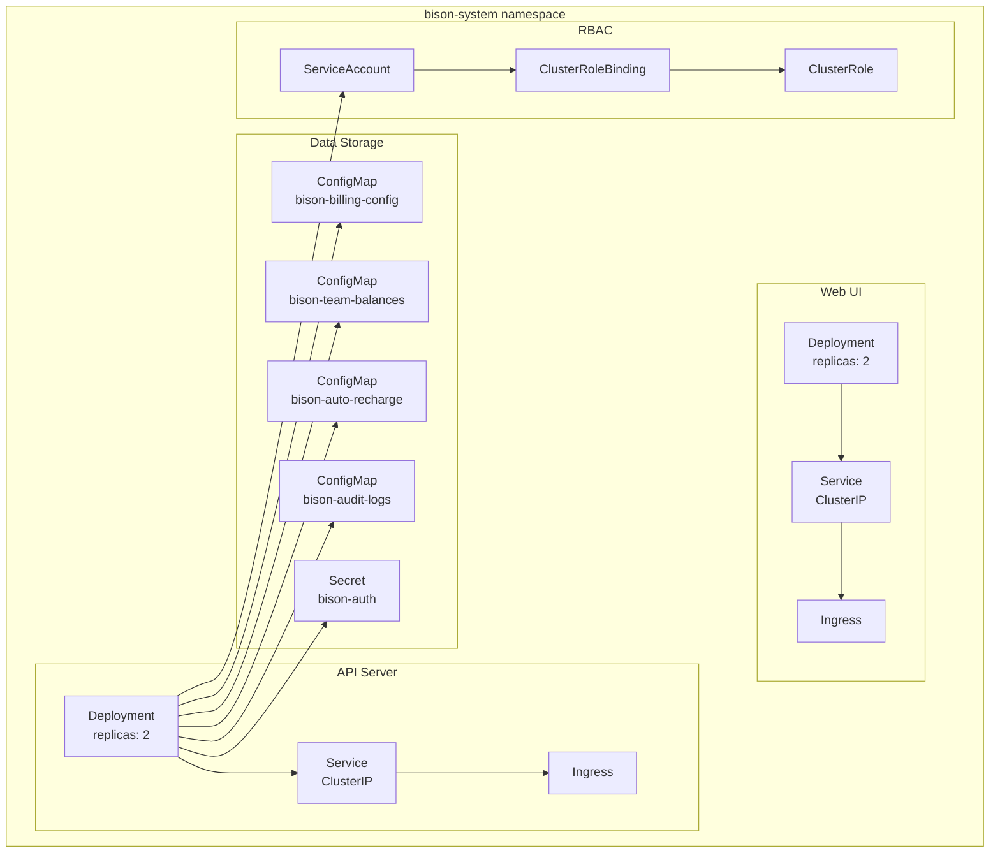
```mermaid
graph TB
    subgraph BISON_NS[bison-system namespace]
        subgraph API[API Server]
            DEP1[Deployment<br/>replicas: 2]
            SVC1[Service<br/>ClusterIP]
            ING1[Ingress]
        end

        subgraph WEB[Web UI]
            DEP2[Deployment<br/>replicas: 2]
            SVC2[Service<br/>ClusterIP]
            ING2[Ingress]
        end

        subgraph STORAGE[Data Storage]
            CM1[ConfigMap<br/>bison-billing-config]
            CM2[ConfigMap<br/>bison-team-balances]
            CM3[ConfigMap<br/>bison-auto-recharge]
            CM4[ConfigMap<br/>bison-audit-logs]
            SEC[Secret<br/>bison-auth]
        end

        subgraph RBAC_SUB[RBAC]
            SA[ServiceAccount]
            CR[ClusterRole]
            CRB[ClusterRoleBinding]
        end
    end

    DEP1 --> SVC1 --> ING1
    DEP2 --> SVC2 --> ING2
    DEP1 --> CM1 & CM2 & CM3 & CM4
    DEP1 --> SEC
    DEP1 --> SA
    SA --> CRB --> CR
```

### High Availability

```mermaid
graph TB
    subgraph LB[Load Balancer]
        LB[Ingress Controller]
    end

    subgraph API_POOL[API Server Pool]
        API1[API Pod 1]
        API2[API Pod 2]
        API3[API Pod N]
    end

    subgraph WEB_POOL[Web UI Pool]
        WEB1[Web Pod 1]
        WEB2[Web Pod 2]
    end

    subgraph SHARED_STATE[Shared State]
        CM[ConfigMaps<br/>etcd backed]
    end

    LB --> API1 & API2 & API3
    LB --> WEB1 & WEB2
    API1 & API2 & API3 --> CM
```

---

## Security Model

### Authentication & Authorization

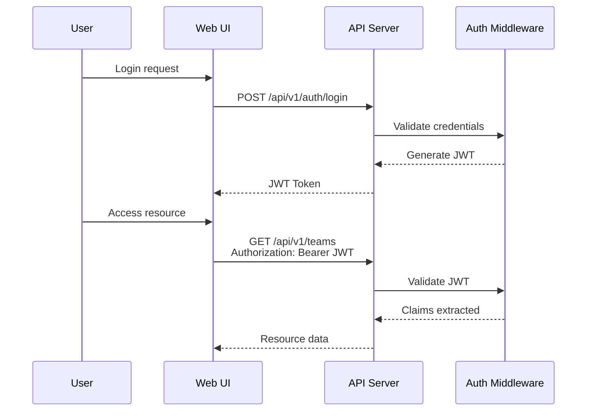
```mermaid
sequenceDiagram
    participant USER as User
    participant UI as Web UI
    participant API as API Server
    participant AUTH as Auth Middleware

    USER->>UI: Login request
    UI->>API: POST /api/v1/auth/login
    API->>AUTH: Validate credentials
    AUTH-->>API: Generate JWT
    API-->>UI: JWT Token

    USER->>UI: Access resource
    UI->>API: GET /api/v1/teams<br/>Authorization: Bearer JWT
    API->>AUTH: Validate JWT
    AUTH-->>API: Claims extracted
    API-->>UI: Resource data
```

### RBAC Permissions

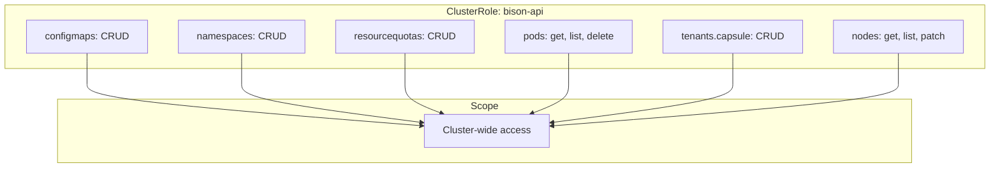
```mermaid
graph TD
    subgraph CLUSTER_ROLE[ClusterRole: bison-api]
        P1[configmaps: CRUD]
        P2[namespaces: CRUD]
        P3[resourcequotas: CRUD]
        P4[pods: get, list, delete]
        P5[tenants.capsule: CRUD]
        P6[nodes: get, list, patch]
    end

    subgraph SCOPE[Scope]
        S1[Cluster-wide access]
    end

    P1 & P2 & P3 & P4 & P5 & P6 --> S1
```

---

## Technology Stack Summary

| Layer | Technology | Purpose |
|-------|------------|---------|
| Frontend | React 18 + TypeScript | SPA framework |
| UI Components | Ant Design Pro 5 | Enterprise UI |
| Charts | ECharts | Data visualization |
| Backend | Go 1.21 + Gin | REST API |
| K8s Client | client-go | Kubernetes integration |
| Multi-Tenancy | Capsule | Namespace isolation |
| Cost Tracking | OpenCost | Resource billing |
| Metrics | Prometheus | Time-series data |
| Data Storage | ConfigMaps | Persistent state |
| Deployment | Helm 3 | Package management |

---

<p align="center">
  <em>Designed for enterprise-grade GPU resource management</em>
</p>
