# Bison Technical Architecture

<p align="center">
  <a href="./architecture_cn.md">中文版</a>
</p>

This document provides a comprehensive technical overview of Bison's architecture, designed with **high cohesion and low coupling** principles for maintainability and scalability.

---

## Table of Contents

- [System Overview](#system-overview)
- [Architecture Layers](#architecture-layers)
- [Core Components](#core-components)
- [Data Flow](#data-flow)
- [Integration Points](#integration-points)
- [Deployment Architecture](#deployment-architecture)
- [Security Model](#security-model)

---

## System Overview

### High-Level Architecture

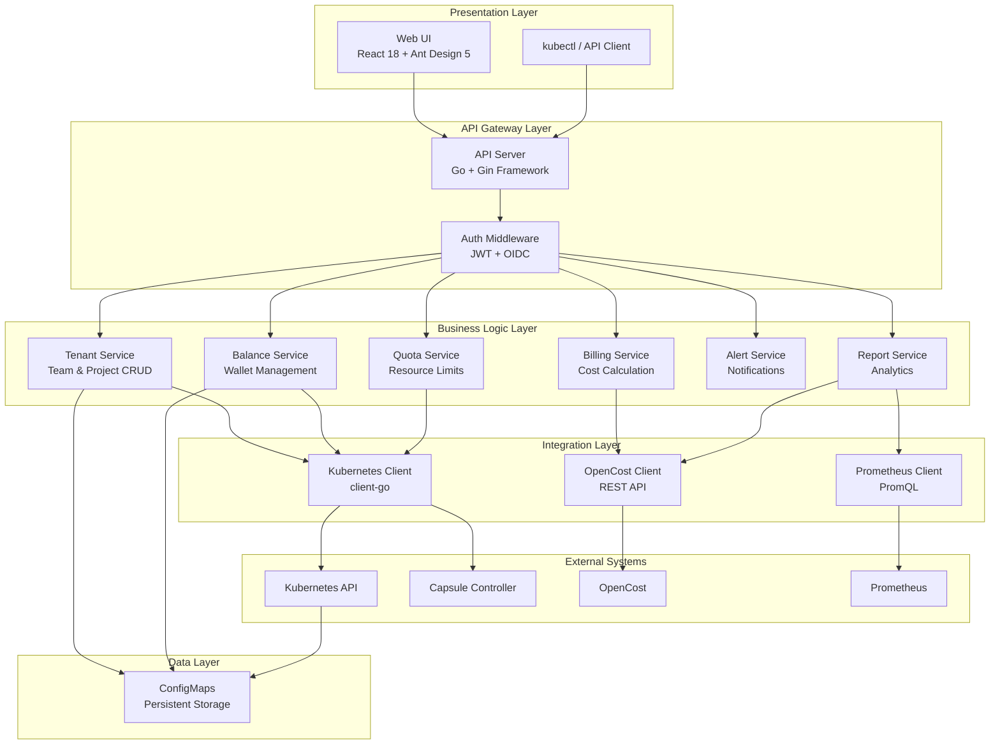

### Design Principles

| Principle | Implementation |
|-----------|----------------|
| **High Cohesion** | Each service handles a single domain (billing, quota, alerts) |
| **Low Coupling** | Services communicate via well-defined interfaces |
| **Stateless API** | All state persisted in Kubernetes ConfigMaps |
| **Cloud Native** | Leverages Kubernetes primitives for HA and scaling |
| **Zero Database** | ConfigMaps eliminate external database dependencies |

---

## Architecture Layers

### Layer Diagram

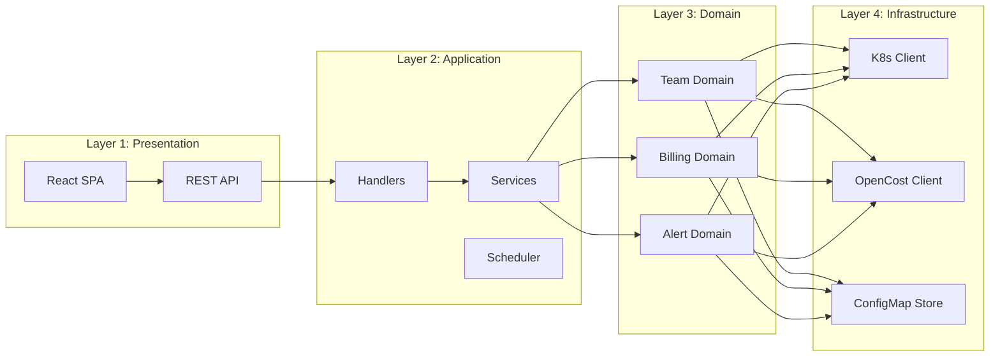

### Layer Responsibilities

#### Presentation Layer
- **Web UI**: React SPA with Ant Design Pro components
- **REST API**: RESTful endpoints following OpenAPI 3.0

#### Application Layer
- **Handlers**: HTTP request/response handling, validation
- **Services**: Business logic orchestration
- **Scheduler**: Background jobs (billing, alerts, auto-recharge)

#### Domain Layer
- **Team Domain**: Capsule Tenant lifecycle
- **Billing Domain**: Cost calculation, balance management
- **Alert Domain**: Threshold monitoring, notifications

#### Infrastructure Layer
- **Kubernetes Client**: CRUD for Tenants, Namespaces, ConfigMaps
- **OpenCost Client**: Query cost allocation API
- **ConfigMap Store**: Data persistence abstraction

---

## Core Components

### Backend Services

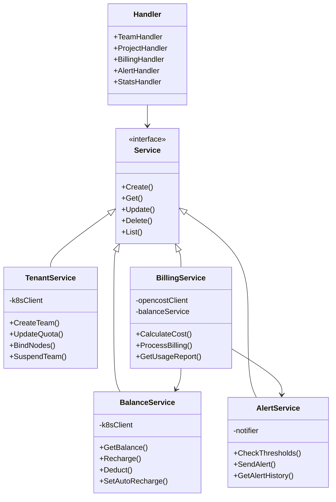

### Service Dependencies

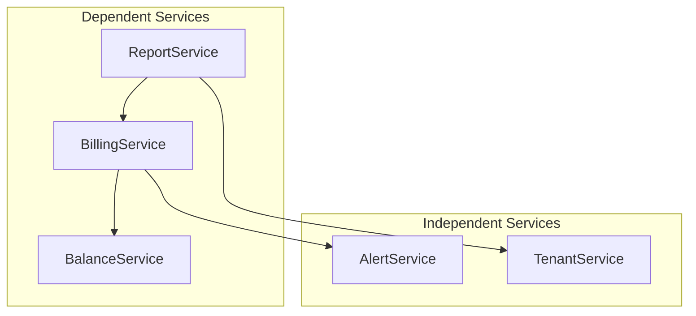

### Frontend Architecture

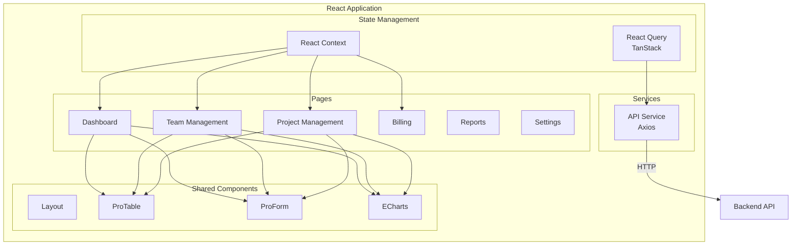

---

## Data Flow

### Billing Cycle

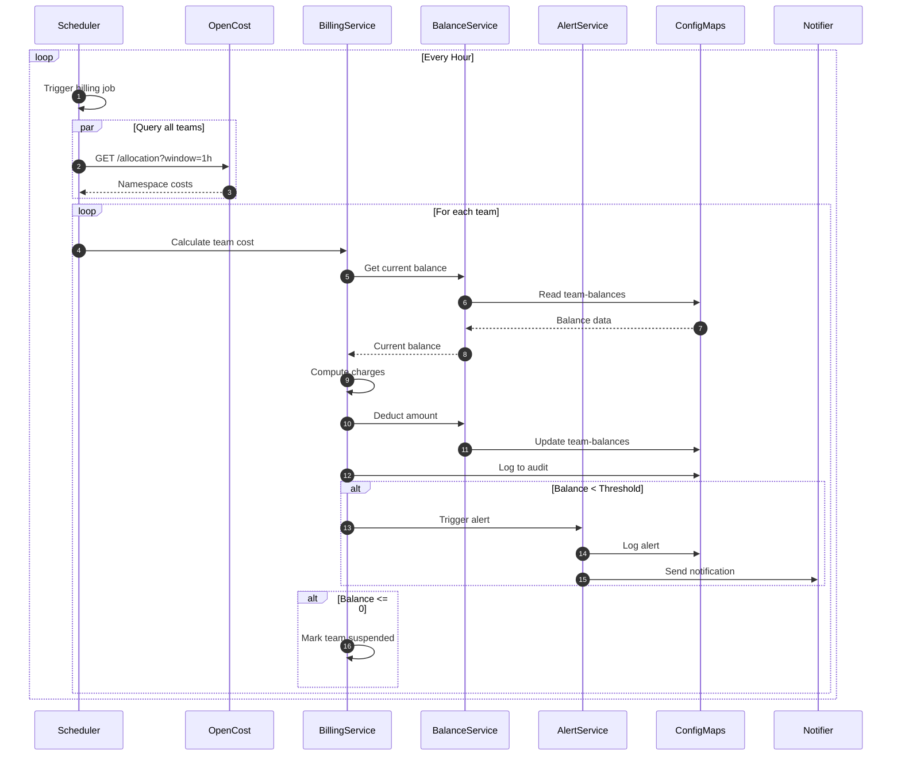

### Team Creation Flow

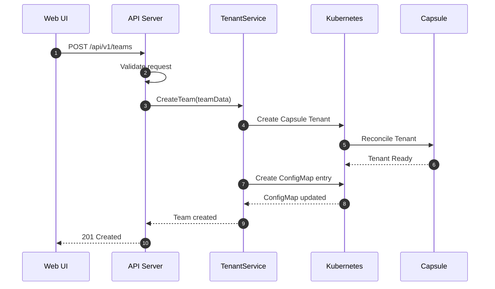

### Project Namespace Lifecycle

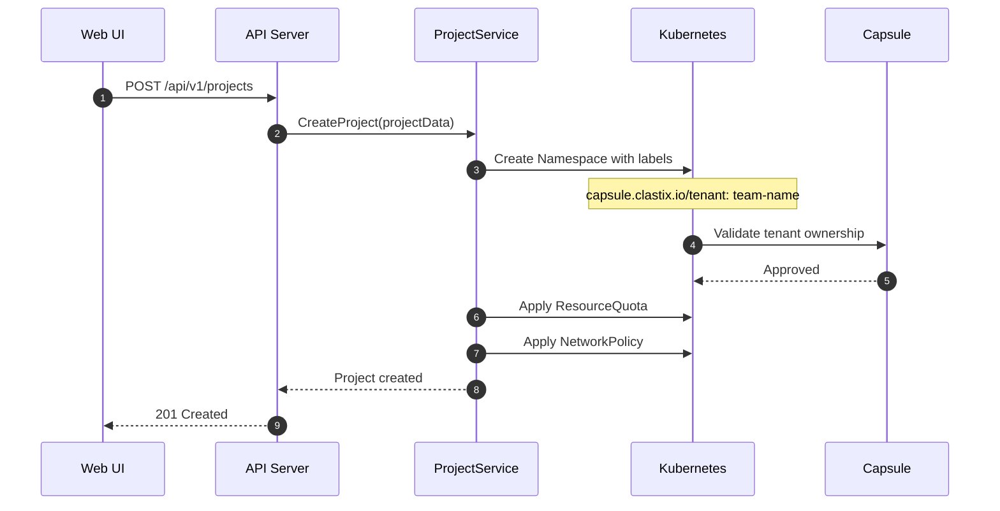

---

## Integration Points

### Capsule Integration

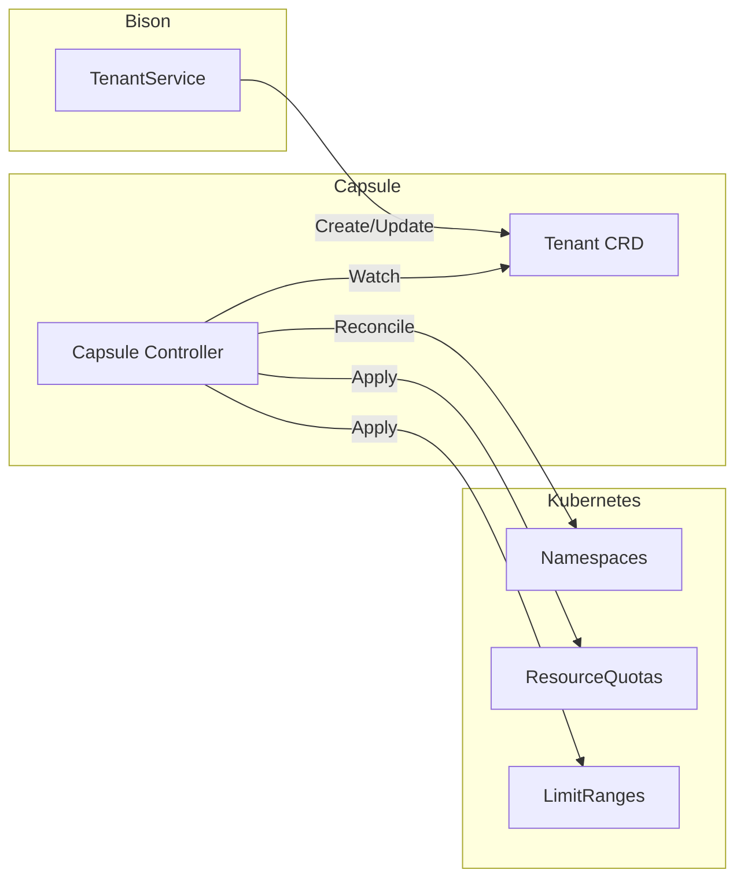

**Tenant CRD Mapping:**

| Bison Concept | Capsule Resource |
|---------------|-----------------|
| Team | Tenant |
| Project | Namespace (within Tenant) |
| Team Owners | Tenant Owners (OIDC groups) |
| Resource Quota | Tenant ResourceQuota |
| Node Binding | Tenant NodeSelector |

### OpenCost Integration

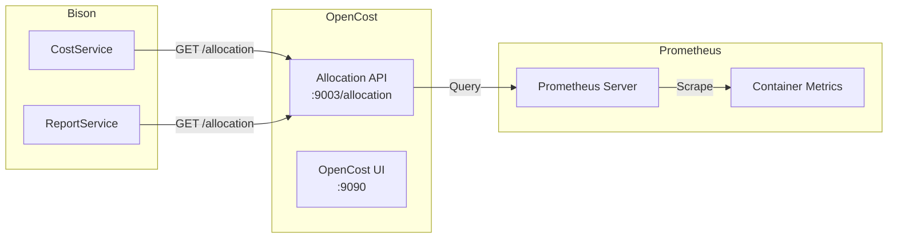

**OpenCost API Usage:**

```bash
# Query hourly costs by namespace
GET /allocation?window=1h&aggregate=namespace

# Response structure
{
  "namespace-name": {
    "cpuCost": 0.05,
    "memoryCost": 0.02,
    "gpuCost": 2.50,
    "totalCost": 2.57
  }
}
```

---

## Deployment Architecture

### Kubernetes Resources

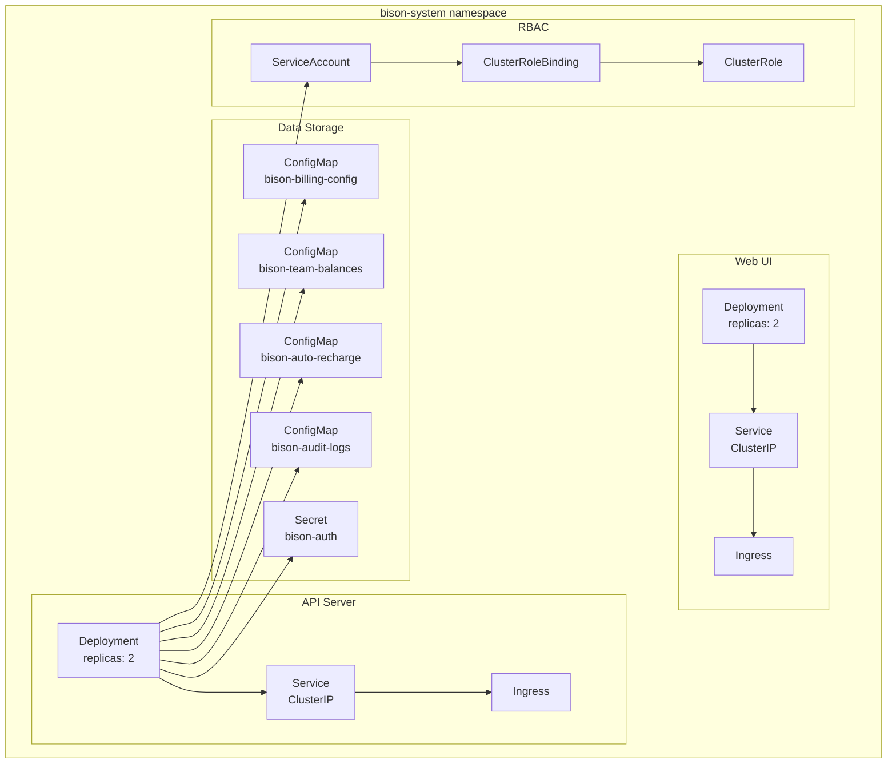

### High Availability

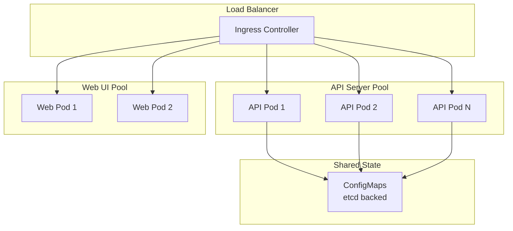

---

## Security Model

### Authentication & Authorization

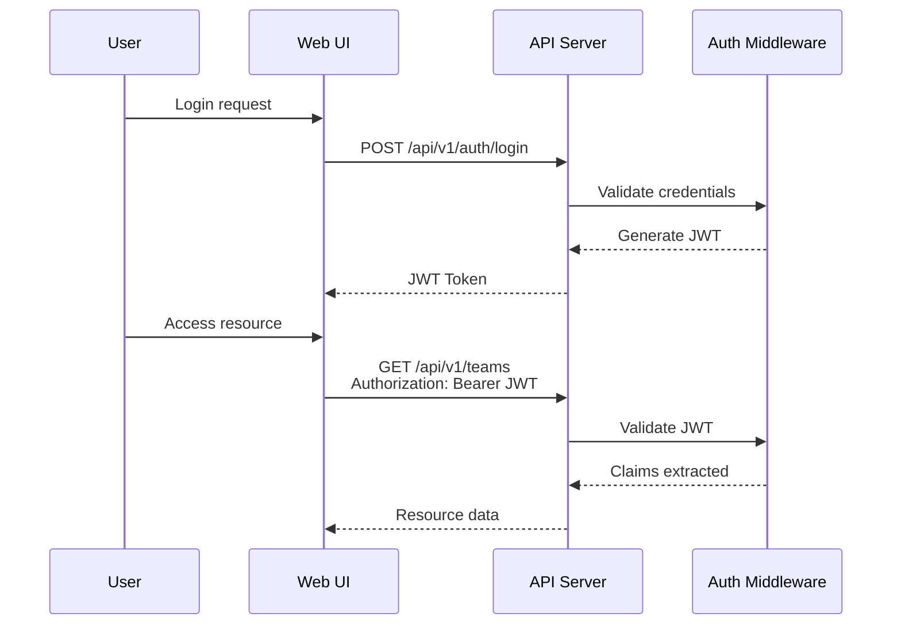

### RBAC Permissions

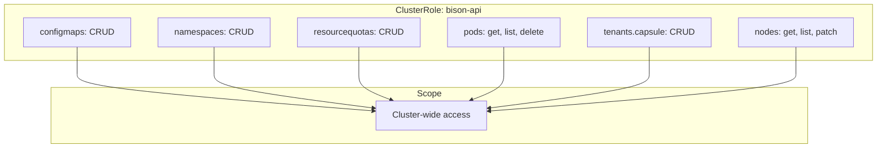

---

## Technology Stack Summary

| Layer | Technology | Purpose |
|-------|------------|---------|
| Frontend | React 18 + TypeScript | SPA framework |
| UI Components | Ant Design Pro 5 | Enterprise UI |
| Charts | ECharts | Data visualization |
| Backend | Go 1.21 + Gin | REST API |
| K8s Client | client-go | Kubernetes integration |
| Multi-Tenancy | Capsule | Namespace isolation |
| Cost Tracking | OpenCost | Resource billing |
| Metrics | Prometheus | Time-series data |
| Data Storage | ConfigMaps | Persistent state |
| Deployment | Helm 3 | Package management |

---

<p align="center">
  <em>Designed for enterprise-grade GPU resource management</em>
</p>
