# Bison 技术架构

<p align="center">
  <a href="./architecture.md">English Version</a>
</p>

本文档详细介绍 Bison 的技术架构，采用**高内聚、低耦合**的设计原则，确保系统的可维护性和可扩展性。

---

## 目录

- [系统概览](#系统概览)
- [架构分层](#架构分层)
- [核心组件](#核心组件)
- [数据流转](#数据流转)
- [集成接口](#集成接口)
- [部署架构](#部署架构)
- [安全模型](#安全模型)

---

## 系统概览

### 整体架构

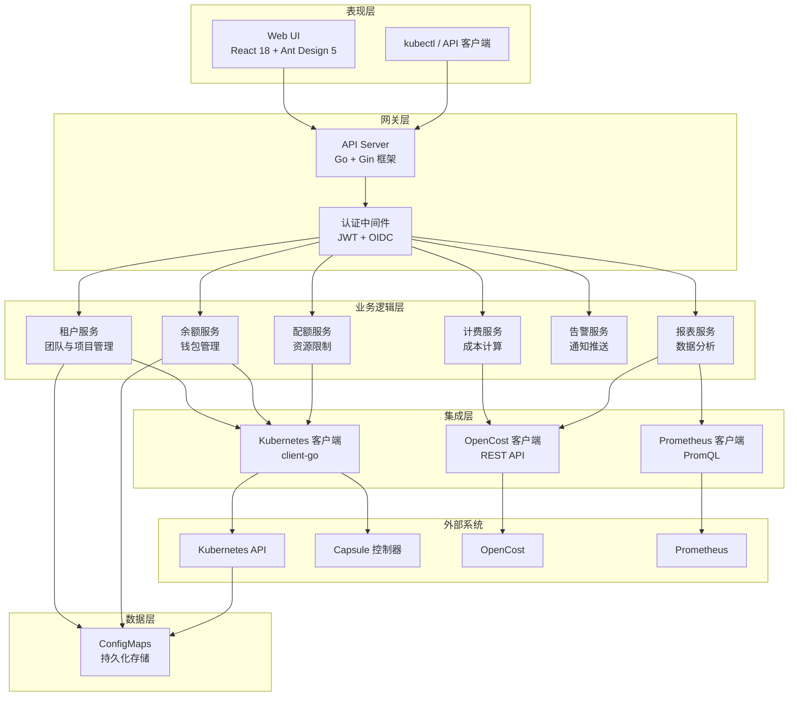

### 设计原则

| 原则 | 实现方式 |
|------|----------|
| **高内聚** | 每个服务只处理单一领域（计费、配额、告警） |
| **低耦合** | 服务间通过明确定义的接口通信 |
| **无状态 API** | 所有状态持久化在 Kubernetes ConfigMaps |
| **云原生** | 利用 Kubernetes 原生能力实现高可用和弹性伸缩 |
| **零数据库** | ConfigMaps 消除外部数据库依赖 |

---

## 架构分层

### 分层图

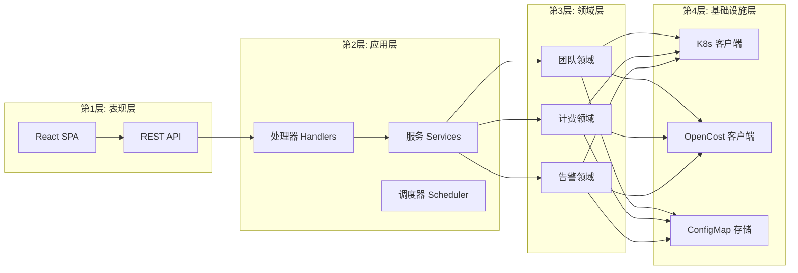

### 各层职责

#### 表现层
- **Web UI**: React 单页应用，使用 Ant Design Pro 组件库
- **REST API**: 遵循 OpenAPI 3.0 规范的 RESTful 接口

#### 应用层
- **处理器**: HTTP 请求/响应处理、参数校验
- **服务**: 业务逻辑编排
- **调度器**: 后台定时任务（计费、告警、自动充值）

#### 领域层
- **团队领域**: Capsule Tenant 生命周期管理
- **计费领域**: 成本计算、余额管理
- **告警领域**: 阈值监控、通知推送

#### 基础设施层
- **Kubernetes 客户端**: Tenant、Namespace、ConfigMap 的 CRUD
- **OpenCost 客户端**: 查询成本分配 API
- **ConfigMap 存储**: 数据持久化抽象

---

## 核心组件

### 后端服务架构

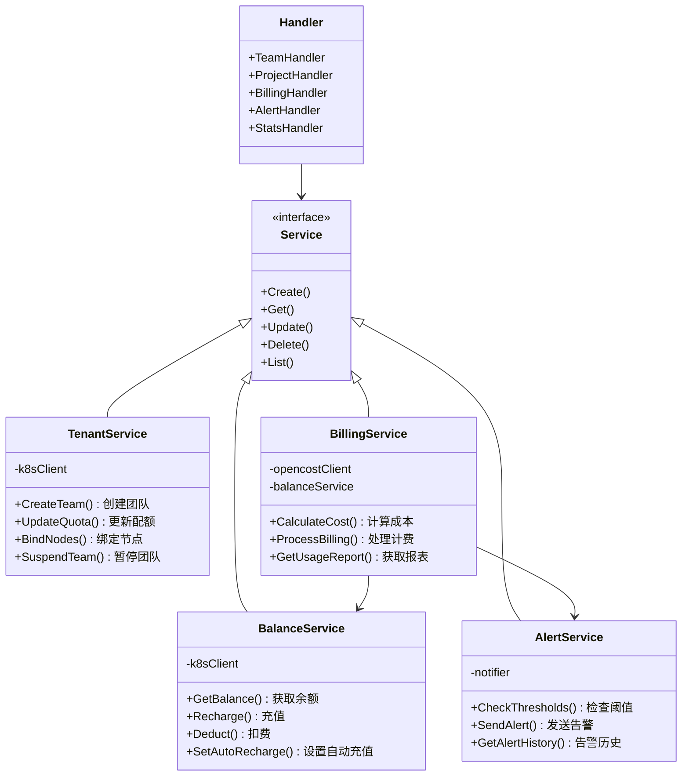

### 服务依赖关系

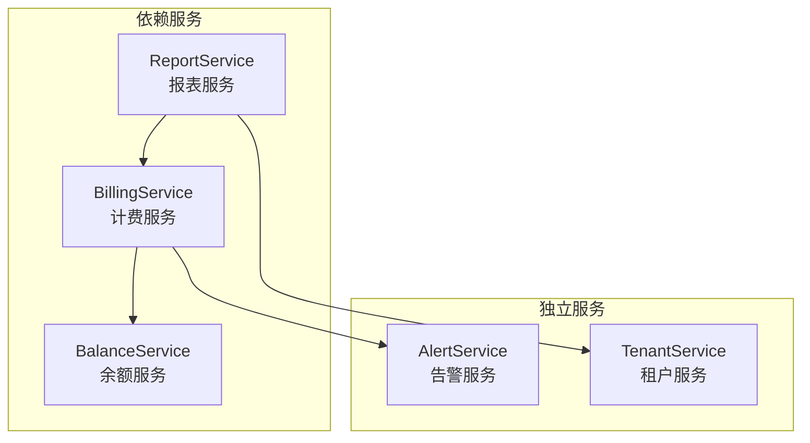

### 前端架构

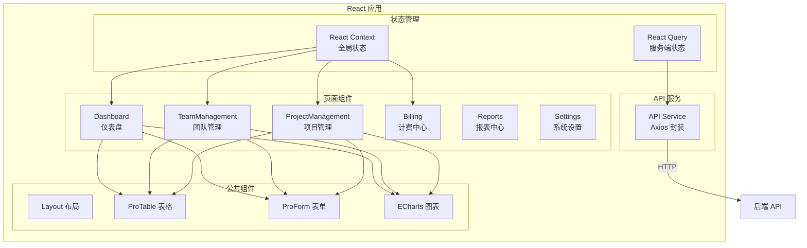

---

## 数据流转

### 计费周期

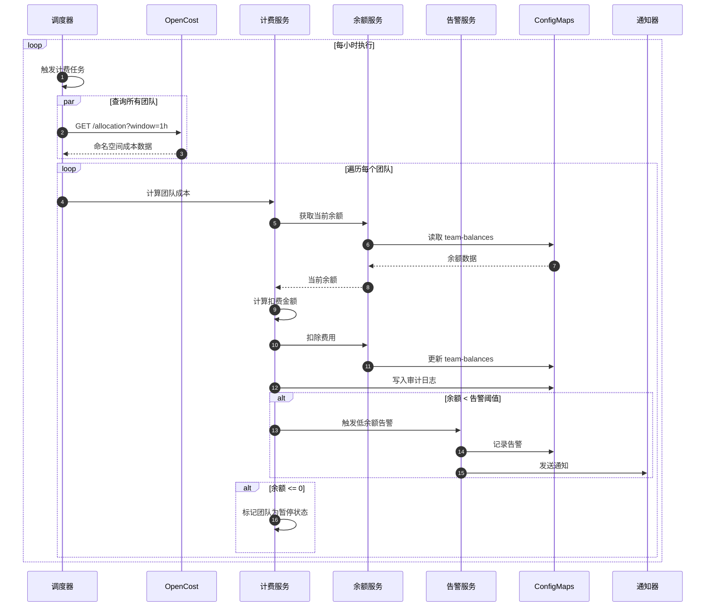

### 团队创建流程

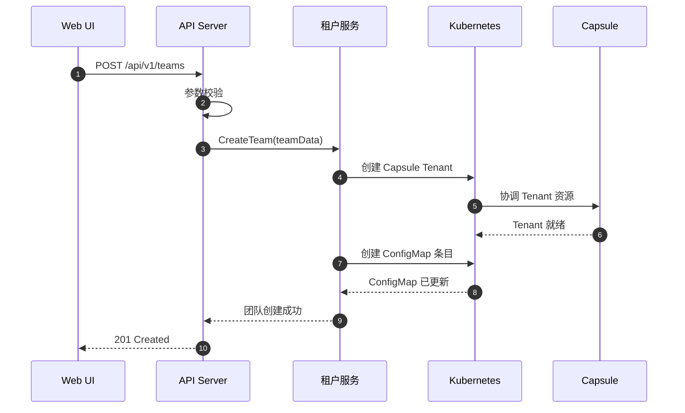

### 项目命名空间生命周期

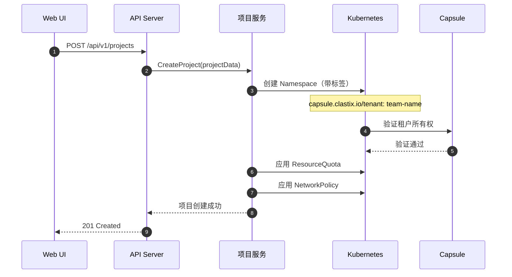

---

## 集成接口

### Capsule 集成

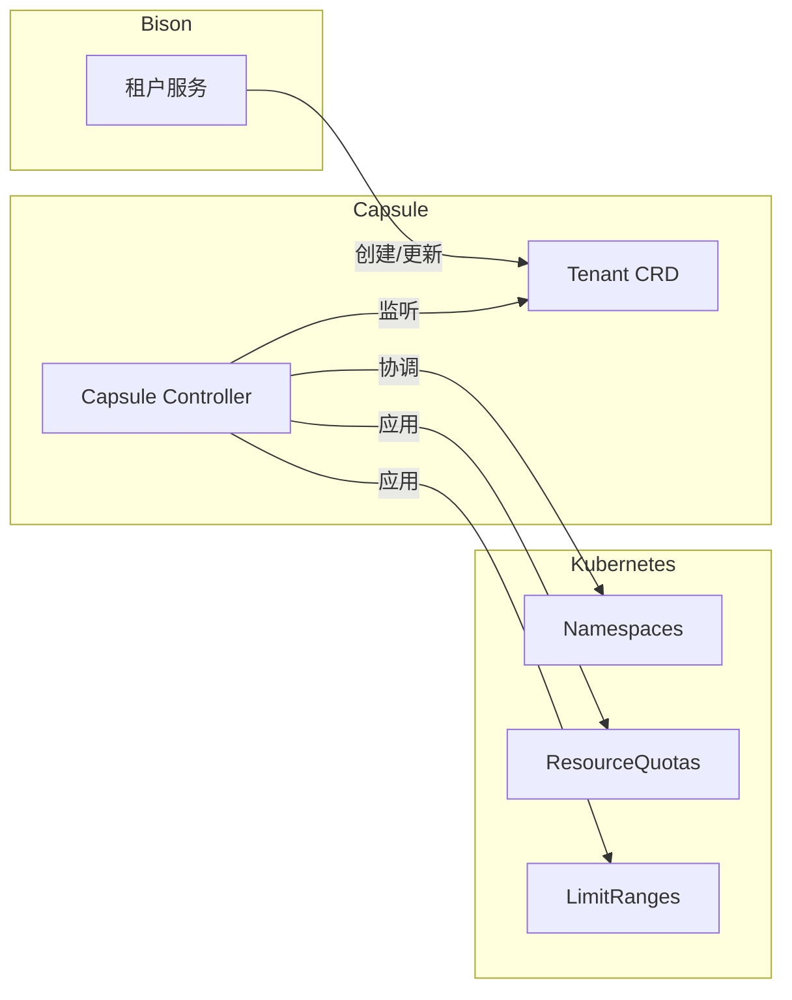

**Tenant CRD 映射关系：**

| Bison 概念 | Capsule 资源 |
|------------|--------------|
| 团队 | Tenant |
| 项目 | Namespace（属于 Tenant） |
| 团队管理员 | Tenant Owners（OIDC 组） |
| 资源配额 | Tenant ResourceQuota |
| 节点绑定 | Tenant NodeSelector |

### OpenCost 集成

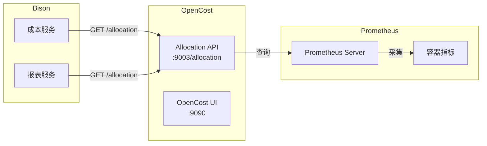

**OpenCost API 使用示例：**

```bash
# 按命名空间查询每小时成本
GET /allocation?window=1h&aggregate=namespace

# 响应结构
{
  "namespace-name": {
    "cpuCost": 0.05,
    "memoryCost": 0.02,
    "gpuCost": 2.50,
    "totalCost": 2.57
  }
}
```

---

## 部署架构

### Kubernetes 资源

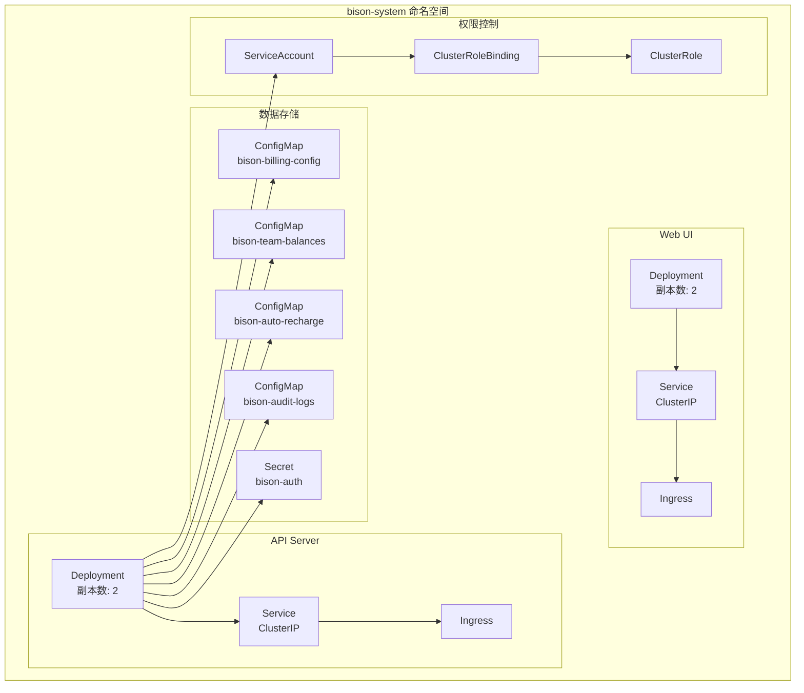

### 高可用架构

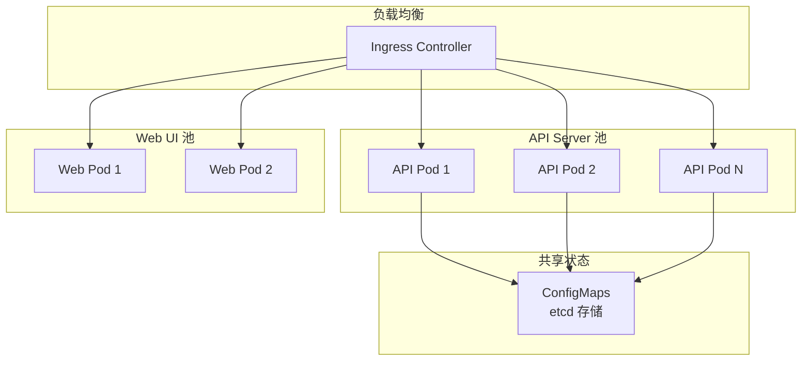

---

## 安全模型

### 认证与授权

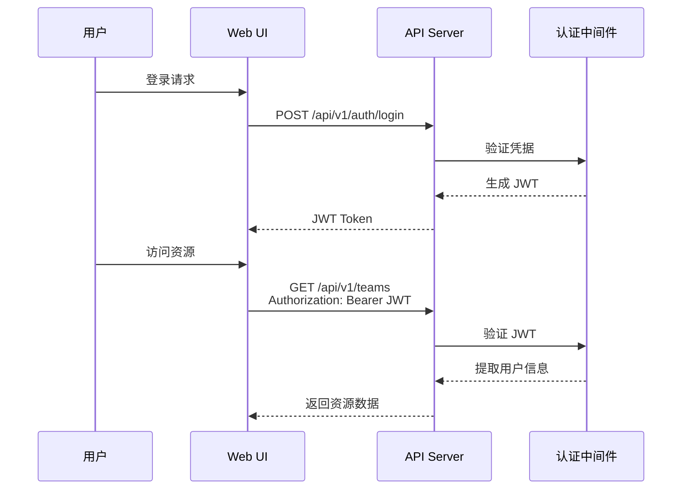

### RBAC 权限配置

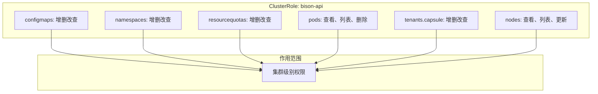

---

## 界面设计

### 仪表盘

<p align="center">
  
</p>

**设计要点：**
- 资源使用率实时展示（CPU/内存/GPU）
- 成本趋势图表（日/周/月）
- 团队 Top N 排行
- 告警概览

### 团队管理

<p align="center">
  
</p>

**功能模块：**
- 团队列表与搜索
- 配额配置（动态资源类型）
- 余额管理（充值/扣费历史）
- 成员与权限设置

### 计费配置

<p align="center">
  
</p>

**配置项：**
- 启用/禁用计费
- 币种设置
- 资源单价（CPU/内存/GPU）
- 计费周期
- 告警阈值

---

## 技术栈总结

| 层级 | 技术 | 用途 |
|------|------|------|
| 前端框架 | React 18 + TypeScript | 单页应用开发 |
| UI 组件库 | Ant Design Pro 5 | 企业级组件 |
| 图表库 | ECharts | 数据可视化 |
| 后端框架 | Go 1.21 + Gin | REST API 开发 |
| K8s 客户端 | client-go | Kubernetes 集成 |
| 多租户 | Capsule | 命名空间隔离 |
| 成本追踪 | OpenCost | 资源计费 |
| 指标采集 | Prometheus | 时序数据 |
| 数据存储 | ConfigMaps | 状态持久化 |
| 部署工具 | Helm 3 | 应用打包 |

---

<p align="center">
  <em>专为企业级 GPU 资源管理而设计</em>
</p>
