# Bison 技术架构

<p align="center">
  <a href="./architecture.md">English Version</a>
</p>

本文档详细介绍 Bison 的技术架构，采用**高内聚、低耦合**的设计原则，确保系统的可维护性和可扩展性。

---

## 目录

- [系统概览](#系统概览)
- [用户角色与职责](#用户角色与职责)
- [架构分层](#架构分层)
- [核心组件](#核心组件)
- [数据流转](#数据流转)
- [使用场景](#使用场景)
- [集成接口](#集成接口)
- [资源隔离架构](#资源隔离架构)
- [部署架构](#部署架构)
- [安全模型](#安全模型)

---

## 系统概览

### 整体架构

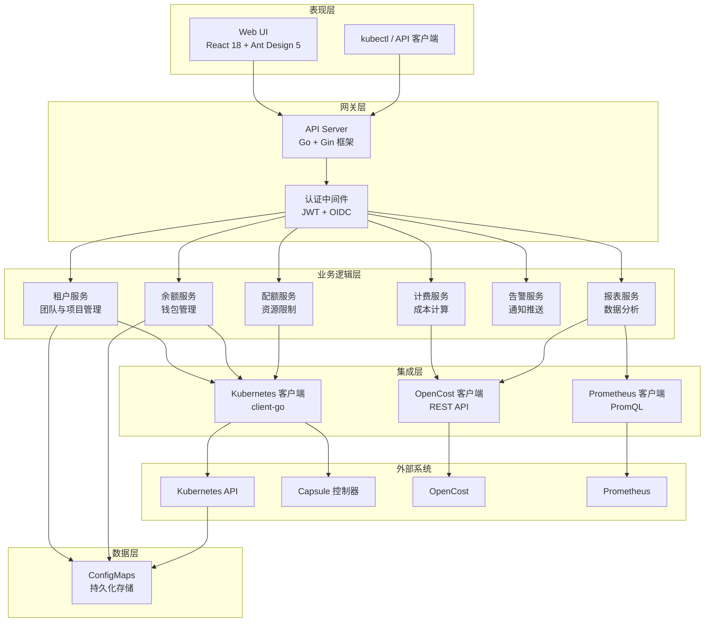
```mermaid
graph TB
    subgraph "表现层"
        WEB[Web UI<br/>React 18 + Ant Design 5]
        CLI[kubectl / API 客户端]
    end

    subgraph "网关层"
        GW[API Server<br/>Go + Gin 框架]
        AUTH[认证中间件<br/>JWT + OIDC]
    end

    subgraph "业务逻辑层"
        TS[租户服务<br/>团队与项目管理]
        BS[计费服务<br/>成本计算]
        BLS[余额服务<br/>钱包管理]
        QS[配额服务<br/>资源限制]
        AS[告警服务<br/>通知推送]
        RS[报表服务<br/>数据分析]
    end

    subgraph "集成层"
        K8S[Kubernetes 客户端<br/>client-go]
        OCC[OpenCost 客户端<br/>REST API]
        PC[Prometheus 客户端<br/>PromQL]
    end

    subgraph "外部系统"
        KAPI[Kubernetes API]
        CAP[Capsule 控制器]
        OC[OpenCost]
        PROM[Prometheus]
    end

    subgraph "数据层"
        CM[ConfigMaps<br/>持久化存储]
    end

    WEB --> GW
    CLI --> GW
    GW --> AUTH
    AUTH --> TS & BS & BLS & QS & AS & RS

    TS --> K8S
    BS --> OCC
    BLS --> K8S
    QS --> K8S
    RS --> OCC & PC

    K8S --> KAPI
    K8S --> CAP
    OCC --> OC
    PC --> PROM

    TS & BLS --> CM
    KAPI --> CM
```

### 设计原则

| 原则 | 实现方式 |
|------|----------|
| **高内聚** | 每个服务只处理单一领域（计费、配额、告警） |
| **低耦合** | 服务间通过明确定义的接口通信 |
| **无状态 API** | 所有状态持久化在 Kubernetes ConfigMaps |
| **云原生** | 利用 Kubernetes 原生能力实现高可用和弹性伸缩 |
| **零数据库** | ConfigMaps 消除外部数据库依赖 |

---

## 用户角色与职责

Bison 服务于四类不同的用户角色,每类用户都有特定的职责和访问模式:

### 角色 1: 平台管理员

**职责:**
- 部署和配置 Bison 平台
- 创建和管理团队(Capsule Tenants)
- 设置全局计费配置
- 监控集群级指标
- 响应告警和充值请求

**典型工作流程:**
1. 创建新团队并选择资源模式(共享/独占)
2. 配置计费规则(CPU/内存/GPU 定价)
3. 批准充值请求
4. 生成月度报表
5. 响应低余额告警

**关键指标仪表盘:**
- 集群总利用率
- 各团队资源消耗
- 成本趋势
- 暂停团队数量
- 活跃告警数量

**技术权限:**
```yaml
# ClusterRole: bison-admin
rules:
- apiGroups: ["capsule.clastix.io"]
  resources: ["tenants"]
  verbs: ["create", "update", "delete", "get", "list"]
- apiGroups: [""]
  resources: ["configmaps", "namespaces"]
  verbs: ["create", "update", "delete", "get", "list"]
- apiGroups: [""]
  resources: ["nodes"]
  verbs: ["get", "list", "patch"]  # 用于节点池绑定
```

---

### 角色 2: 团队负责人

**职责:**
- 在团队内创建和管理项目(namespaces)
- 为项目分配配额
- 监控团队余额和消耗速率
- 申请充值
- 配置自动充值计划

**典型工作流程:**
1. 创建项目并分配资源配额
2. 每日监控预算和消耗速率
3. 在余额耗尽前提交充值请求
4. 查看按项目分类的使用报表
5. 设置每月自动充值

**关键指标仪表盘:**
- 团队余额和消耗速率
- 各项目成本
- 团队配额利用率
- 预计余额耗尽日期

**技术权限:**
```yaml
# Role: team-leader (限定在团队的命名空间内)
rules:
- apiGroups: [""]
  resources: ["namespaces"]
  verbs: ["create", "get", "list"]
  # 通过 Capsule 限制在团队的租户内
- apiGroups: [""]
  resources: ["resourcequotas"]
  verbs: ["create", "update", "get", "list"]
```

---

### 角色 3: 项目开发者

**职责:**
- 创建 Kubernetes 工作负载(Pods、Jobs、Deployments)
- 请求适当的资源(CPU、GPU)
- 监控工作负载状态和日志
- 清理已完成的作业以停止计费

**典型工作流程:**
1. 从团队负责人接收 kubeconfig
2. 编写带 GPU 请求的 Job/Pod 清单
3. 部署工作负载 - 配额强制自动执行
4. 监控作业进度和成本累积
5. 删除已完成的资源

**关键指标仪表盘:**
- 作业状态和日志
- 资源使用情况
- 作业成本(在 Bison Dashboard 中可见)
- 项目配额剩余

**资源隔离体验:**
- **独占模式**: Pod 自动运行在团队的专属节点上
- **共享模式**: Pod 运行在共享池中,成本优化
- **配额强制**: Capsule 阻止超过团队配额的请求

**技术权限:**
```yaml
# Role: developer (限定在特定项目命名空间内)
rules:
- apiGroups: ["", "apps", "batch"]
  resources: ["pods", "deployments", "jobs"]
  verbs: ["create", "get", "list", "delete"]
- apiGroups: [""]
  resources: ["pods/log"]
  verbs: ["get"]
```

---

### 角色 4: Kubernetes 工作负载用户

**重点: 理解资源隔离**

该角色代表通过 `kubectl` 部署工作负载的用户,需要了解 Bison 如何强制执行多租户。

**隔离保证:**

| 隔离类型 | 机制 | 优势 |
|---------|------|------|
| **计算** | 每个 Tenant 的 ResourceQuota | 无法超过团队分配的 CPU/内存/GPU |
| **节点(独占)** | NodeSelector 注入 | 工作负载仅运行在团队的专属节点上 |
| **节点(共享)** | 带配额的共享池 | 小团队的成本优化方案 |
| **命名空间** | Capsule Tenant 所有权 | 只能创建/访问团队的命名空间 |
| **网络(可选)** | NetworkPolicies | 防止跨团队 Pod 通信 |
| **计费** | 独立的团队余额 | 一个团队的支出不影响其他团队 |

**示例: Capsule 如何强制隔离**

```yaml
# 开发者创建这个简单的 Pod
apiVersion: v1
kind: Pod
metadata:
  name: training-job
  namespace: ml-training  # 属于 team-ml
spec:
  containers:
  - name: pytorch
    image: pytorch:latest
    resources:
      requests:
        nvidia.com/gpu: 2

# Capsule webhook 自动将其转换为:
apiVersion: v1
kind: Pod
metadata:
  name: training-job
  namespace: ml-training
spec:
  nodeSelector:
    bison.io/pool: team-ml  # 由 Capsule 注入,用于独占模式!
  containers:
  - name: pytorch
    image: pytorch:latest
    resources:
      requests:
        nvidia.com/gpu: 2
```

**隔离执行流程:**
1. 用户提交 Pod 创建请求
2. Capsule 准入 webhook 拦截请求
3. 验证团队是否有足够的配额
4. 如果团队是独占模式,注入 `nodeSelector`
5. 应用 `ResourceQuota` 强制执行
6. 如果配额超限则拒绝请求

---

## 架构分层

### 分层图

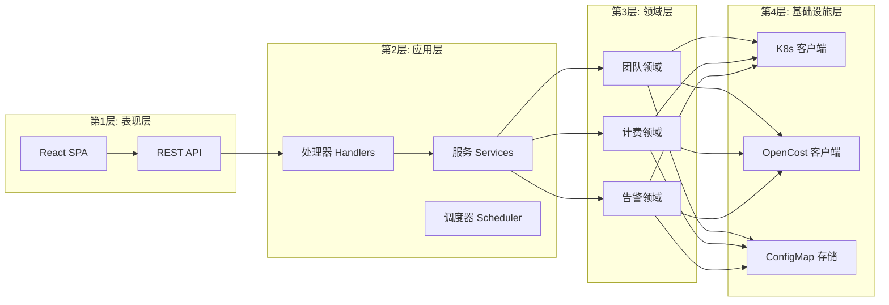
```mermaid
graph LR
    subgraph "第1层: 表现层"
        direction TB
        A1[React SPA]
        A2[REST API]
    end

    subgraph "第2层: 应用层"
        direction TB
        B1[处理器 Handlers]
        B2[服务 Services]
        B3[调度器 Scheduler]
    end

    subgraph "第3层: 领域层"
        direction TB
        C1[团队领域]
        C2[计费领域]
        C3[告警领域]
    end

    subgraph "第4层: 基础设施层"
        direction TB
        D1[K8s 客户端]
        D2[OpenCost 客户端]
        D3[ConfigMap 存储]
    end

    A1 --> A2
    A2 --> B1
    B1 --> B2
    B2 --> C1 & C2 & C3
    C1 & C2 & C3 --> D1 & D2 & D3
```

### 各层职责

#### 表现层
- **Web UI**: React 单页应用，使用 Ant Design Pro 组件库
- **REST API**: 遵循 OpenAPI 3.0 规范的 RESTful 接口

#### 应用层
- **处理器**: HTTP 请求/响应处理、参数校验
- **服务**: 业务逻辑编排
- **调度器**: 后台定时任务（计费、告警、自动充值）

#### 领域层
- **团队领域**: Capsule Tenant 生命周期管理
- **计费领域**: 成本计算、余额管理
- **告警领域**: 阈值监控、通知推送

#### 基础设施层
- **Kubernetes 客户端**: Tenant、Namespace、ConfigMap 的 CRUD
- **OpenCost 客户端**: 查询成本分配 API
- **ConfigMap 存储**: 数据持久化抽象

---

## 核心组件

### 后端服务架构

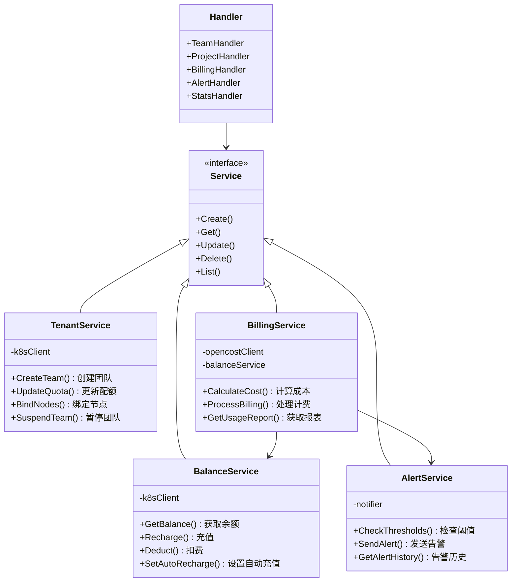
```mermaid
classDiagram
    class Handler {
        +TeamHandler
        +ProjectHandler
        +BillingHandler
        +AlertHandler
        +StatsHandler
    }

    class Service {
        <<interface>>
        +Create()
        +Get()
        +Update()
        +Delete()
        +List()
    }

    class TenantService {
        -k8sClient
        +CreateTeam() 创建团队
        +UpdateQuota() 更新配额
        +BindNodes() 绑定节点
        +SuspendTeam() 暂停团队
    }

    class BillingService {
        -opencostClient
        -balanceService
        +CalculateCost() 计算成本
        +ProcessBilling() 处理计费
        +GetUsageReport() 获取报表
    }

    class BalanceService {
        -k8sClient
        +GetBalance() 获取余额
        +Recharge() 充值
        +Deduct() 扣费
        +SetAutoRecharge() 设置自动充值
    }

    class AlertService {
        -notifier
        +CheckThresholds() 检查阈值
        +SendAlert() 发送告警
        +GetAlertHistory() 告警历史
    }

    Handler --> Service
    Service <|-- TenantService
    Service <|-- BillingService
    Service <|-- BalanceService
    Service <|-- AlertService

    BillingService --> BalanceService
    BillingService --> AlertService
```

### 服务依赖关系

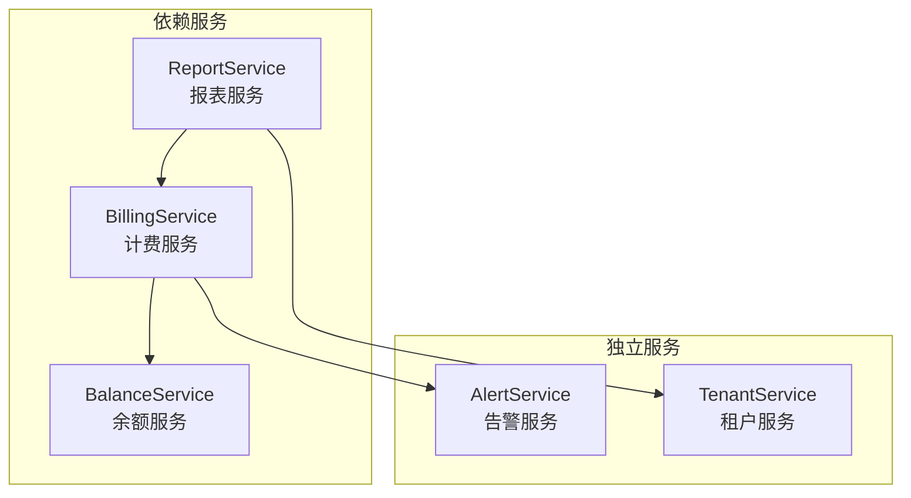
```mermaid
graph TD
    subgraph "独立服务"
        TS[TenantService<br/>租户服务]
        AS[AlertService<br/>告警服务]
    end

    subgraph "依赖服务"
        BLS[BalanceService<br/>余额服务]
        BS[BillingService<br/>计费服务]
        RS[ReportService<br/>报表服务]
    end

    BS --> BLS
    BS --> AS
    RS --> BS
    RS --> TS
```

### 前端架构

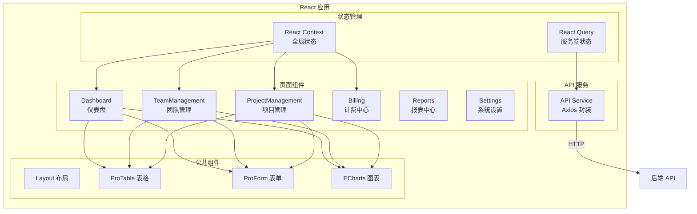
```mermaid
graph TB
    subgraph "React 应用"
        subgraph "状态管理"
            CTX[React Context<br/>全局状态]
            RQ[React Query<br/>服务端状态]
        end

        subgraph "页面组件"
            DASH[Dashboard<br/>仪表盘]
            TEAM[TeamManagement<br/>团队管理]
            PROJ[ProjectManagement<br/>项目管理]
            BILL[Billing<br/>计费中心]
            REPORT[Reports<br/>报表中心]
            SETTINGS[Settings<br/>系统设置]
        end

        subgraph "公共组件"
            LAYOUT[Layout 布局]
            TABLE[ProTable 表格]
            FORM[ProForm 表单]
            CHART[ECharts 图表]
        end

        subgraph "API 服务"
            API[API Service<br/>Axios 封装]
        end
    end

    CTX --> DASH & TEAM & PROJ & BILL
    RQ --> API
    DASH & TEAM & PROJ --> TABLE & FORM & CHART
    API --> |HTTP| BE[后端 API]
```

---

## 数据流转

### 计费周期

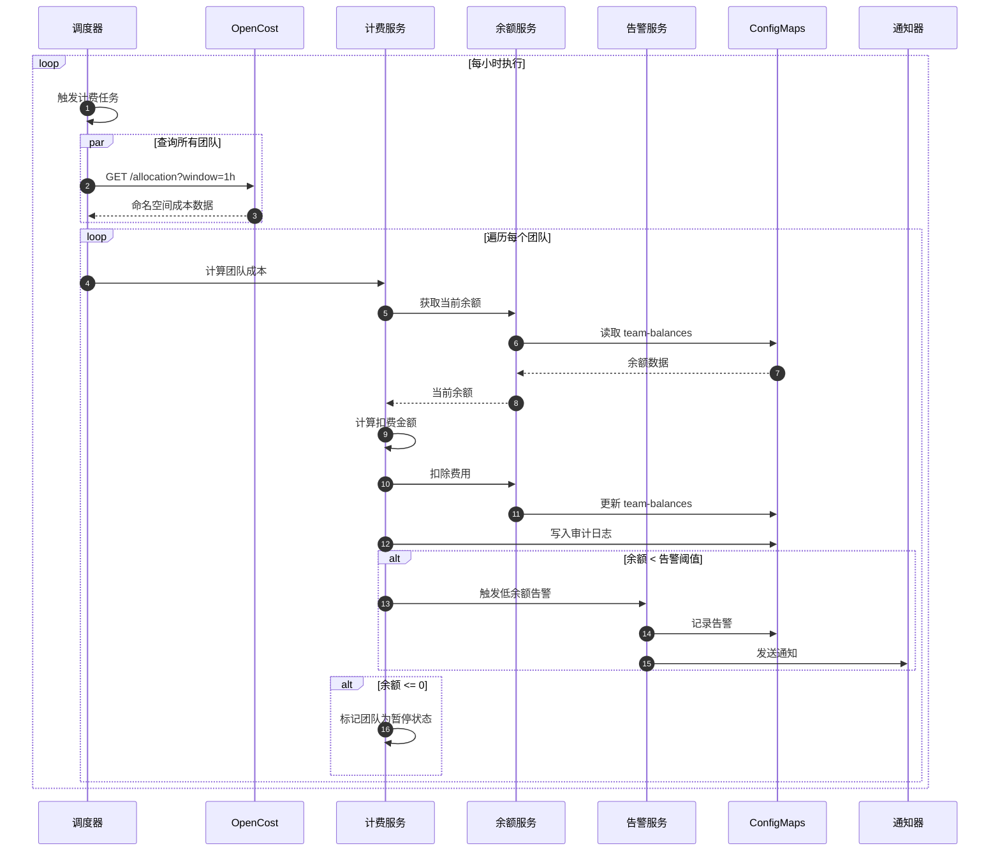
```mermaid
sequenceDiagram
    autonumber
    participant SCHED as 调度器
    participant OC as OpenCost
    participant BILL as 计费服务
    participant BAL as 余额服务
    participant ALERT as 告警服务
    participant CM as ConfigMaps
    participant NOTIFY as 通知器

    loop 每小时执行
        SCHED->>SCHED: 触发计费任务

        par 查询所有团队
            SCHED->>OC: GET /allocation?window=1h
            OC-->>SCHED: 命名空间成本数据
        end

        loop 遍历每个团队
            SCHED->>BILL: 计算团队成本
            BILL->>BAL: 获取当前余额
            BAL->>CM: 读取 team-balances
            CM-->>BAL: 余额数据
            BAL-->>BILL: 当前余额

            BILL->>BILL: 计算扣费金额
            BILL->>BAL: 扣除费用
            BAL->>CM: 更新 team-balances
            BILL->>CM: 写入审计日志

            alt 余额 < 告警阈值
                BILL->>ALERT: 触发低余额告警
                ALERT->>CM: 记录告警
                ALERT->>NOTIFY: 发送通知
            end

            alt 余额 <= 0
                BILL->>BILL: 标记团队为暂停状态
            end
        end
    end
```

### 团队创建流程

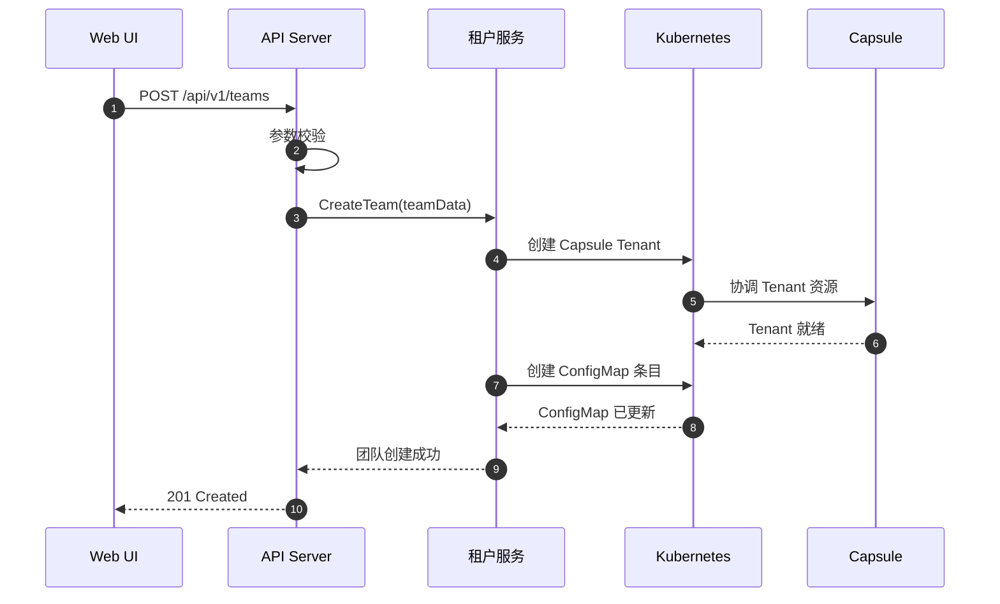
```mermaid
sequenceDiagram
    autonumber
    participant UI as Web UI
    participant API as API Server
    participant TS as 租户服务
    participant K8S as Kubernetes
    participant CAP as Capsule

    UI->>API: POST /api/v1/teams
    API->>API: 参数校验
    API->>TS: CreateTeam(teamData)

    TS->>K8S: 创建 Capsule Tenant
    K8S->>CAP: 协调 Tenant 资源
    CAP-->>K8S: Tenant 就绪

    TS->>K8S: 创建 ConfigMap 条目
    K8S-->>TS: ConfigMap 已更新

    TS-->>API: 团队创建成功
    API-->>UI: 201 Created
```

### 项目命名空间生命周期

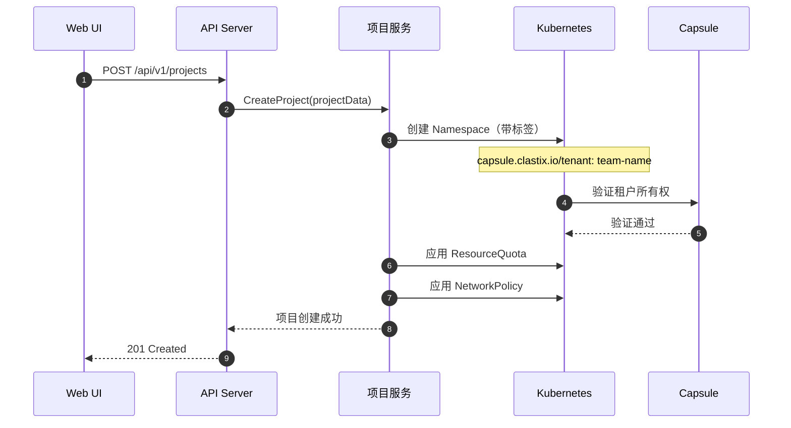
```mermaid
sequenceDiagram
    autonumber
    participant UI as Web UI
    participant API as API Server
    participant PS as 项目服务
    participant K8S as Kubernetes
    participant CAP as Capsule

    UI->>API: POST /api/v1/projects
    API->>PS: CreateProject(projectData)

    PS->>K8S: 创建 Namespace（带标签）
    Note over K8S: capsule.clastix.io/tenant: team-name

    K8S->>CAP: 验证租户所有权
    CAP-->>K8S: 验证通过

    PS->>K8S: 应用 ResourceQuota
    PS->>K8S: 应用 NetworkPolicy

    PS-->>API: 项目创建成功
    API-->>UI: 201 Created
```

---

## 使用场景

本节展示典型的端到端场景,演示不同组件如何交互。

### 场景 1: 新团队入职

**场景:** 平台管理员为一个新的机器学习团队配置独占 GPU 节点。

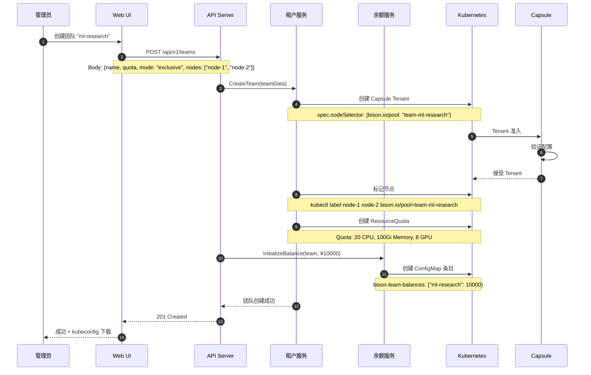
```mermaid
sequenceDiagram
    autonumber
    participant ADMIN as 管理员
    participant UI as Web UI
    participant API as API Server
    participant TS as 租户服务
    participant BS as 余额服务
    participant K8S as Kubernetes
    participant CAP as Capsule

    ADMIN->>UI: 创建团队 "ml-research"
    UI->>API: POST /api/v1/teams
    Note over UI,API: Body: {name, quota, mode: "exclusive", nodes: ["node-1", "node-2"]}

    API->>TS: CreateTeam(teamData)

    TS->>K8S: 创建 Capsule Tenant
    Note over TS,K8S: spec.nodeSelector: {bison.io/pool: "team-ml-research"}

    K8S->>CAP: Tenant 准入
    CAP->>CAP: 验证配置
    CAP-->>K8S: 接受 Tenant

    TS->>K8S: 标记节点
    Note over TS,K8S: kubectl label node-1 node-2 bison.io/pool=team-ml-research

    TS->>K8S: 创建 ResourceQuota
    Note over TS,K8S: Quota: 20 CPU, 100Gi Memory, 8 GPU

    API->>BS: InitializeBalance(team, ¥10000)
    BS->>K8S: 创建 ConfigMap 条目
    Note over BS,K8S: bison-team-balances: {"ml-research": 10000}

    TS-->>API: 团队创建成功
    API-->>UI: 201 Created
    UI-->>ADMIN: 成功 + kubeconfig 下载
```

**关键要点:**
- Capsule Tenant 是团队隔离的权威来源
- 独占模式的 NodeSelector 注入自动发生
- 余额初始化独立于 K8s 资源
- 管理员获得团队命名空间的 kubeconfig

---

### 场景 2: 开发者部署 GPU 作业(配额超限)

**场景:** 开发者尝试部署超过团队配额的作业。

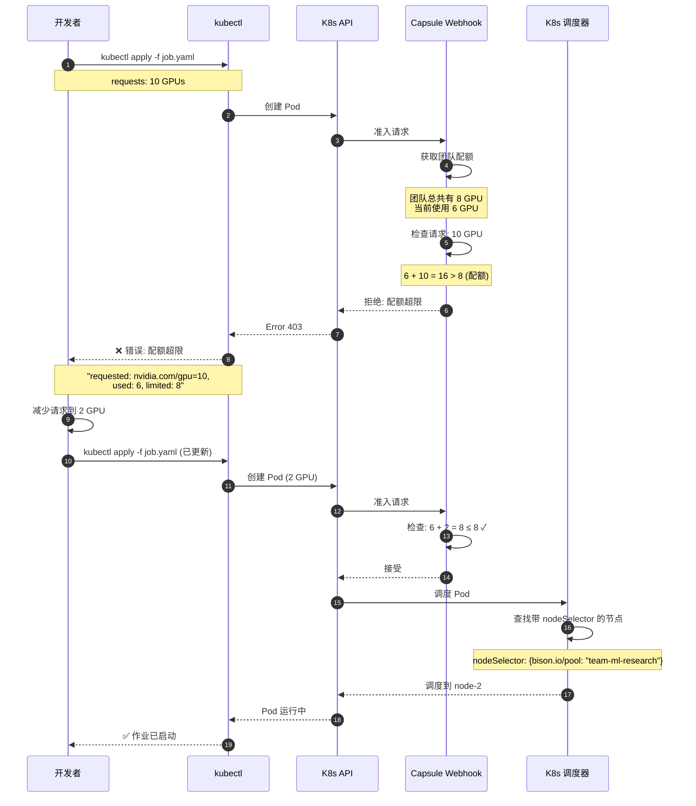
```mermaid
sequenceDiagram
    autonumber
    participant DEV as 开发者
    participant KUBECTL as kubectl
    participant K8S as K8s API
    participant CAP as Capsule Webhook
    participant SCHED as K8s 调度器

    DEV->>KUBECTL: kubectl apply -f job.yaml
    Note over DEV,KUBECTL: requests: 10 GPUs

    KUBECTL->>K8S: 创建 Pod
    K8S->>CAP: 准入请求

    CAP->>CAP: 获取团队配额
    Note over CAP: 团队总共有 8 GPU<br/>当前使用 6 GPU

    CAP->>CAP: 检查请求: 10 GPU
    Note over CAP: 6 + 10 = 16 > 8 (配额)

    CAP-->>K8S: 拒绝: 配额超限
    K8S-->>KUBECTL: Error 403

    KUBECTL-->>DEV: ❌ 错误: 配额超限
    Note over DEV,KUBECTL: "requested: nvidia.com/gpu=10,<br/>used: 6, limited: 8"

    DEV->>DEV: 减少请求到 2 GPU
    DEV->>KUBECTL: kubectl apply -f job.yaml (已更新)

    KUBECTL->>K8S: 创建 Pod (2 GPU)
    K8S->>CAP: 准入请求
    CAP->>CAP: 检查: 6 + 2 = 8 ≤ 8 ✓
    CAP-->>K8S: 接受

    K8S->>SCHED: 调度 Pod
    SCHED->>SCHED: 查找带 nodeSelector 的节点
    Note over SCHED: nodeSelector: {bison.io/pool: "team-ml-research"}

    SCHED-->>K8S: 调度到 node-2
    K8S-->>KUBECTL: Pod 运行中
    KUBECTL-->>DEV: ✅ 作业已启动
```

**关键要点:**
- Capsule 在准入时(调度前)强制执行配额
- 清晰的错误消息指导用户修正资源请求
- NodeSelector 确保 Pod 在团队专属节点上运行
- 配额追踪是跨团队所有命名空间累计的

---

### 场景 3: 每小时计费与低余额告警

**场景:** 自动计费任务运行并检测到团队低余额。

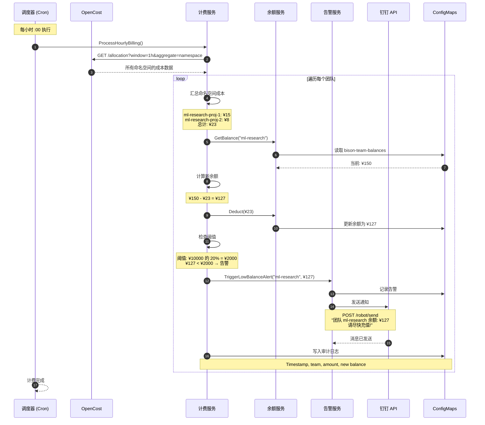
```mermaid
sequenceDiagram
    autonumber
    participant CRON as 调度器 (Cron)
    participant OC as OpenCost
    participant BILL as 计费服务
    participant BAL as 余额服务
    participant ALERT as 告警服务
    participant DT as 钉钉 API
    participant CM as ConfigMaps

    Note over CRON: 每小时 :00 执行
    CRON->>BILL: ProcessHourlyBilling()

    BILL->>OC: GET /allocation?window=1h&aggregate=namespace
    OC-->>BILL: 所有命名空间的成本数据

    loop 遍历每个团队
        BILL->>BILL: 汇总命名空间成本
        Note over BILL: ml-research-proj-1: ¥15<br/>ml-research-proj-2: ¥8<br/>总计: ¥23

        BILL->>BAL: GetBalance("ml-research")
        BAL->>CM: 读取 bison-team-balances
        CM-->>BAL: 当前: ¥150

        BILL->>BILL: 计算新余额
        Note over BILL: ¥150 - ¥23 = ¥127

        BILL->>BAL: Deduct(¥23)
        BAL->>CM: 更新余额为 ¥127

        BILL->>BILL: 检查阈值
        Note over BILL: 阈值: ¥10000 的 20% = ¥2000<br/>¥127 < ¥2000 → 告警

        BILL->>ALERT: TriggerLowBalanceAlert("ml-research", ¥127)

        ALERT->>CM: 记录告警
        ALERT->>DT: 发送通知
        Note over ALERT,DT: POST /robot/send<br/>"团队 ml-research 余额: ¥127<br/>请尽快充值!"

        DT-->>ALERT: 消息已发送

        BILL->>CM: 写入审计日志
        Note over BILL,CM: Timestamp, team, amount, new balance
    end

    CRON-->>CRON: 计费完成
```

**关键要点:**
- 计费每小时运行,汇总 OpenCost 的成本
- 余额扣除和告警检查原子执行
- 支持多种通知渠道(钉钉、企业微信、Webhook)
- 审计日志提供完整的计费历史

---

### 场景 4: 定时自动充值

**场景:** 团队配置了每月自动充值,定时任务执行。

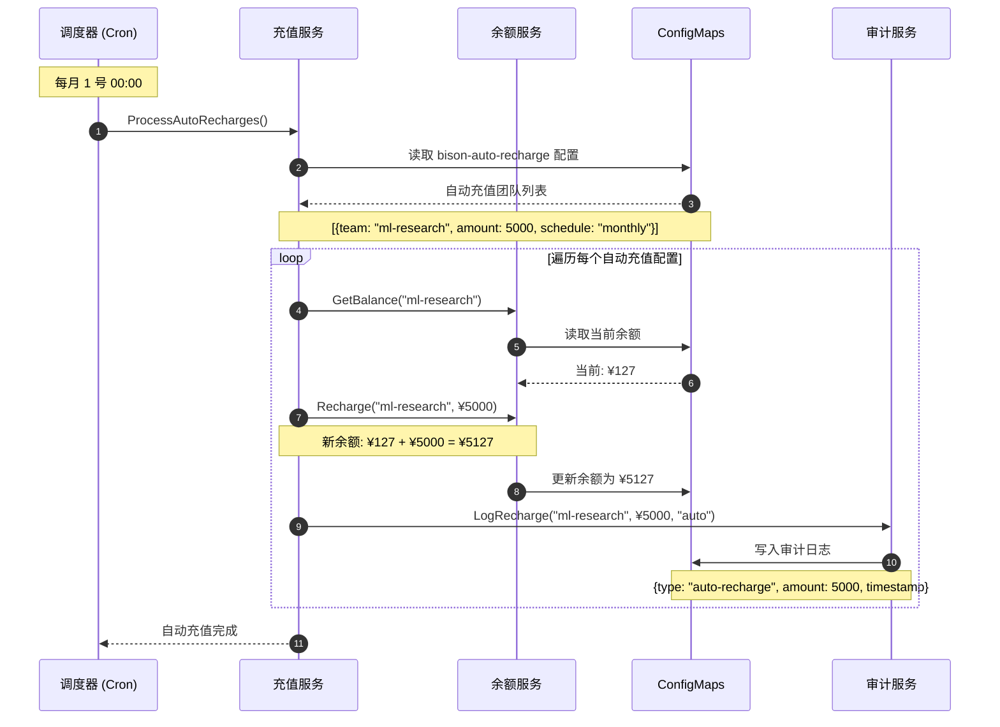
```mermaid
sequenceDiagram
    autonumber
    participant CRON as 调度器 (Cron)
    participant RECHARGE as 充值服务
    participant BAL as 余额服务
    participant CM as ConfigMaps
    participant AUDIT as 审计服务

    Note over CRON: 每月 1 号 00:00
    CRON->>RECHARGE: ProcessAutoRecharges()

    RECHARGE->>CM: 读取 bison-auto-recharge 配置
    CM-->>RECHARGE: 自动充值团队列表
    Note over CM,RECHARGE: [{team: "ml-research", amount: 5000, schedule: "monthly"}]

    loop 遍历每个自动充值配置
        RECHARGE->>BAL: GetBalance("ml-research")
        BAL->>CM: 读取当前余额
        CM-->>BAL: 当前: ¥127

        RECHARGE->>BAL: Recharge("ml-research", ¥5000)
        Note over RECHARGE,BAL: 新余额: ¥127 + ¥5000 = ¥5127

        BAL->>CM: 更新余额为 ¥5127

        RECHARGE->>AUDIT: LogRecharge("ml-research", ¥5000, "auto")
        AUDIT->>CM: 写入审计日志
        Note over AUDIT,CM: {type: "auto-recharge", amount: 5000, timestamp}
    end

    RECHARGE-->>CRON: 自动充值完成
```

**关键要点:**
- 自动充值计划存储在 ConfigMaps 中
- 完全自动化 - 无需人工干预
- 保留审计轨迹以确保合规性
- 防止意外的服务中断

---

## 集成接口

### Capsule 集成

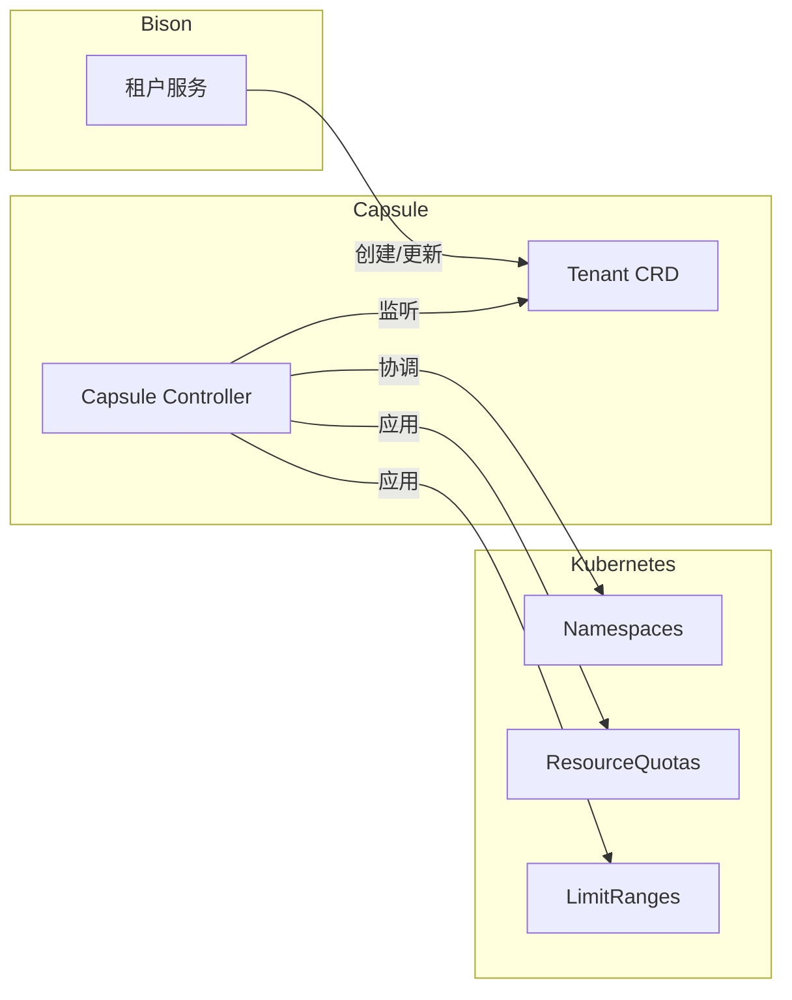
```mermaid
graph LR
    subgraph "Bison"
        TS[租户服务]
    end

    subgraph "Capsule"
        CTRL[Capsule Controller]
        TEN[Tenant CRD]
    end

    subgraph "Kubernetes"
        NS[Namespaces]
        RQ[ResourceQuotas]
        LR[LimitRanges]
    end

    TS -->|创建/更新| TEN
    CTRL -->|监听| TEN
    CTRL -->|协调| NS
    CTRL -->|应用| RQ & LR
```

**Tenant CRD 映射关系：**

| Bison 概念 | Capsule 资源 |
|------------|--------------|
| 团队 | Tenant |
| 项目 | Namespace（属于 Tenant） |
| 团队管理员 | Tenant Owners（OIDC 组） |
| 资源配额 | Tenant ResourceQuota |
| 节点绑定 | Tenant NodeSelector |

### OpenCost 集成

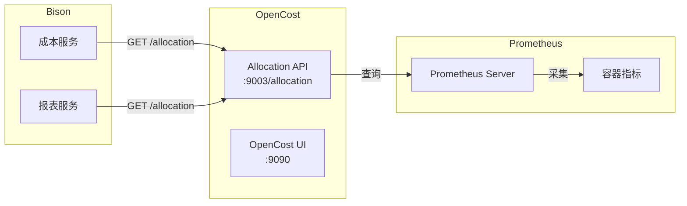
```mermaid
graph LR
    subgraph "Bison"
        CS[成本服务]
        RS[报表服务]
    end

    subgraph "OpenCost"
        API[Allocation API<br/>:9003/allocation]
        UI[OpenCost UI<br/>:9090]
    end

    subgraph "Prometheus"
        PROM[Prometheus Server]
        METRICS[容器指标]
    end

    CS -->|GET /allocation| API
    RS -->|GET /allocation| API
    API -->|查询| PROM
    PROM -->|采集| METRICS
```

**OpenCost API 使用示例：**

```bash
# 按命名空间查询每小时成本
GET /allocation?window=1h&aggregate=namespace

# 响应结构
{
  "namespace-name": {
    "cpuCost": 0.05,
    "memoryCost": 0.02,
    "gpuCost": 2.50,
    "totalCost": 2.57
  }
}
```

---

## 资源隔离架构

Bison 通过 **Capsule** 实现真正的多租户,在多个层面强制执行团队间的严格隔离。

### 隔离层次结构

```mermaid
graph TB
    subgraph "Kubernetes 集群"
        subgraph "团队 A: 独占模式"
            style "团队 A: 独占模式" fill:#e3f2fd
            T1[Capsule Tenant: team-ml<br/>模式: exclusive]
            T1_NS1[Namespace: ml-training<br/>配额: 10 GPU, 50 CPU]
            T1_NS2[Namespace: ml-inference<br/>配额: 5 GPU, 20 CPU]

            T1_POD1[Pod: trainer-job-1<br/>GPU: 2, CPU: 8]
            T1_POD2[Pod: trainer-job-2<br/>GPU: 4, CPU: 16]
            T1_POD3[Pod: inference-server<br/>GPU: 1, CPU: 4]

            T1 --> T1_NS1
            T1 --> T1_NS2
            T1_NS1 --> T1_POD1
            T1_NS1 --> T1_POD2
            T1_NS2 --> T1_POD3
        end

        subgraph "团队 B: 共享模式"
            style "团队 B: 共享模式" fill:#fce4ec
            T2[Capsule Tenant: team-cv<br/>模式: shared]
            T2_NS1[Namespace: cv-research<br/>配额: 5 GPU, 30 CPU]
            T2_POD1[Pod: detector-job<br/>GPU: 2, CPU: 8]

            T2 --> T2_NS1
            T2_NS1 --> T2_POD1
        end

        subgraph "节点池层"
            style "节点池层" fill:#f3e5f5
            N1[Node: gpu-node-1<br/>标签: bison.io/pool=team-ml<br/>GPUs: 4, Taints: team-ml:NoSchedule]
            N2[Node: gpu-node-2<br/>标签: bison.io/pool=team-ml<br/>GPUs: 4, Taints: team-ml:NoSchedule]
            N3[Node: gpu-node-3<br/>标签: bison.io/pool=shared<br/>GPUs: 8]
            N4[Node: gpu-node-4<br/>标签: bison.io/pool=shared<br/>GPUs: 8]
        end
    end

    T1_POD1 -.仅调度到.-> N1
    T1_POD2 -.仅调度到.-> N1
    T1_POD3 -.仅调度到.-> N2

    T2_POD1 -.可调度到.-> N3
    T2_POD1 -.可调度到.-> N4

    style T1 fill:#2196f3,color:#fff
    style T2 fill:#e91e63,color:#fff
    style N1 fill:#4caf50,color:#fff
    style N2 fill:#4caf50,color:#fff
    style N3 fill:#ff9800,color:#fff
    style N4 fill:#ff9800,color:#fff
```

---

### 隔离机制

| 隔离层 | 技术 | 强制点 | 优势 |
|--------|------|--------|------|
| **命名空间** | Capsule Tenant 所有权 | K8s RBAC | 团队只能创建/访问自己的命名空间 |
| **计算配额** | 每个 Tenant 的 ResourceQuota | Capsule 准入 webhook | 团队无法超过分配的 CPU/内存/GPU |
| **节点(独占)** | NodeSelector + Taints | Capsule 变更 webhook | 团队 Pod 仅运行在专属节点上 |
| **节点(共享)** | 带配额的共享池 | K8s 调度器 | 小团队的成本优化方案 |
| **网络(可选)** | NetworkPolicies | K8s 网络插件 | 防止跨团队 Pod 通信 |
| **计费** | 独立余额 ConfigMap | Bison 计费服务 | 一个团队的支出不影响其他团队 |

---

### Capsule 隔离执行流程

该序列图展示 Capsule 如何为独占模式团队拦截和强制执行隔离:

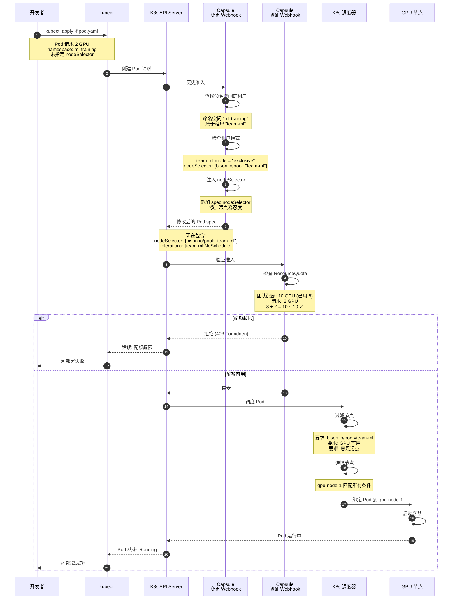
```mermaid
sequenceDiagram
    autonumber
    participant DEV as 开发者
    participant KUBECTL as kubectl
    participant K8S as K8s API Server
    participant CAP_MUTATE as Capsule<br/>变更 Webhook
    participant CAP_VALIDATE as Capsule<br/>验证 Webhook
    participant SCHED as K8s 调度器
    participant NODE as GPU 节点

    DEV->>KUBECTL: kubectl apply -f pod.yaml
    Note over DEV,KUBECTL: Pod 请求 2 GPU<br/>namespace: ml-training<br/>未指定 nodeSelector

    KUBECTL->>K8S: 创建 Pod 请求

    %% 变更 webhook 阶段
    K8S->>CAP_MUTATE: 变更准入
    CAP_MUTATE->>CAP_MUTATE: 查找命名空间的租户
    Note over CAP_MUTATE: 命名空间 "ml-training"<br/>属于租户 "team-ml"

    CAP_MUTATE->>CAP_MUTATE: 检查租户模式
    Note over CAP_MUTATE: team-ml.mode = "exclusive"<br/>nodeSelector: {bison.io/pool: "team-ml"}

    CAP_MUTATE->>CAP_MUTATE: 注入 nodeSelector
    Note over CAP_MUTATE: 添加 spec.nodeSelector<br/>添加污点容忍度

    CAP_MUTATE-->>K8S: 修改后的 Pod spec
    Note over CAP_MUTATE,K8S: 现在包含:<br/>nodeSelector: {bison.io/pool: "team-ml"}<br/>tolerations: [team-ml:NoSchedule]

    %% 验证 webhook 阶段
    K8S->>CAP_VALIDATE: 验证准入
    CAP_VALIDATE->>CAP_VALIDATE: 检查 ResourceQuota
    Note over CAP_VALIDATE: 团队配额: 10 GPU (已用 8)<br/>请求: 2 GPU<br/>8 + 2 = 10 ≤ 10 ✓

    alt 配额超限
        CAP_VALIDATE-->>K8S: 拒绝 (403 Forbidden)
        K8S-->>KUBECTL: 错误: 配额超限
        KUBECTL-->>DEV: ❌ 部署失败
    else 配额可用
        CAP_VALIDATE-->>K8S: 接受

        %% 调度阶段
        K8S->>SCHED: 调度 Pod
        SCHED->>SCHED: 过滤节点
        Note over SCHED: 要求: bison.io/pool=team-ml<br/>要求: GPU 可用<br/>要求: 容忍污点

        SCHED->>SCHED: 选择节点
        Note over SCHED: gpu-node-1 匹配所有条件

        SCHED->>NODE: 绑定 Pod 到 gpu-node-1
        NODE->>NODE: 启动容器
        NODE-->>K8S: Pod 运行中
        K8S-->>KUBECTL: Pod 状态: Running
        KUBECTL-->>DEV: ✅ 部署成功
    end
```

**关键步骤:**
1. **变更 Webhook** - Capsule 自动为独占模式团队注入 `nodeSelector` 和 `tolerations`
2. **验证 Webhook** - Capsule 检查跨团队所有命名空间的 ResourceQuota 强制执行
3. **调度器** - K8s 调度器遵守 nodeSelector,确保 Pod 仅运行在团队专属节点上
4. **拒绝** - 清晰的错误消息指导开发者减少资源请求

---

### 资源模式对比

#### 独占模式

**配置:**
```yaml
apiVersion: capsule.clastix.io/v1beta2
kind: Tenant
metadata:
  name: team-ml
spec:
  owners:
  - name: ml-team-lead@company.com
    kind: User

  # 独占模式的节点绑定
  nodeSelector:
    bison.io/pool: team-ml

  # 防止其他团队在此调度
  tolerations:
  - key: team-ml
    operator: Equal
    value: "true"
    effect: NoSchedule

  resourceQuotas:
    scope: Tenant
    items:
    - hard:
        limits.cpu: "100"
        limits.memory: "500Gi"
        requests.nvidia.com/gpu: "10"
```

**节点标记:**
```bash
# 为独占团队标记节点
kubectl label nodes gpu-node-1 gpu-node-2 bison.io/pool=team-ml

# 应用污点以防止其他团队
kubectl taint nodes gpu-node-1 gpu-node-2 team-ml=true:NoSchedule
```

**优势:**
- **性能隔离**: 没有"吵闹邻居"问题
- **可预测调度**: 保证节点可用性
- **安全性**: 工作负载物理分离
- **合规性**: 满足数据隔离的监管要求

**权衡:**
- 更高成本(专用硬件)
- 如果团队未充分使用节点,可能存在利用率不足

---

#### 共享模式

**配置:**
```yaml
apiVersion: capsule.clastix.io/v1beta2
kind: Tenant
metadata:
  name: team-cv
spec:
  owners:
  - name: cv-team-lead@company.com
    kind: User

  # 无 nodeSelector - 可使用共享池中的任何节点
  # (或明确指定共享池)
  nodeSelector:
    bison.io/pool: shared

  resourceQuotas:
    scope: Tenant
    items:
    - hard:
        limits.cpu: "50"
        limits.memory: "200Gi"
        requests.nvidia.com/gpu: "5"
```

**节点标记:**
```bash
# 为共享池标记节点
kubectl label nodes gpu-node-3 gpu-node-4 bison.io/pool=shared
```

**优势:**
- **成本效益**: 共享硬件利用
- **灵活性**: 多个团队间的突发容量
- **较低门槛**: 适合小团队或实验性工作

**权衡:**
- 潜在的性能变化
- 配额强制对防止资源垄断至关重要

---

### 隔离验证

**如何验证隔离是否正常工作:**

```bash
# 1. 检查租户配置
kubectl get tenant team-ml -o yaml

# 2. 验证 nodeSelector 注入
kubectl get pod training-job -n ml-training -o jsonpath='{.spec.nodeSelector}'
# 期望: {"bison.io/pool":"team-ml"}

# 3. 确认 Pod 运行在正确的节点上
kubectl get pod training-job -n ml-training -o wide
# 期望: NODE 列显示 gpu-node-1 或 gpu-node-2

# 4. 测试配额强制(应该失败)
kubectl run test --image=busybox -n ml-training \
  --requests='nvidia.com/gpu=100'
# 期望: Error from server (Forbidden): 超出配额

# 5. 验证跨团队隔离(团队 B 无法访问团队 A 命名空间)
kubectl get pods -n ml-training --as=cv-team-lead@company.com
# 期望: Error: 用户无法在命名空间 "ml-training" 中列出 Pod
```

---

## 部署架构

### Kubernetes 资源

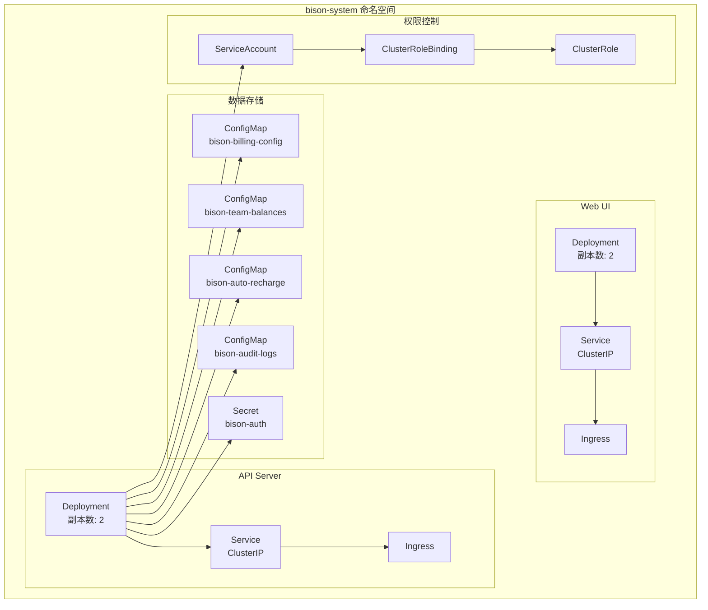
```mermaid
graph TB
    subgraph "bison-system 命名空间"
        subgraph "API Server"
            DEP1[Deployment<br/>副本数: 2]
            SVC1[Service<br/>ClusterIP]
            ING1[Ingress]
        end

        subgraph "Web UI"
            DEP2[Deployment<br/>副本数: 2]
            SVC2[Service<br/>ClusterIP]
            ING2[Ingress]
        end

        subgraph "数据存储"
            CM1[ConfigMap<br/>bison-billing-config]
            CM2[ConfigMap<br/>bison-team-balances]
            CM3[ConfigMap<br/>bison-auto-recharge]
            CM4[ConfigMap<br/>bison-audit-logs]
            SEC[Secret<br/>bison-auth]
        end

        subgraph "权限控制"
            SA[ServiceAccount]
            CR[ClusterRole]
            CRB[ClusterRoleBinding]
        end
    end

    DEP1 --> SVC1 --> ING1
    DEP2 --> SVC2 --> ING2
    DEP1 --> CM1 & CM2 & CM3 & CM4
    DEP1 --> SEC
    DEP1 --> SA
    SA --> CRB --> CR
```

### 高可用架构

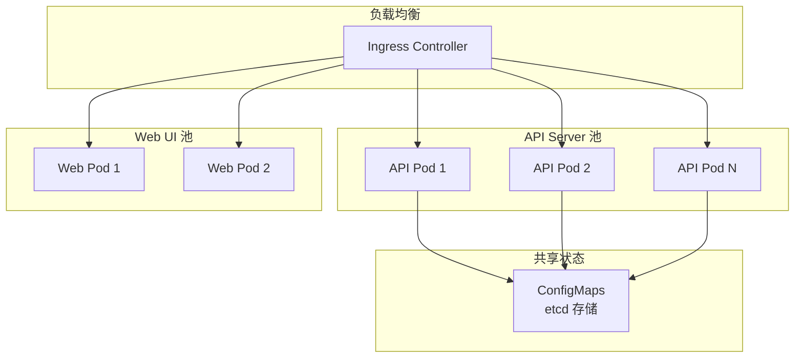
```mermaid
graph TB
    subgraph "负载均衡"
        LB[Ingress Controller]
    end

    subgraph "API Server 池"
        API1[API Pod 1]
        API2[API Pod 2]
        API3[API Pod N]
    end

    subgraph "Web UI 池"
        WEB1[Web Pod 1]
        WEB2[Web Pod 2]
    end

    subgraph "共享状态"
        CM[ConfigMaps<br/>etcd 存储]
    end

    LB --> API1 & API2 & API3
    LB --> WEB1 & WEB2
    API1 & API2 & API3 --> CM
```

---

## 安全模型

### 认证与授权

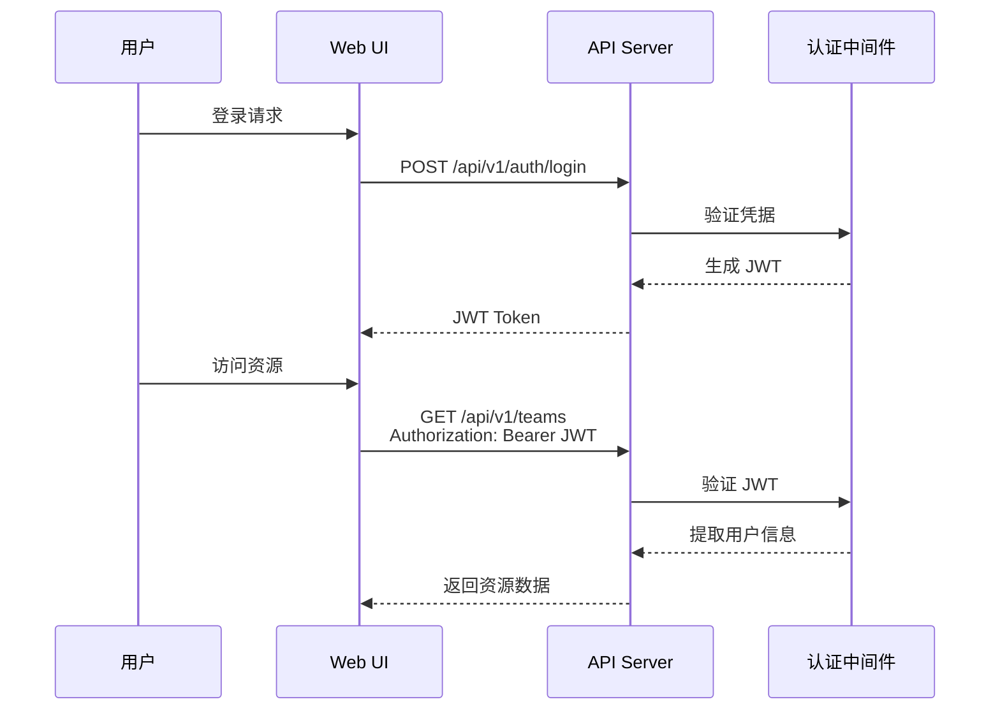
```mermaid
sequenceDiagram
    participant USER as 用户
    participant UI as Web UI
    participant API as API Server
    participant AUTH as 认证中间件

    USER->>UI: 登录请求
    UI->>API: POST /api/v1/auth/login
    API->>AUTH: 验证凭据
    AUTH-->>API: 生成 JWT
    API-->>UI: JWT Token

    USER->>UI: 访问资源
    UI->>API: GET /api/v1/teams<br/>Authorization: Bearer JWT
    API->>AUTH: 验证 JWT
    AUTH-->>API: 提取用户信息
    API-->>UI: 返回资源数据
```

### RBAC 权限配置

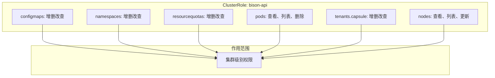
```mermaid
graph TD
    subgraph "ClusterRole: bison-api"
        P1[configmaps: 增删改查]
        P2[namespaces: 增删改查]
        P3[resourcequotas: 增删改查]
        P4[pods: 查看、列表、删除]
        P5[tenants.capsule: 增删改查]
        P6[nodes: 查看、列表、更新]
    end

    subgraph "作用范围"
        S1[集群级别权限]
    end

    P1 & P2 & P3 & P4 & P5 & P6 --> S1
```

---

## 界面设计

### 仪表盘

<p align="center">
  
</p>

**设计要点：**
- 资源使用率实时展示（CPU/内存/GPU）
- 成本趋势图表（日/周/月）
- 团队 Top N 排行
- 告警概览

### 团队管理

<p align="center">
  
</p>

**功能模块：**
- 团队列表与搜索
- 配额配置（动态资源类型）
- 余额管理（充值/扣费历史）
- 成员与权限设置

### 计费配置

<p align="center">
  
</p>

**配置项：**
- 启用/禁用计费
- 币种设置
- 资源单价（CPU/内存/GPU）
- 计费周期
- 告警阈值

---

## 技术栈总结

| 层级 | 技术 | 用途 |
|------|------|------|
| 前端框架 | React 18 + TypeScript | 单页应用开发 |
| UI 组件库 | Ant Design Pro 5 | 企业级组件 |
| 图表库 | ECharts | 数据可视化 |
| 后端框架 | Go 1.21 + Gin | REST API 开发 |
| K8s 客户端 | client-go | Kubernetes 集成 |
| 多租户 | Capsule | 命名空间隔离 |
| 成本追踪 | OpenCost | 资源计费 |
| 指标采集 | Prometheus | 时序数据 |
| 数据存储 | ConfigMaps | 状态持久化 |
| 部署工具 | Helm 3 | 应用打包 |

---

<p align="center">
  <em>专为企业级 GPU 资源管理而设计</em>
</p>
