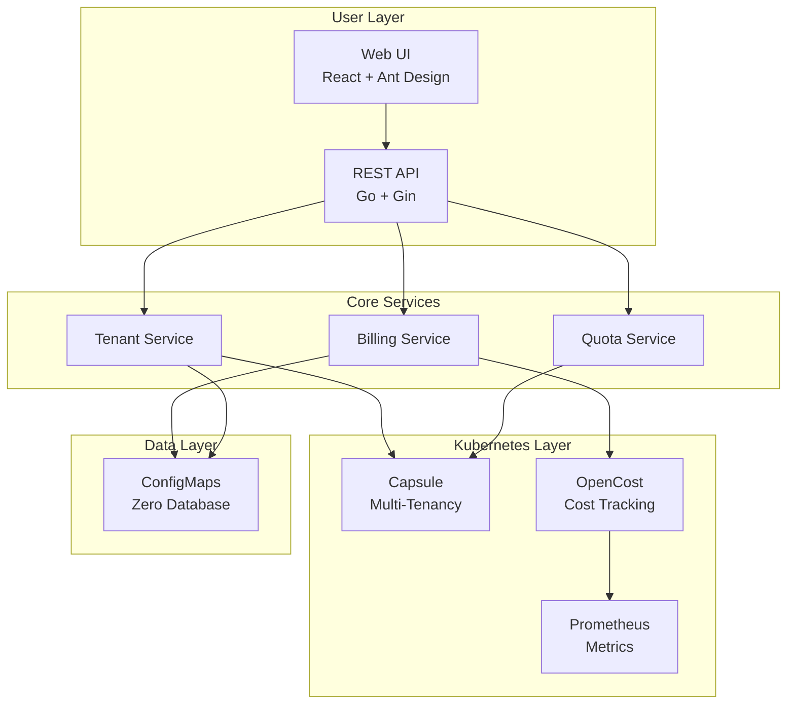

# Features

Bison provides a comprehensive suite of features for GPU resource management, billing, and multi-tenant isolation in Kubernetes environments.

## See Bison in Action

### Real-Time Resource Dashboard

**What you see:**
- **Cluster Overview** - Total teams, projects, resource pools, and quotas at a glance
- **Resource Utilization** - Visual breakdown showing which teams are consuming resources
- **7-Day Cost Trends** - Historical cost data to identify spending patterns
- **Top 5 Cost Rankings** - Quickly identify heavy GPU consumers
- **Team Budget Status** - Real-time balance monitoring with color-coded alerts

**Who benefits:**
- **Platform Administrators** get instant visibility into cluster health and usage patterns
- **Finance Teams** can track costs in real-time without waiting for monthly reports
- **Team Leaders** can compare their usage against other teams

---

### Team Management & Budget Monitoring

**What you see:**
- **Team List** with real-time status indicators:
  - **Green** balance = Healthy budget
  - **Amber** balance = Approaching threshold
  - **Red** balance = Low balance or suspended
- **Resource Allocation** - CPU/Memory/GPU quotas per team (e.g., "cpu 0/10" means 0 used out of 10 allocated)
- **Project Count** - Number of namespaces/projects under each team
- **Quick Actions** - Edit quotas, recharge balance, or delete team with one click

**Who benefits:**
- **Team Leaders** monitor their budget status and resource usage at a glance
- **Administrators** manage multiple teams from a single unified view
- **Finance Teams** see which teams need recharging

---

### Flexible Billing Configuration

**What you see:**
- **Per-Resource Pricing** - Set custom prices for CPU (per core-hour), Memory (per GB-hour), GPU (per GPU-hour)
- **Currency Selection** - Support for CNY, USD, EUR, and other currencies
- **Enable/Disable Toggle** - Turn billing on/off for specific resources with one click
- **Billing Rules** - Define how resources are metered (hourly, daily, etc.)
- **Alert Thresholds** - Configure when to send low-balance warnings

**Who benefits:**
- **Finance Teams** align cloud costs with internal chargeback policies
- **Administrators** adjust pricing based on actual hardware costs
- **Budget Managers** set appropriate warning thresholds to prevent overruns

---

## Core Capabilities

> **Legend** — items marked _Planned_ are on the [optimization roadmap](https://github.com/SuperMarioYL/Bison/blob/main/docs/optimization-roadmap.md) and not yet implemented. Everything else ships today.

### Multi-Tenant Management
- **Capsule-Powered Isolation** — true multi-tenancy using the Kubernetes-native Capsule operator
- **Team-Based Access Control** — manage users, roles, and permissions per team
- **Shared & Exclusive Node Pools** — flexible resource allocation strategies
- **Enterprise SSO / OIDC** — _Planned_

### Real-Time Billing
- **Usage-Based Billing** — accurate cost tracking based on actual resource consumption (via OpenCost)
- **Configurable Pricing** — set custom rates for CPU, Memory, GPU, and any Kubernetes resource
- **Multi-Currency Support** — configurable currency and symbol (e.g. CNY ¥, USD $)
- **Prepaid Balances with Real-Time Deduction** — hourly metering with optimistic-concurrency-safe balance writes

### Cluster & Node Management
- **Node Inventory** — live view of every node with architecture, status, and GPU device breakdown
- **Node Pool Modes** — mark nodes as shared, exclusive, disabled, or unmanaged
- **Per-Node Detail** — CPU / memory / GPU utilization time series and workload placement
- **Resource Discovery** — auto-discover cluster resources (CPU, memory, GPU, storage, custom) and configure display units and pricing

### Automated Node Onboarding
- **Init Script Generation** — generate a per-node bootstrap script from the control-plane configuration
- **SSH Onboarding Tasks** — run onboarding over SSH with live progress tracking
- **Control-Plane Configuration** — manage how new nodes join the managed pool

### Dynamic Resource Quotas
- **Per-Team Quotas** — CPU, Memory, GPU, Storage, and custom resources
- **Namespace Quotas** — project-level resource limits within teams
- **Auto-Enforcement** — Kubernetes-native quota enforcement via Capsule
- **Quota Alerts** — dashboard warnings when usage approaches limits (≥ 80%)

### Team Balance & Wallet System
- **Prepaid Balances** — team wallets with real-time deduction
- **Transaction History** — complete audit trail of every recharge and deduction
- **Grace Period & Auto-Suspension** — configurable grace window before suspending overdue teams

### Auto-Recharge
- **Scheduled Top-Ups** — weekly or monthly automatic recharges
- **Custom Amounts** — flexible recharge amounts per team

### Balance Alerts
- **Multi-Channel Notifications** — Webhook, DingTalk, WeChat
- **Configurable Thresholds** — set warning levels (e.g. 20%, 10%, 5%)
- **Auto-Suspension** — automatically suspend workloads when the grace period expires
- **Email / SMTP notifications** — _Planned_

### Usage Reports
- **Team & Project Analytics** — per-team and per-namespace cost breakdowns and trends
- **CSV Export** — export summary reports for finance reconciliation
- **Historical Windows** — 7 / 30 / 90-day cost analysis
- **Excel & PDF export** — _Planned_

### Audit Logging
- **Complete Operation History** — track administrative actions with pagination
- **User Attribution** — who did what and when
- **Resource Changes** — track quota, balance, and configuration changes

---

## Architecture Highlights

Bison's architecture is designed for simplicity, scalability, and zero external dependencies.

### Key Architectural Benefits

- **Zero External Dependencies** - All data stored in Kubernetes ConfigMaps (etcd-backed)
- **Cloud-Native** - Built on Kubernetes primitives for maximum portability
- **Scalable** - Stateless API server that can scale horizontally
- **Secure** - Kubernetes RBAC integration and optional authentication
- **Observable** - Prometheus metrics and structured logging
- **Configurable** - custom per-resource pricing, alert thresholds, and grace policy

---

## Integration Points

### OpenCost Integration
Bison leverages [OpenCost](https://www.opencost.io/) for real-time cost tracking:
- Per-pod, per-namespace, per-team cost visibility
- GPU utilization metrics
- Historical cost data and trends
- Integration with Prometheus for metric collection

### Capsule Integration
Bison uses [Capsule](https://capsule.clastix.io/) for multi-tenancy:
- Team-based tenant isolation
- Namespace quota enforcement
- Network and security policies

### Prometheus Integration
Metrics collection and monitoring:
- Resource utilization tracking
- Custom billing metrics
- Alert rule evaluation
- Historical data retention

---

## Next Steps

- [Installation Guide](installation.md) - Deploy Bison in your cluster
- [User Guides](user-guides/admin.md) - Learn how to use Bison
- [Architecture](architecture.md) - Deep dive into system design
- [Configuration](configuration.md) - Configure billing and settings
