# Introduction to Bison


**Enterprise GPU Resource Billing & Multi-Tenant Management Platform**

Bison is a Kubernetes-based platform that provides comprehensive GPU resource management, billing, and multi-tenant isolation for organizations running shared GPU clusters.

## The GPU Management Challenge

Managing shared GPU clusters across multiple teams creates critical operational and financial challenges:

**For Platform Administrators:**
- How do you fairly allocate expensive GPU resources across competing teams?
- How do you prevent resource hogging while ensuring everyone gets their fair share?
- How do you track who's using what and implement accurate chargeback?
- How do you maintain strict multi-tenant isolation without complex manual configuration?

**For Finance & Budget Teams:**
- How do you implement automated chargeback for GPU usage without manual accounting?
- How do you prevent budget overruns before they happen?
- How do you generate accurate cost reports for internal billing?

**For Development Teams:**
- How do you get predictable, isolated access to GPU resources?
- How do you know when you're approaching your budget limits?
- How do you avoid impacting other teams' workloads?

**Traditional Approach:**
- Manual quota configuration per namespace
- Excel-based billing calculations
- No real-time cost visibility
- Complex multi-tool setup (quota management + cost tracking + billing system)
- Frequent resource conflicts and budget surprises

## Bison's Integrated Solution

```mermaid
graph TB
    subgraph WITHOUT["Without Bison"]
        P1[❌ Manual Quota Management<br/>Per-namespace configuration]
        P2[❌ Spreadsheet Billing<br/>Manual calculations & reports]
        P3[❌ No Resource Isolation<br/>Teams compete for resources]
        P4[❌ Budget Overruns<br/>No proactive alerts]
        P5[❌ Complex Tooling<br/>Multiple systems to manage]
    end

    subgraph WITH["With Bison"]
        S1[✅ Automated Team Quotas<br/>Capsule-powered isolation]
        S2[✅ Real-Time Billing<br/>OpenCost integration]
        S3[✅ True Multi-Tenancy<br/>Shared/Exclusive modes]
        S4[✅ Proactive Alerts<br/>Balance monitoring & auto-suspend]
        S5[✅ Unified Platform<br/>Single pane of glass]
    end

    P1 -.Transform.-> S1
    P2 -.Transform.-> S2
    P3 -.Transform.-> S3
    P4 -.Transform.-> S4
    P5 -.Transform.-> S5

    style WITHOUT fill:#ffebee
    style WITH fill:#e8f5e9
    style S1 fill:#4caf50,color:#fff
    style S2 fill:#4caf50,color:#fff
    style S3 fill:#4caf50,color:#fff
    style S4 fill:#4caf50,color:#fff
    style S5 fill:#4caf50,color:#fff
```



**Bison combines:**
- 🔐 **Kubernetes-native multi-tenancy** (Capsule) - True team isolation with shared or exclusive node pools
- 💰 **Real-time cost tracking** (OpenCost + Prometheus) - Per-pod, per-namespace, per-team cost visibility
- 💳 **Automated billing & budgets** - Prepaid balances, auto-deduction, low-balance alerts, and auto-suspension
- 📊 **Unified dashboard** - Single interface for admins, team leaders, and finance teams
- 🔧 **Zero external dependencies** - All data stored in Kubernetes ConfigMaps (etcd-backed)

**Result:** Deploy once, get complete GPU resource management with automated billing in under 30 minutes.

## Quick Start

### Prerequisites

- Kubernetes 1.22+
- kubectl configured
- Helm 3.0+
- Capsule operator (v0.1.0+) installed
- OpenCost deployed with Prometheus

### Installation

Choose one of the following installation methods:

#### Option A: Using Helm Repository (Recommended)

```bash
# Add Bison Helm repository
helm repo add bison https://supermarioyl.github.io/Bison/charts/
helm repo update

# Install with default configuration
helm install bison bison/bison --namespace bison-system --create-namespace

# Or customize installation
helm install bison bison/bison \
  --namespace bison-system \
  --create-namespace \
  --set opencost.url=http://opencost.opencost-system.svc:9003 \
  --set auth.enabled=false
```

#### Option B: From GitHub Release

```bash
# Download latest Helm chart
VERSION=0.0.1
wget https://github.com/SuperMarioYL/Bison/releases/download/v${VERSION}/bison-${VERSION}.tgz

# Install
helm install bison bison-${VERSION}.tgz \
  --namespace bison-system \
  --create-namespace
```

#### Option C: From Source

```bash
# Clone repository
git clone https://github.com/SuperMarioYL/Bison.git
cd Bison

# Install dependencies and build
make install-deps
make build

# Deploy using Helm
helm install bison ./deploy/charts/bison \
  --namespace bison-system \
  --create-namespace
```

### Access the Platform

After installation, access Bison through:

```bash
# Port-forward the Web UI
kubectl port-forward -n bison-system svc/bison-webui 3000:80

# Access at http://localhost:3000
# Default credentials (if auth enabled):
# Username: admin
# Password: admin (change immediately in production!)
```

## Next Steps

- [Explore Features](features.md) - Learn about all capabilities
- [Installation Guide](installation.md) - Detailed installation instructions
- [User Guides](user-guides/admin.md) - Role-based user guides
- [Architecture](architecture.md) - Understand the system architecture
- [Configuration](configuration.md) - Configure billing and settings
