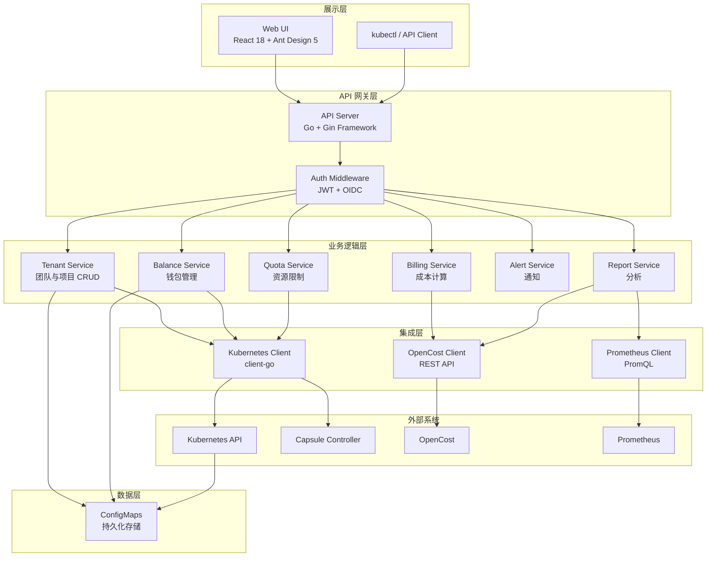
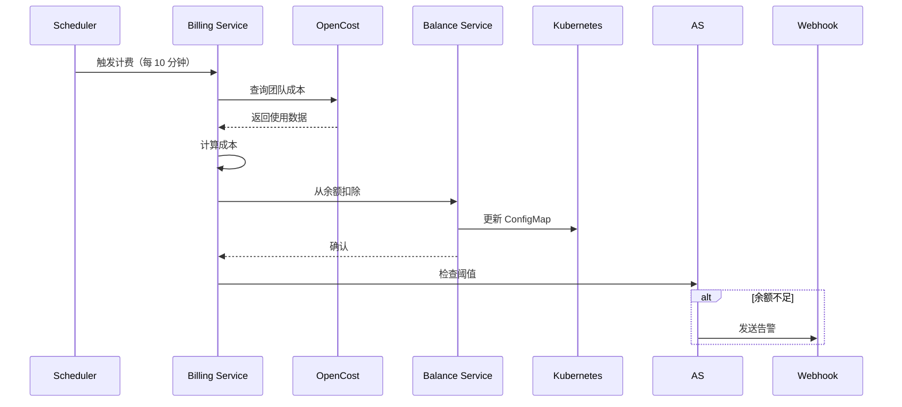
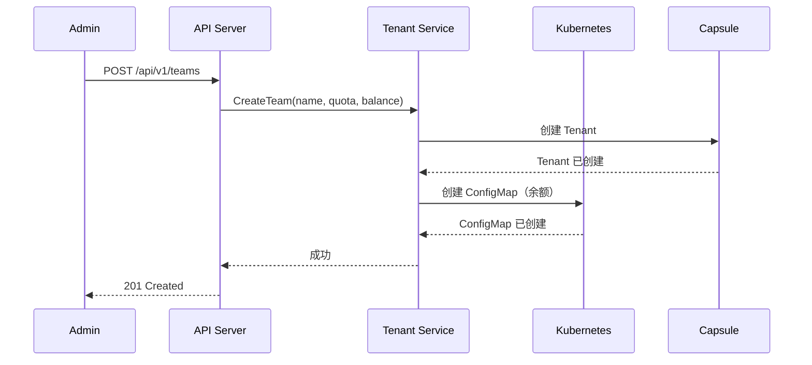
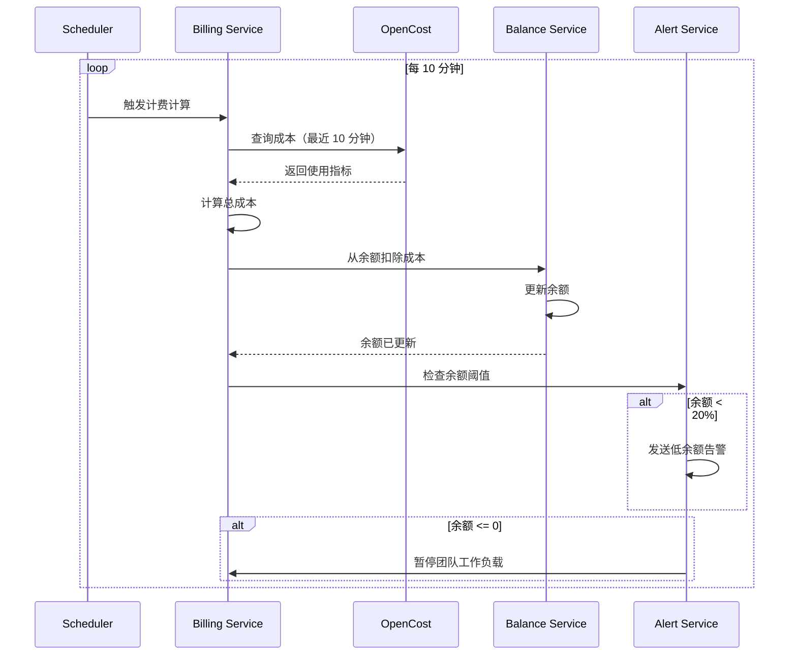
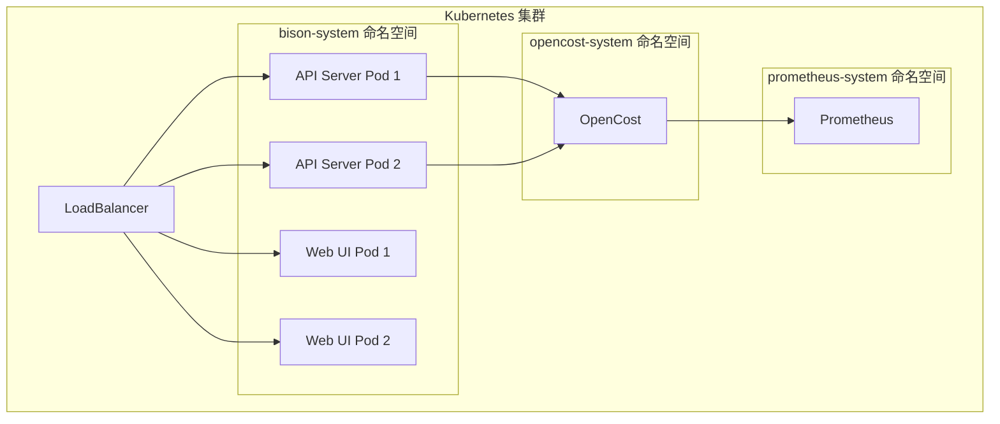

# 架构

本文档提供 Bison 架构的技术概览，采用高内聚、低耦合的设计原则，以保证可维护性和可扩展性。

## 系统概览

### 高层架构



### 设计原则

| 原则 | 实现方式 |
|-----------|----------------|
| **高内聚** | 每个服务处理单一领域（计费、配额、告警） |
| **低耦合** | 服务之间通过明确定义的接口通信 |
| **无状态 API** | 所有状态持久化到 Kubernetes ConfigMaps |
| **云原生** | 利用 Kubernetes 原语实现高可用和扩展 |
| **零数据库** | ConfigMaps 消除了外部数据库依赖 |

## 架构层次

Bison 遵循分层架构模式：

### 1. 展示层
- **Web UI**: React 18 + TypeScript + Ant Design 5
- **API Client**: REST API 用于外部集成

### 2. API 网关层
- **API Server**: Go + Gin 框架
- **认证**: JWT 和 OIDC 支持
- **中间件**: 日志、恢复、CORS 处理

### 3. 业务逻辑层
- **Tenant Service**: 团队和项目管理
- **Billing Service**: 成本计算和聚合
- **Balance Service**: 钱包管理和自动扣费
- **Quota Service**: 资源限制执行
- **Alert Service**: 多渠道通知
- **Report Service**: 分析和导出

### 4. 集成层
- **Kubernetes Client**: client-go 用于 K8s API 交互
- **OpenCost Client**: REST API 用于成本数据
- **Prometheus Client**: PromQL 查询指标

### 5. 数据层
- **ConfigMaps**: 余额、计费配置和元数据的持久化存储
- **etcd**: 通过 Kubernetes ConfigMaps 作为后端存储

## 核心组件

### API Server

API Server 是处理所有 HTTP 请求的核心组件：

**技术栈：**
- Go 1.24+
- Gin web 框架
- client-go 用于 Kubernetes API

**关键职责：**
- 提供 REST API 端点
- 认证和授权
- 请求路由和中间件
- 后台任务调度

**端点：**
```
/api/v1/teams          - 团队管理
/api/v1/projects       - 项目管理
/api/v1/billing        - 计费配置
/api/v1/balance        - 余额操作
/api/v1/stats          - 统计和报告
```

### Web UI

基于 React 的单页应用：

**技术栈：**
- React 18
- TypeScript
- Vite（构建工具）
- Ant Design 5
- ECharts（可视化）
- React Query（状态管理）

**功能：**
- 实时指标仪表板
- 团队和项目管理
- 计费配置
- 余额监控
- 使用报告和导出

### Billing Service

基于资源使用计算成本：

**数据流：**


**计费公式：**
```
总成本 = (CPU_核数 × CPU_价格 × 小时) +
        (内存_GB × 内存_价格 × 小时) +
        (GPU_数量 × GPU_价格 × 小时)
```

### Balance Service

管理团队钱包和自动扣费：

**功能：**
- 实时余额追踪
- 基于使用量自动扣费
- 充值操作
- 交易历史
- 余额耗尽时自动暂停

**存储：**
```yaml
apiVersion: v1
kind: ConfigMap
metadata:
  name: bison-team-balances
  namespace: bison-system
data:
  ml-team: "1523.45"
  data-team: "890.12"
  dev-team: "2100.00"
```

### Tenant Service

管理团队（Capsule Tenants）和项目（Namespaces）：

**功能：**
- 创建/删除团队
- 分配资源配额
- 配置节点池（共享/独占）
- 管理团队元数据

**Capsule 集成：**
```yaml
apiVersion: capsule.clastix.io/v1beta1
kind: Tenant
metadata:
  name: ml-team
spec:
  owners:
  - name: team-leader
    kind: User
  resourceQuota:
    items:
    - hard:
        cpu: "20"
        memory: 64Gi
        nvidia.com/gpu: "4"
```

## 数据流

### 团队创建流程



### 计费周期流程



## 集成点

### Kubernetes 集成

Bison 与 Kubernetes 深度集成：

- **Capsule Tenants** 用于多租户
- **ResourceQuotas** 用于限制执行
- **Namespaces** 用于项目隔离
- **ConfigMaps** 用于数据持久化
- **RBAC** 用于访问控制

### OpenCost 集成

通过 OpenCost API 实现实时成本追踪：

```bash
# 查询团队成本
GET /allocation/compute?window=10m&aggregate=namespace&filter=namespace:ml-team

# 响应
{
  "ml-team": {
    "cpuCost": 0.25,
    "memCost": 0.10,
    "gpuCost": 4.17,
    "totalCost": 4.52
  }
}
```

### Prometheus 集成

指标收集用于监控：

- 资源利用率指标
- 成本指标
- 余额指标
- 告警指标

## 部署架构

### 高可用设置



### 资源要求

**最低配置：**
- API Server: 200m CPU，256Mi 内存
- Web UI: 100m CPU，128Mi 内存

**推荐配置（生产环境）：**
- API Server: 1000m CPU，512Mi 内存（2 个副本）
- Web UI: 500m CPU，256Mi 内存（2 个副本）

## 安全模型

### 认证
- 基于 JWT token 的认证
- OIDC/SSO 集成
- 管理员用户管理

### 授权
- Kubernetes RBAC 集成
- 基于角色的访问控制
- 团队范围的权限

### 数据安全
- 所有数据静态加密（etcd 加密）
- API 通信使用 TLS
- 通过 Kubernetes Secrets 管理密钥

## 技术栈

### 后端
- **语言**: Go 1.24+
- **框架**: Gin
- **Kubernetes 客户端**: client-go
- **配置**: Viper
- **日志**: Logrus

### 前端
- **框架**: React 18
- **语言**: TypeScript
- **UI 库**: Ant Design 5
- **构建工具**: Vite
- **状态管理**: React Query
- **图表**: ECharts

### 基础设施
- **平台**: Kubernetes 1.22+
- **多租户**: Capsule
- **成本追踪**: OpenCost
- **指标**: Prometheus
- **存储**: ConfigMaps（etcd）

## 下一步

- [安装指南](installation.md) - 部署 Bison
- [配置](configuration.md) - 配置计费
- [用户指南](user-guides/admin.md) - 学习使用 Bison
- [功能特性](features.md) - 探索功能
