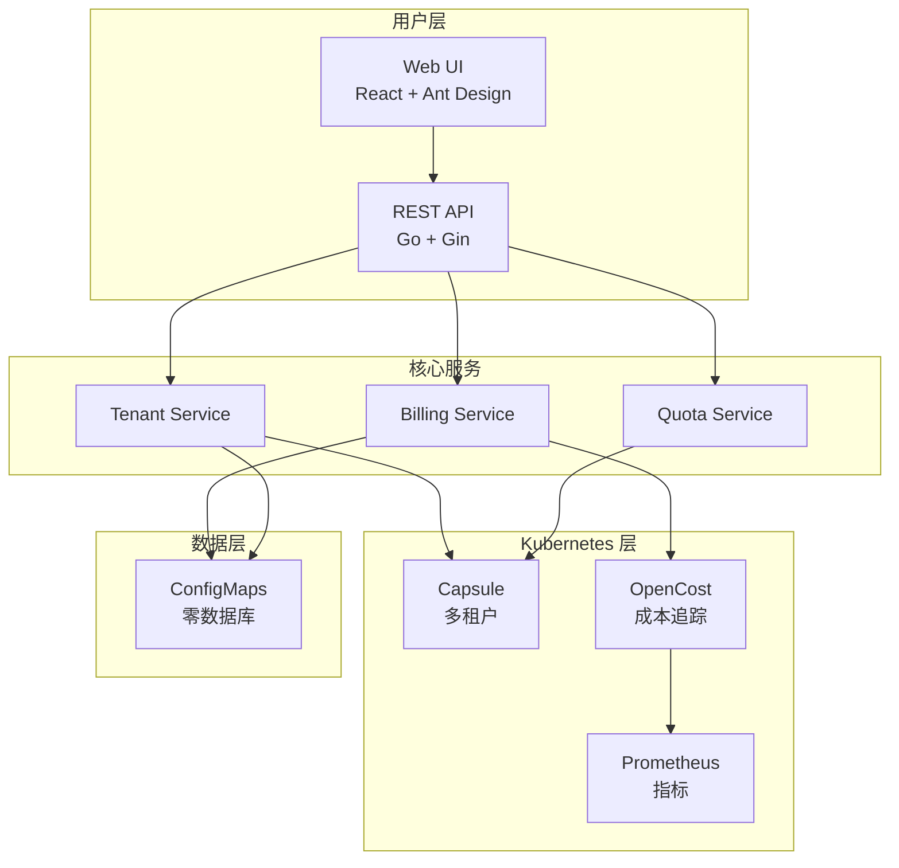

# 功能特性

Bison 为 Kubernetes 环境中的 GPU 资源管理、计费和多租户隔离提供了全面的功能套件。

## Bison 实际运行

### 🎯 实时资源仪表板

**您可以看到：**
- **集群概览** - 一目了然地查看总团队数、项目数、资源池和配额
- **资源利用率** - 可视化展示哪些团队正在消耗资源
- **7 天成本趋势** - 历史成本数据，用于识别支出模式
- **Top 5 成本排名** - 快速识别 GPU 重度使用者
- **团队预算状态** - 实时余额监控，带有颜色编码的告警

**谁会受益：**
- **平台管理员** 即时了解集群健康状况和使用模式
- **财务团队** 可以实时跟踪成本，无需等待月度报告
- **团队负责人** 可以将自己的使用情况与其他团队进行比较

---

### 💼 团队管理与预算监控

**您可以看到：**
- **团队列表** 带有实时状态指示器：
  - 🟢 绿色余额 = 预算健康
  - 🟡 黄色余额 = 接近阈值
  - 🔴 红色余额 = 余额不足或已暂停
- **资源分配** - 每个团队的 CPU/内存/GPU 配额（例如，"cpu 0/10" 表示已分配 10 个中使用了 0 个）
- **项目计数** - 每个团队下的命名空间/项目数量
- **快速操作** - 一键编辑配额、充值余额或删除团队

**谁会受益：**
- **团队负责人** 一目了然地监控他们的预算状态和资源使用情况
- **管理员** 从单一统一视图管理多个团队
- **财务团队** 查看哪些团队需要充值

---

### 💰 灵活的计费配置

**您可以看到：**
- **按资源定价** - 为 CPU（每核心小时）、内存（每 GB 小时）、GPU（每 GPU 小时）设置自定义价格
- **货币选择** - 支持 CNY、USD、EUR 等货币
- **启用/禁用开关** - 一键打开或关闭特定资源的计费
- **计费规则** - 定义资源计量方式（每小时、每天等）
- **告警阈值** - 配置何时发送低余额警告

**谁会受益：**
- **财务团队** 将云成本与内部退款政策对齐
- **管理员** 根据实际硬件成本调整定价
- **预算管理者** 设置适当的警告阈值以防止超支

---

## 核心能力

### 多租户管理
✅ **Capsule 驱动的隔离** - 使用 Kubernetes 原生 Capsule operator 实现真正的多租户
✅ **OIDC 集成** - 企业 SSO 支持认证
✅ **基于团队的访问控制** - 管理每个团队的用户、角色和权限
✅ **共享与独占节点池** - 灵活的资源分配策略

### 实时计费
✅ **基于使用量的计费** - 基于实际资源消耗的准确成本追踪
✅ **可配置定价** - 为 CPU、内存、GPU 和任何 Kubernetes 资源设置自定义费率
✅ **多货币支持** - CNY、USD、EUR 等
✅ **计费规则引擎** - 定义自定义计费逻辑和聚合周期

### 动态资源配额
✅ **团队级配额** - CPU、内存、GPU、存储和自定义资源
✅ **命名空间配额** - 团队内的项目级资源限制
✅ **自动执行** - Kubernetes 原生配额执行
✅ **配额告警** - 接近限制时的通知

### 团队余额与钱包系统
✅ **预付费余额** - 团队钱包实时扣费
✅ **自动扣费** - 基于资源使用的自动计费
✅ **余额阈值** - 可配置的警告和暂停级别
✅ **交易历史** - 所有余额变更的完整审计跟踪

### 自动充值
✅ **定时充值** - 每周或每月自动充值
✅ **自定义金额** - 每个团队的灵活充值金额
✅ **充值通知** - 余额增加时通知团队

### 余额告警
✅ **多渠道通知** - Webhook、钉钉、微信、邮件
✅ **可配置阈值** - 设置警告级别（例如 20%、10%、5%）
✅ **自动暂停** - 余额耗尽时自动暂停工作负载
✅ **自定义模板** - 自定义告警消息

### 使用报告
✅ **团队分析** - 团队级成本细分和趋势
✅ **项目分析** - 命名空间级资源消耗
✅ **导出功能** - CSV、Excel、PDF 报告
✅ **历史数据** - 30/60/90 天成本分析

### 审计日志
✅ **完整操作历史** - 跟踪所有管理操作
✅ **用户归属** - 谁在何时做了什么
✅ **资源变更** - 跟踪配额、余额和配置变更
✅ **合规就绪** - 满足内部审计要求

---

## 架构亮点

Bison 的架构设计简单、可扩展，且无外部依赖。

### 关键架构优势

- **零外部依赖** - 所有数据存储在 Kubernetes ConfigMaps（etcd 支持）
- **云原生** - 基于 Kubernetes 原语构建，实现最大可移植性
- **可扩展** - 无状态 API Server 可以水平扩展
- **安全** - Kubernetes RBAC 集成和可选认证
- **可观测** - Prometheus 指标和结构化日志
- **可扩展** - 用于自定义计费规则和告警的插件架构

---

## 集成点

### OpenCost 集成
Bison 利用 [OpenCost](https://www.opencost.io/) 进行实时成本追踪：
- 按 pod、按命名空间、按团队的成本可见性
- GPU 利用率指标
- 历史成本数据和趋势
- 与 Prometheus 集成以收集指标

### Capsule 集成
Bison 使用 [Capsule](https://capsule.clastix.io/) 实现多租户：
- 基于团队的租户隔离
- 命名空间配额执行
- 网络和安全策略
- OIDC/SSO 集成

### Prometheus 集成
指标收集和监控：
- 资源利用率追踪
- 自定义计费指标
- 告警规则评估
- 历史数据保留

---

## 下一步

- [安装指南](installation.md) - 在您的集群中部署 Bison
- [用户指南](user-guides/admin.md) - 学习如何使用 Bison
- [架构](architecture.md) - 深入了解系统设计
- [配置](configuration.md) - 配置计费和设置
