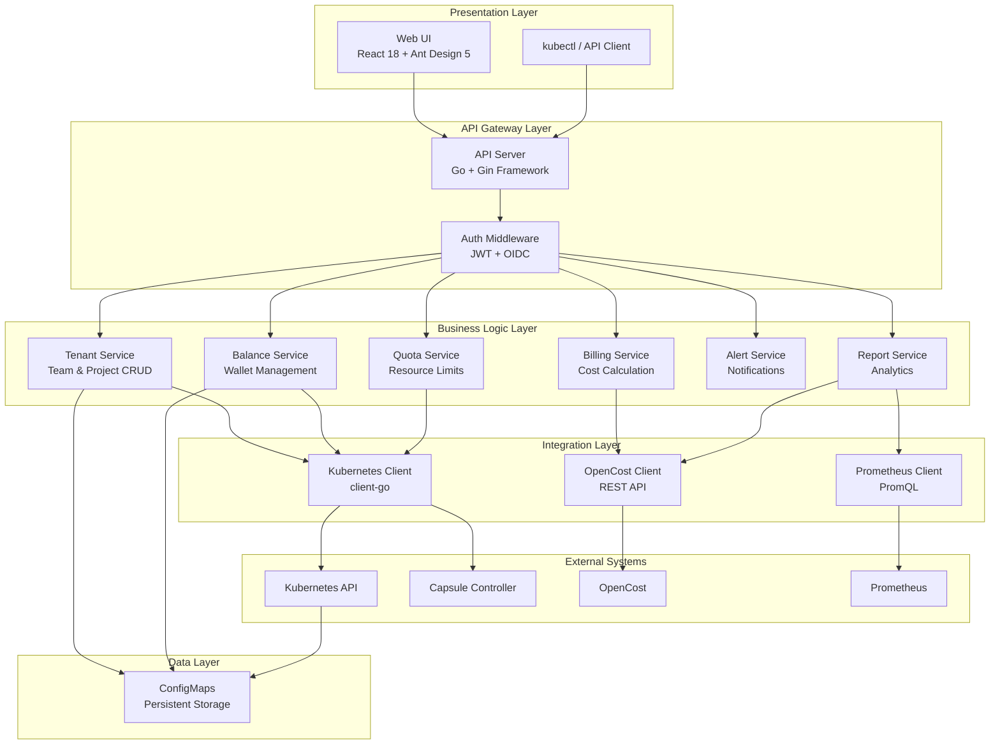
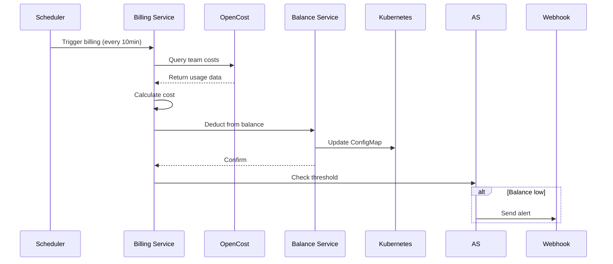
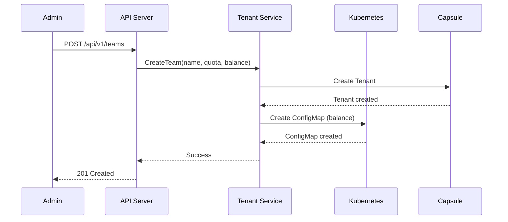
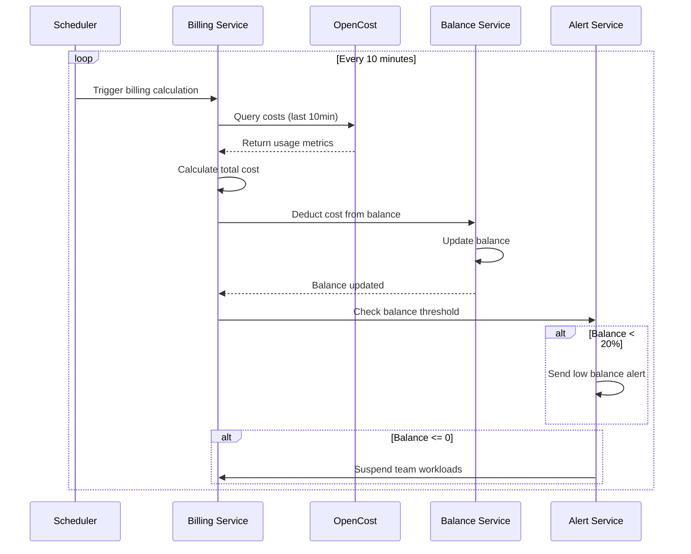
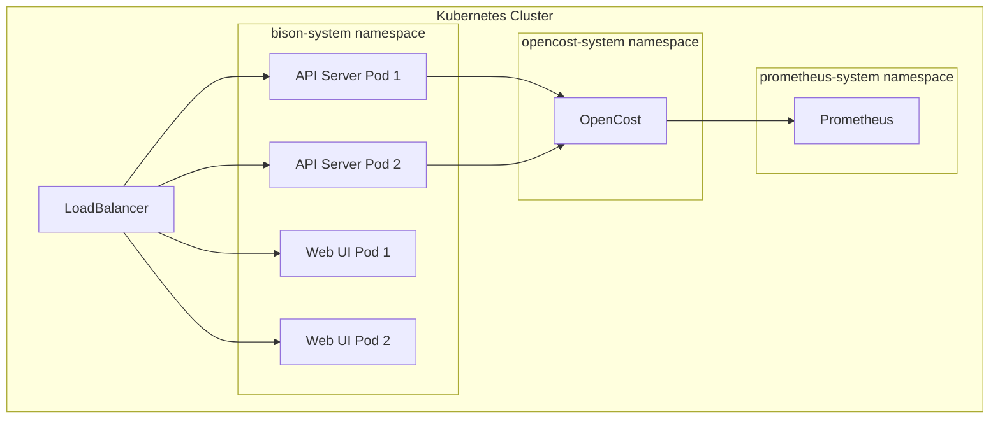

# Architecture

This document provides a technical overview of Bison's architecture, designed with high cohesion and low coupling principles for maintainability and scalability.

## System Overview

### High-Level Architecture



### Design Principles

| Principle | Implementation |
|-----------|----------------|
| **High Cohesion** | Each service handles a single domain (billing, quota, alerts) |
| **Low Coupling** | Services communicate via well-defined interfaces |
| **Stateless API** | All state persisted in Kubernetes ConfigMaps |
| **Cloud Native** | Leverages Kubernetes primitives for HA and scaling |
| **Zero Database** | ConfigMaps eliminate external database dependencies |

## Architecture Layers

Bison follows a layered architecture pattern:

### 1. Presentation Layer
- **Web UI**: React 18 + TypeScript + Ant Design 5
- **API Client**: REST API for external integrations

### 2. API Gateway Layer
- **API Server**: Go + Gin framework
- **Authentication**: JWT and OIDC support
- **Middleware**: Logging, recovery, CORS handling

### 3. Business Logic Layer
- **Tenant Service**: Team and project management
- **Billing Service**: Cost calculation and aggregation
- **Balance Service**: Wallet management and auto-deduction
- **Quota Service**: Resource limit enforcement
- **Alert Service**: Multi-channel notifications
- **Report Service**: Analytics and export

### 4. Integration Layer
- **Kubernetes Client**: client-go for K8s API interaction
- **OpenCost Client**: REST API for cost data
- **Prometheus Client**: PromQL queries for metrics

### 5. Data Layer
- **ConfigMaps**: Persistent storage for balances, billing config, and metadata
- **etcd**: Backing store via Kubernetes ConfigMaps

## Core Components

### API Server

The API server is the central component that handles all HTTP requests:

**Technology Stack:**
- Go 1.24+
- Gin web framework
- client-go for Kubernetes API

**Key Responsibilities:**
- Serve REST API endpoints
- Authentication and authorization
- Request routing and middleware
- Background task scheduling

**Endpoints:**
```
/api/v1/teams          - Team management
/api/v1/projects       - Project management
/api/v1/billing        - Billing configuration
/api/v1/balance        - Balance operations
/api/v1/stats          - Statistics and reports
```

### Web UI

React-based single-page application:

**Technology Stack:**
- React 18
- TypeScript
- Vite (build tool)
- Ant Design 5
- ECharts (visualization)
- React Query (state management)

**Features:**
- Dashboard with real-time metrics
- Team and project management
- Billing configuration
- Balance monitoring
- Usage reports and export

### Billing Service

Calculates costs based on resource usage:

**Data Flow:**


**Billing Formula:**
```
Total Cost = (CPU_cores × CPU_price × hours) +
             (Memory_GB × Memory_price × hours) +
             (GPU_count × GPU_price × hours)
```

### Balance Service

Manages team wallets and auto-deduction:

**Features:**
- Real-time balance tracking
- Auto-deduction based on usage
- Recharge operations
- Transaction history
- Auto-suspension when balance depleted

**Storage:**
```yaml
apiVersion: v1
kind: ConfigMap
metadata:
  name: bison-team-balances
  namespace: bison-system
data:
  ml-team: "1523.45"
  data-team: "890.12"
  dev-team: "2100.00"
```

### Tenant Service

Manages teams (Capsule Tenants) and projects (Namespaces):

**Features:**
- Create/delete teams
- Assign resource quotas
- Configure node pools (shared/exclusive)
- Manage team metadata

**Capsule Integration:**
```yaml
apiVersion: capsule.clastix.io/v1beta1
kind: Tenant
metadata:
  name: ml-team
spec:
  owners:
  - name: team-leader
    kind: User
  resourceQuota:
    items:
    - hard:
        cpu: "20"
        memory: 64Gi
        nvidia.com/gpu: "4"
```

## Data Flow

### Team Creation Flow



### Billing Cycle Flow



## Integration Points

### Kubernetes Integration

Bison integrates deeply with Kubernetes:

- **Capsule Tenants** for multi-tenancy
- **ResourceQuotas** for limit enforcement
- **Namespaces** for project isolation
- **ConfigMaps** for data persistence
- **RBAC** for access control

### OpenCost Integration

Real-time cost tracking via OpenCost API:

```bash
# Query team costs
GET /allocation/compute?window=10m&aggregate=namespace&filter=namespace:ml-team

# Response
{
  "ml-team": {
    "cpuCost": 0.25,
    "memCost": 0.10,
    "gpuCost": 4.17,
    "totalCost": 4.52
  }
}
```

### Prometheus Integration

Metrics collection for monitoring:

- Resource utilization metrics
- Cost metrics
- Balance metrics
- Alert metrics

## Deployment Architecture

### High Availability Setup



### Resource Requirements

**Minimum:**
- API Server: 200m CPU, 256Mi Memory
- Web UI: 100m CPU, 128Mi Memory

**Recommended (Production):**
- API Server: 1000m CPU, 512Mi Memory (2 replicas)
- Web UI: 500m CPU, 256Mi Memory (2 replicas)

## Security Model

### Authentication
- JWT token-based authentication
- OIDC/SSO integration
- Admin user management

### Authorization
- Kubernetes RBAC integration
- Role-based access control
- Team-scoped permissions

### Data Security
- All data encrypted at rest (etcd encryption)
- TLS for API communication
- Secret management via Kubernetes Secrets

## Technology Stack

### Backend
- **Language**: Go 1.24+
- **Framework**: Gin
- **Kubernetes Client**: client-go
- **Configuration**: Viper
- **Logging**: Logrus

### Frontend
- **Framework**: React 18
- **Language**: TypeScript
- **UI Library**: Ant Design 5
- **Build Tool**: Vite
- **State Management**: React Query
- **Charts**: ECharts

### Infrastructure
- **Platform**: Kubernetes 1.22+
- **Multi-Tenancy**: Capsule
- **Cost Tracking**: OpenCost
- **Metrics**: Prometheus
- **Storage**: ConfigMaps (etcd)

## Next Steps

- [Installation Guide](installation.md) - Deploy Bison
- [Configuration](configuration.md) - Configure billing
- [User Guides](user-guides/admin.md) - Learn to use Bison
- [Features](features.md) - Explore capabilities
