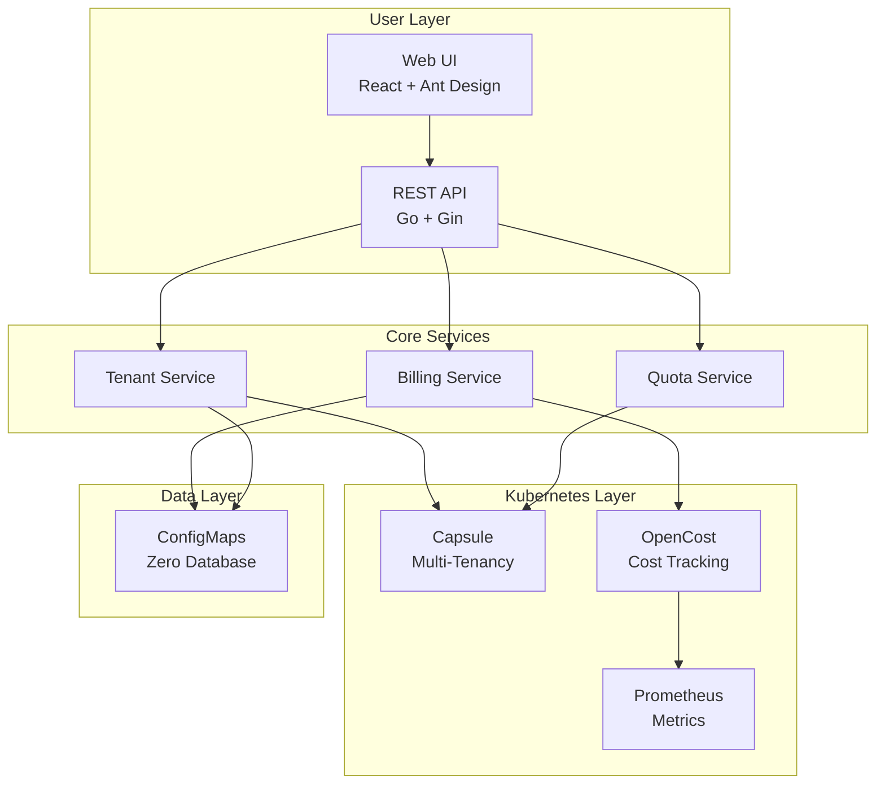

# Features

Bison provides a comprehensive suite of features for GPU resource management, billing, and multi-tenant isolation in Kubernetes environments.

## See Bison in Action

### 🎯 Real-Time Resource Dashboard

**What you see:**
- **Cluster Overview** - Total teams, projects, resource pools, and quotas at a glance
- **Resource Utilization** - Visual breakdown showing which teams are consuming resources
- **7-Day Cost Trends** - Historical cost data to identify spending patterns
- **Top 5 Cost Rankings** - Quickly identify heavy GPU consumers
- **Team Budget Status** - Real-time balance monitoring with color-coded alerts

**Who benefits:**
- **Platform Administrators** get instant visibility into cluster health and usage patterns
- **Finance Teams** can track costs in real-time without waiting for monthly reports
- **Team Leaders** can compare their usage against other teams

---

### 💼 Team Management & Budget Monitoring

**What you see:**
- **Team List** with real-time status indicators:
  - 🟢 Green balance = Healthy budget
  - 🟡 Yellow balance = Approaching threshold
  - 🔴 Red balance = Low balance or suspended
- **Resource Allocation** - CPU/Memory/GPU quotas per team (e.g., "cpu 0/10" means 0 used out of 10 allocated)
- **Project Count** - Number of namespaces/projects under each team
- **Quick Actions** - Edit quotas, recharge balance, or delete team with one click

**Who benefits:**
- **Team Leaders** monitor their budget status and resource usage at a glance
- **Administrators** manage multiple teams from a single unified view
- **Finance Teams** see which teams need recharging

---

### 💰 Flexible Billing Configuration

**What you see:**
- **Per-Resource Pricing** - Set custom prices for CPU (per core-hour), Memory (per GB-hour), GPU (per GPU-hour)
- **Currency Selection** - Support for CNY, USD, EUR, and other currencies
- **Enable/Disable Toggle** - Turn billing on/off for specific resources with one click
- **Billing Rules** - Define how resources are metered (hourly, daily, etc.)
- **Alert Thresholds** - Configure when to send low-balance warnings

**Who benefits:**
- **Finance Teams** align cloud costs with internal chargeback policies
- **Administrators** adjust pricing based on actual hardware costs
- **Budget Managers** set appropriate warning thresholds to prevent overruns

---

## Core Capabilities

### Multi-Tenant Management
✅ **Capsule-Powered Isolation** - True multi-tenancy using Kubernetes-native Capsule operator
✅ **OIDC Integration** - Enterprise SSO support for authentication
✅ **Team-Based Access Control** - Manage users, roles, and permissions per team
✅ **Shared & Exclusive Node Pools** - Flexible resource allocation strategies

### Real-Time Billing
✅ **Usage-Based Billing** - Accurate cost tracking based on actual resource consumption
✅ **Configurable Pricing** - Set custom rates for CPU, Memory, GPU, and any Kubernetes resource
✅ **Multi-Currency Support** - CNY, USD, EUR, and more
✅ **Billing Rules Engine** - Define custom billing logic and aggregation periods

### Dynamic Resource Quotas
✅ **Per-Team Quotas** - CPU, Memory, GPU, Storage, and custom resources
✅ **Namespace Quotas** - Project-level resource limits within teams
✅ **Auto-Enforcement** - Kubernetes-native quota enforcement
✅ **Quota Alerts** - Notifications when approaching limits

### Team Balance & Wallet System
✅ **Prepaid Balances** - Team wallets with real-time deduction
✅ **Auto-Deduction** - Automated billing based on resource usage
✅ **Balance Thresholds** - Configurable warning and suspension levels
✅ **Transaction History** - Complete audit trail of all balance changes

### Auto-Recharge
✅ **Scheduled Top-Ups** - Weekly or monthly automatic recharges
✅ **Custom Amounts** - Flexible recharge amounts per team
✅ **Recharge Notifications** - Alert teams when balance is added

### Balance Alerts
✅ **Multi-Channel Notifications** - Webhook, DingTalk, WeChat, Email
✅ **Configurable Thresholds** - Set warning levels (e.g., 20%, 10%, 5%)
✅ **Auto-Suspension** - Automatically suspend workloads when balance depleted
✅ **Custom Templates** - Customize alert messages

### Usage Reports
✅ **Team Analytics** - Per-team cost breakdowns and trends
✅ **Project Analytics** - Namespace-level resource consumption
✅ **Export Capabilities** - CSV, Excel, PDF reports
✅ **Historical Data** - 30/60/90-day cost analysis

### Audit Logging
✅ **Complete Operation History** - Track all administrative actions
✅ **User Attribution** - Who did what and when
✅ **Resource Changes** - Track quota, balance, and configuration changes
✅ **Compliance Ready** - Meet internal audit requirements

---

## Architecture Highlights

Bison's architecture is designed for simplicity, scalability, and zero external dependencies.

### Key Architectural Benefits

- **Zero External Dependencies** - All data stored in Kubernetes ConfigMaps (etcd-backed)
- **Cloud-Native** - Built on Kubernetes primitives for maximum portability
- **Scalable** - Stateless API server that can scale horizontally
- **Secure** - Kubernetes RBAC integration and optional authentication
- **Observable** - Prometheus metrics and structured logging
- **Extensible** - Plugin architecture for custom billing rules and alerts

---

## Integration Points

### OpenCost Integration
Bison leverages [OpenCost](https://www.opencost.io/) for real-time cost tracking:
- Per-pod, per-namespace, per-team cost visibility
- GPU utilization metrics
- Historical cost data and trends
- Integration with Prometheus for metric collection

### Capsule Integration
Bison uses [Capsule](https://capsule.clastix.io/) for multi-tenancy:
- Team-based tenant isolation
- Namespace quota enforcement
- Network and security policies
- OIDC/SSO integration

### Prometheus Integration
Metrics collection and monitoring:
- Resource utilization tracking
- Custom billing metrics
- Alert rule evaluation
- Historical data retention

---

## Next Steps

- [Installation Guide](installation.md) - Deploy Bison in your cluster
- [User Guides](user-guides/admin.md) - Learn how to use Bison
- [Architecture](architecture.md) - Deep dive into system design
- [Configuration](configuration.md) - Configure billing and settings
